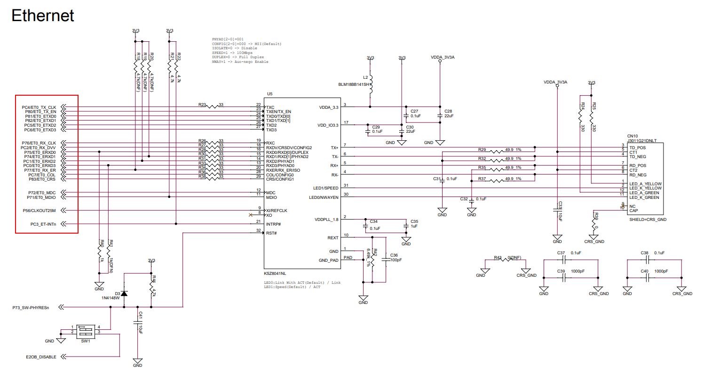
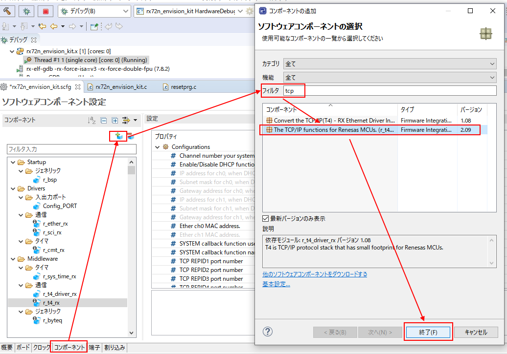
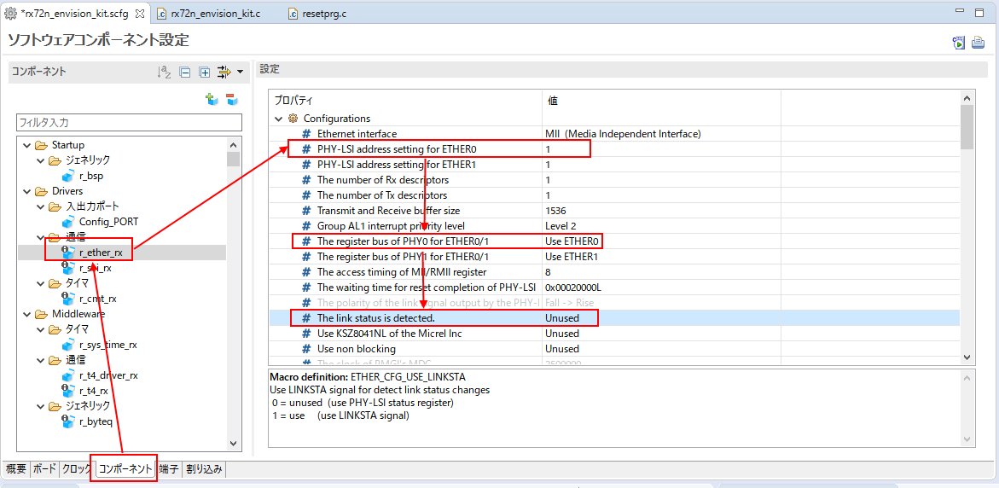
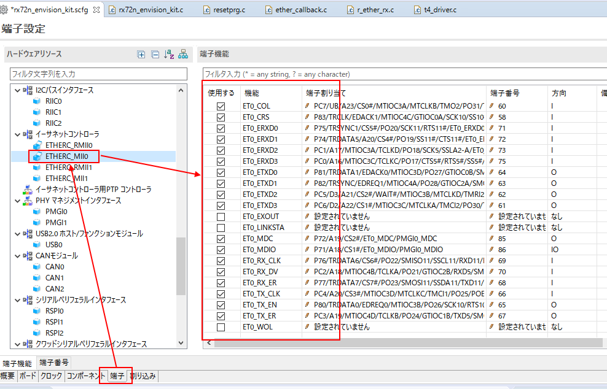
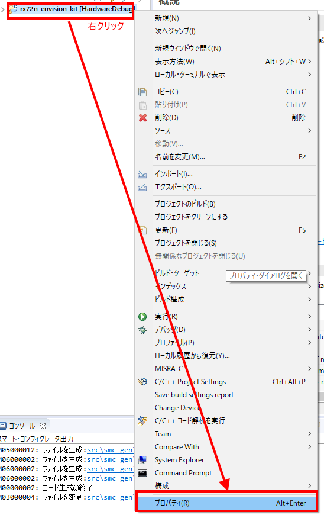
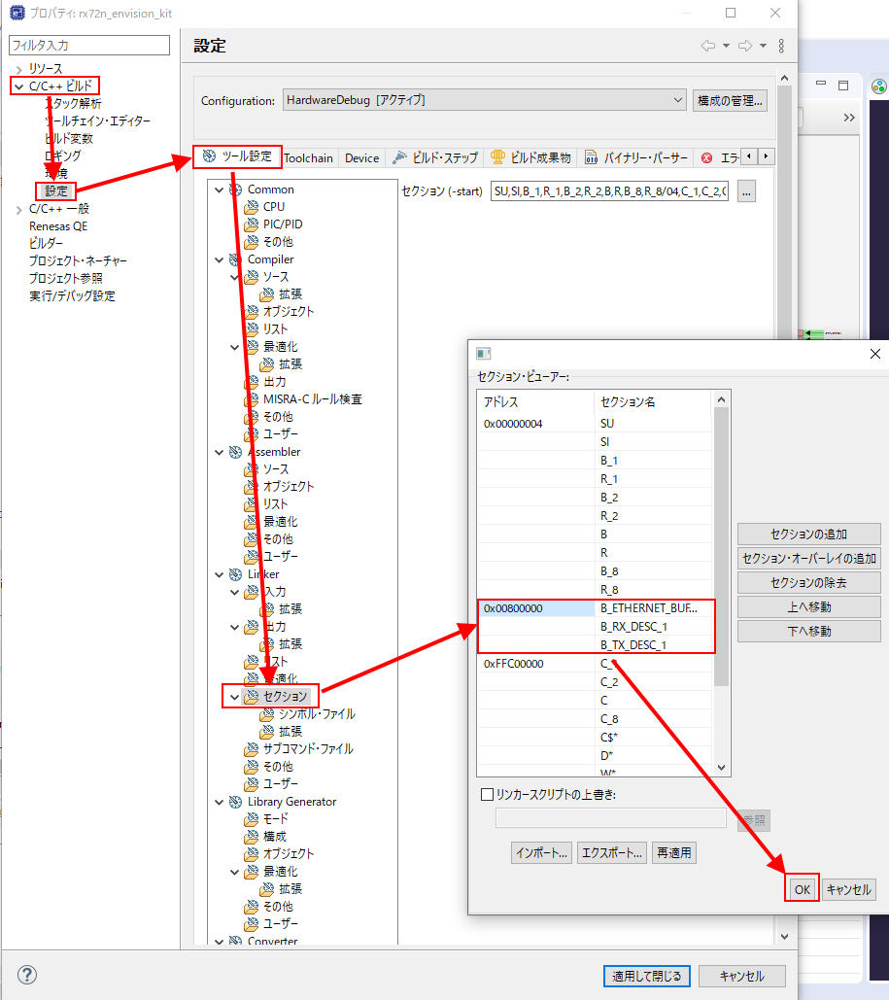

# Things to prepare
* Indispensable
    * RX72N Envision Kit × 1 unit
    * USB cable (USB Micro-B --- USB Type A) × 2 
    * LAN cable x 2 
    * Router which can be connected to the internet (Support Ethernet connection) x 1 unit
    * Windows PC × 1 unit
        * Tools to be installed in Windows PC 
            * [e2 studio 2020-07](https://www.renesas.com/products/software-tools/tools/ide/e2studio.html)
            * [CC-RX](https://www.renesas.com/products/software-tools/tools/compiler-assembler/compiler-package-for-rx-family.html) V3.02 or later
            * [Tera Term](https://osdn.net/projects/ttssh2/) 4.105 or later

# Prerequisite
* [Generate new project (bare metal)](../../bare-metal/generate-new-project.md) must be completed.
* [1+SCI_](../../bare-metal/sci.md) must be completed.
    * In this section, implements by adding TCP/IP stack ([TCP/IP M3S-T4-Tiny for embedded](https://www.renesas.com/products/software-tools/software-os-middleware-driver/protocol-stack/m3s-t4-tiny-for-rx.html)) to LED 0.1 second cycle blinking program created in [Generate new project (bare metal)](../../bare-metal/generate-new-project.md) and log display mechanism created [1+SCI_](../../bare-metal/sci.md).

# Features of TCP/IP M3S-T4-Tiny for the embedded
* Lightweight TCP/IP protocol stack which runs on the OS-less environment
    * Runs with around 20KB ROM, around several KB RAM and one timer
* [The writer](https://github.com/HirokiIshiguro) developed from scratch
* The development started in 2003.
* Commonly called "T4"
* Supported R8C, H8, M16C, SH2A and so on in the past, and RX as of 2020.
* The source code is stored in the following webpage. (It is like a spaghetti code now due to repeated rebuilding, so I want to rebuild it, but have not had no opportunity to do so.)
    * https://github.com/renesas/rx-driver-package/tree/master/source/r_t4_rx/r_t4_rx_vx.xx/r_t4_rx/make_lib
* Installed in many mass-produced products centering on RX family
* If using OS environment, we recommend using TCP/IP stack provided by OS vendors such as [FreeRTOS by AWS](https://aws.amazon.com/freertos/) and so on.
    * Now, FreeRTOS includes not only the kernel of the real time OS, but also various protocols, which are required to AWS connection including TCP/IP stack, SSL and MQTT.
    * Patch is provided appropriately for the latest vulnerability, too. See the following webpage.
        * https://aws.amazon.com/freertos/security-updates/
* This TCP/IP traces the vulnerability and provide the patch as much as possible, but can not trace with as large scale as AWS.
    * Accordingly, we recommend that the system which uses this TCP/IP should be limited on LAN communication without connecting to the internet.

# How to connect
```
RX72N ENvision Kit ----(LAN cable)---Router which can be connected to the internet
 |(USB(ECN1, CN8))                        |
PC---------------(LAN cable)------------+
```

# Check circuit
* <a href="../../images/063_board_ether.png" target="_blank"></a>
    * EtherC/EDMAC is connected with [Media Independ Interface(MII)](https://ja.wikipedia.org/wiki/Media-independent_interface#:~:text=media%2Dindependent%20interface%EF%BC%88MII%E3%80%81,%E3%81%9F%E6%A8%99%E6%BA%96%E3%82%A4%E3%83%B3%E3%82%BF%E3%83%95%E3%82%A7%E3%83%BC%E3%82%B9%E3%81%A7%E3%81%82%E3%82%8B%E3%80%82) which combines  8 data signal lines of ET0_ETXD0-3(transmit), ET0_ERXD0-3(receipt), two transfer clock of transmit and receipt, ET0_TX_CLK and ET0_RX_CLK each and control signal such as ET0_TX_EN, as shown in the above circuit, PC4/ET0_TX_CLK~PC3/ET-INTn.
    * The signal of MII is connected to PHY chip (KSZ8041NL)
    * Other than the signal stipulated by MII, the following is connected.
        * P56/CLKOUT25M: A clock which is provided from RX72N to PHY chip. 25MHz is supplied.
            * In MII, 25MHz is transfer clock and transfer 4 bit per 1 clock by four data lines for transmit and receipt each, or realizes 100Mbps.
    * The communication with PHY chip is conducted with clock synchronous serial communication by two lines of MDC/MDIO
        * PHY chip has PHY address like I2C communication.
        * PHY address is confirmed according to the pin state when PHY chip is reset.
        * On the circuit diagram, PHYAD0="floating", PHYAD1="floating"、PHYAD2="floating"
            * Although it seems to be pulled up/down on the circuit diagram, but it is DNA and unconnected.
            * Default value is retained within PHY chip, and PHYAD[2:0] = "001"
            * Also, Inside PHY chip, fixed at PHYAD3="L" and PHYAD4="L", accordingly, PHYAD[4:3] = "00"
                * That is to say, PHY address is PHYAD[4:0] = "00001".
        * [PHY chip(KSZ8041NL) datasheet](https://ww1.microchip.com/downloads/en/DeviceDoc/00002245B.pdf)
            * Refer to 2.2 STRAP-IN OPTION ? KSZ8041NL 

# Set EtherC/EDMAC driver software and TCP/IP with Smart Configurator
## Add component
* <a href="../../images/064_e2_studio_sc.png" target="_blank"></a>
    * Add T4 component as shown above.
        * r_t4_rx (Described in the above screenshot)
    * The following component which is dependent is automatically registered.
        * r_ether_rx, r_sys_time_rx, r_t4_driver_rx
## Set component
### r_t4_rx
* Setting is not necessary.
    * The main setting items include the following 
        * ON/OFF of DHCP
        * Fixed IP address when DHCP is OFF
        * Setting of communication-endpoint (Commonly known as "socket")
            * Six communication-endpoints of TCP are defined by default
            * The value of default setting needs to hold the receive window of 1460 bytes by communication-endpoint and ram is required to support this.
            * It's preferable to define the minimum amount required for communication at the same time.

### r_ether_rx
* <a href="../../images/065_e2_studio_sc.png" target="_blank"></a>
    * Change PHY address from "0" to "1" 
    *  "The register bus of PHY0/1 for ETHER0/1" from "Use ETHER1" to "Use ETHER0".
    * Change "The link status is detected" from "Used" to "Unused" 
        * A circuit which connects ET_LINKSTA pin and the link state output signal of PHY chip enables to catch the change of link state as interrupt.
        * Change of link state means the insertion and removal of LAN cable which rarely requires immediate processing. Accordingly, in many cases ET_LINKSTA pin is not used.
        * When setting this to "Unused", shifts to the implementation (10ms cycle polling) of regularly asking link state to PHY chip with MDC/MIDO.
                 * This 10ms cycle control is performed with the following code of r_t4_driver.c.
                * https://github.com/renesas/rx-driver-package/blob/ebfbb6d89e6d4229a5ce524128499c9fe6b41377/source/r_t4_driver_rx/r_t4_driver_rx_vx.xx/r_t4_driver_rx/src/t4_driver.c#L484

### r_sys_time_rx
* Setting is not necessary.

### r_t4_driver_rx
* Setting is not necessary.

### r_tsip_rx
* Setting is not necessary.
  * If user uses r_t4_rx v210 or later, r_t4_rx execute random number generation by using "Trusted Secure IP(TSIP)" on security IP inside of RX MCUs for the TCP sequence number generating process that needs some of randomness. 
  * r_tsip_rx is generally provided as "library format" but user can get source code version, for this, please contact to Renesas customer support center.
  * For Library version, all function would be linked (this issue would be fixed in future), this causes big ROM size needed.
  * Please use source code version if you would consider mass-production that need ROM size optimization, etc.

## Pin setting
* <a href="../../images/066_e2_studio_sc.png" target="_blank"></a>
    * Since RX72N MCU assigns multi functions to one pin, you need to perform the setting of which function to be used with software.
    * Perform the pin setting on Smart Configurator to generate the code as shown in the above picture.
    * By reading Board Configuration File (BDF), "pin setting " on Smart Configurator is automated.

## Set TeraTerm
* [Refeence](https://github.com/renesas/rx72n-envision-kit/wiki/Confirm-factory-image-behavior#benchmark-demo)
    * Refer to the item of "Connect CN8(USB Micro-B) and  the USB port (PC, etc.) which is the communication destination with USB cable".
    * Refer to the item of "Boot Teraterm on Windows PC and select COM port (COMx: RSK USB Serial Port(COMx)) to connect."

## Change section setting
* When performing build operation, an error occurs to show B section overlapping in which another variable is assigned to the Ether related section "B_ETHERNET_BUFFERS" and so on.
* It's preferable to assign the following 3 sections to the extensive RAM area in 0x00800000.
    * B_ETHERNET_BUFFERS_1
    * B_RX_DESC_1
    * B_TX_DESC_1
* On the e2 studio project explorer
* <a href="../../images/067_e2_studio_sc.png" target="_blank"></a>
* <a href="../../images/068_e2_studio_sc.png" target="_blank"></a>

## Coding of main() function
* Add the codes to rx72n_envision_kit.c as shown below.
* Fullfill to the step of booting TCP/IP with this code.
* When TCP/IP boots normally, displays the information of IP address and so on which was obtained by DHCP on TeraTerm side.
* By inputting "ping 192.168.1.207" for the IP address with command orompt from the PC, you can see there is a response.

```rx72n_envision_kit.c
#include <stdio.h>
#include <string.h> 

#include "r_smc_entry.h"
#include "platform.h"
#include "r_cmt_rx_if.h"
#include "r_sci_rx_if.h"
#include "r_t4_itcpip.h"
#include "r_t4_rx_config.h"

#include "Pin.h"
#include "r_sci_rx_pinset.h"
#include "r_ether_rx_pinset.h"
#include "r_sys_time_rx_if.h"

#if 1
/* Please turn off this section if you would use old r_t4_rx. */
#include "r_tsip_rx_if.h"
#endif

#define DEBUG_PRINT 1

void main(void);
void cmt_callback(void *arg);
void sci_callback(void *arg);
void my_sw_charput_function(char *data);
char my_sw_charget_function(void);

static sci_hdl_t sci_handle;
static UB guc_event[T4_CFG_SYSTEM_CHANNEL_NUMBER];
static DHCP* gpt_dhcp[T4_CFG_SYSTEM_CHANNEL_NUMBER];

static UW tcpudp_work[14800];

void main(void)
{
    uint32_t cmt_channel;
    R_CMT_CreatePeriodic(10, cmt_callback, &cmt_channel);
    sci_cfg_t   my_sci_config;
    int32_t size;

#if 1
    /* Please turn off this section if you would use old r_t4_rx. */
    R_TSIP_Open(NULL, NULL); 
#endif

    /* Set up the configuration data structure for asynchronous (UART) operation. */
    my_sci_config.async.baud_rate    = 115200;
    my_sci_config.async.clk_src      = SCI_CLK_INT;
    my_sci_config.async.data_size    = SCI_DATA_8BIT;
    my_sci_config.async.parity_en    = SCI_PARITY_OFF;
    my_sci_config.async.parity_type  = SCI_EVEN_PARITY;
    my_sci_config.async.stop_bits    = SCI_STOPBITS_1;
    my_sci_config.async.int_priority = 15; /* disable 0 - low 1 - 15 high */

    R_Pins_Create();
    R_SCI_Open(SCI_CH2, SCI_MODE_ASYNC, &my_sci_config, sci_callback, &sci_handle);
    R_SCI_PinSet_SCI2();
    R_ETHER_PinSet_ETHERC0_MII();

    printf("Hello World\n");

    R_SYS_TIME_Open();

    /* start LAN controller */
    lan_open();

    /* initialize TCP/IP */
    size = tcpudp_get_ramsize();
    if (size > (sizeof(tcpudp_work)))
    {
        while (1);
    }
    tcpudp_open(tcpudp_work);

    while(1);
}

void cmt_callback(void *arg)
{
	if(PORT4.PIDR.BIT.B0 == 1)
	{
		PORT4.PODR.BIT.B0 = 0;
	}
	else
	{
		PORT4.PODR.BIT.B0 = 1;
	}
}

void sci_callback(void *arg)
{

}

void my_sw_charput_function(char *data)
{
    uint32_t arg = 0;
    /* do not call printf()->charput in interrupt context */
    do
    {
        R_SCI_Control(sci_handle, SCI_CMD_TX_Q_BYTES_FREE, (void*)&arg);
    }
    while (SCI_CFG_CH2_TX_BUFSIZ != arg);
    R_SCI_Send(sci_handle, (uint8_t*)&data, 1);
}

char my_sw_charget_function(void)
{
	return 0;
}

ER system_callback(UB channel, UW eventid, VP param)
{
#if defined(DEBUG_PRINT)
    uint8_t*    ev_tbl[] =
    {
        "ETHER_EV_LINK_OFF",
        "ETHER_EV_LINK_ON",
        "ETHER_EV_COLLISION_IP",
        "", "", "", "", "", "", "", "", "", "", "", "", "", "", "", "", "",
        "DHCP_EV_LEASE_IP",
        "DHCP_EV_LEASE_OVER",
        "DHCP_EV_INIT",
        "DHCP_EV_INIT_REBOOT",
        "DHCP_EV_APIPA",
        "DHCP_EV_NAK",
        "DHCP_EV_FATAL_ERROR",
        "DHCP_EV_PLEASE_RESET"
    };
    printf("^^>>>user_cb<<< ch:%d,eventID = %s\n", channel, ev_tbl[eventid]);
#endif /*#if defined(DEBUG_PRINT)*/
    guc_event[channel] = eventid;
    switch(eventid)
    {
        case ETHER_EV_LINK_OFF:
        {
            /* Do Nothing. */
        }
        break;

        case ETHER_EV_LINK_ON:
        {
            /* Do Nothing. */
        }
        break;

        case ETHER_EV_COLLISION_IP:
        {
            /* Do Nothing. */
        }
        break;

        case DHCP_EV_LEASE_IP:
        {
            /* cast from VP to DHCP* */
            gpt_dhcp[channel] = (DHCP*)param;
#if defined(DEBUG_PRINT)
            printf("DHCP.ipaddr[4]   %d.%d.%d.%d\n",
                   gpt_dhcp[channel]->ipaddr[0], gpt_dhcp[channel]->ipaddr[1],
                   gpt_dhcp[channel]->ipaddr[2], gpt_dhcp[channel]->ipaddr[3]);
            printf("DHCP.maskaddr[4] %d.%d.%d.%d\n",
                   gpt_dhcp[channel]->maskaddr[0], gpt_dhcp[channel]->maskaddr[1],
                   gpt_dhcp[channel]->maskaddr[2], gpt_dhcp[channel]->maskaddr[3]);
            printf("DHCP.gwaddr[4]   %d.%d.%d.%d\n",
                   gpt_dhcp[channel]->gwaddr[0], gpt_dhcp[channel]->gwaddr[1],
                   gpt_dhcp[channel]->gwaddr[2], gpt_dhcp[channel]->gwaddr[3]);
            printf("DHCP.dnsaddr[4]  %d.%d.%d.%d\n",
                   gpt_dhcp[channel]->dnsaddr[0], gpt_dhcp[channel]->dnsaddr[1],
                   gpt_dhcp[channel]->dnsaddr[2], gpt_dhcp[channel]->dnsaddr[3]);
            printf("DHCP.dnsaddr2[4] %d.%d.%d.%d\n",
                   gpt_dhcp[channel]->dnsaddr2[0], gpt_dhcp[channel]->dnsaddr2[1],
                   gpt_dhcp[channel]->dnsaddr2[2], gpt_dhcp[channel]->dnsaddr2[3]);
            printf("DHCP.macaddr[6]  %02X:%02X:%02X:%02X:%02X:%02X\n",
                   gpt_dhcp[channel]->macaddr[0],  gpt_dhcp[channel]->macaddr[1],  gpt_dhcp[channel]->macaddr[2],
                   gpt_dhcp[channel]->macaddr[3],  gpt_dhcp[channel]->macaddr[4],  gpt_dhcp[channel]->macaddr[5]);
            printf("DHCP.domain[%d] %s\n", strlen(gpt_dhcp[channel]->domain), gpt_dhcp[channel]->domain);
            printf("\n");
#endif /*#if defined(DEBUG_PRINT)*/
        }
        break;

        case DHCP_EV_LEASE_OVER:
        {
            /* Do Nothing. */
        }
        break;

        case DHCP_EV_INIT:
        {
            /* Do Nothing. */
        }
        break;

        case DHCP_EV_INIT_REBOOT:
        {
            /* Do Nothing. */
        }
        break;

        case DHCP_EV_APIPA:
        {
            /* cast from VP to DHCP* */
            gpt_dhcp[channel] = (DHCP*)param;
#if defined(DEBUG_PRINT)
            printf("DHCP.ipaddr[4]   %d.%d.%d.%d\n",
                   gpt_dhcp[channel]->ipaddr[0], gpt_dhcp[channel]->ipaddr[1],
                   gpt_dhcp[channel]->ipaddr[2], gpt_dhcp[channel]->ipaddr[3]);
            printf("DHCP.maskaddr[4] %d.%d.%d.%d\n",
                   gpt_dhcp[channel]->maskaddr[0], gpt_dhcp[channel]->maskaddr[1],
                   gpt_dhcp[channel]->maskaddr[2], gpt_dhcp[channel]->maskaddr[3]);
            printf("DHCP.gwaddr[4]   %d.%d.%d.%d\n",
                   gpt_dhcp[channel]->gwaddr[0], gpt_dhcp[channel]->gwaddr[1],
                   gpt_dhcp[channel]->gwaddr[2], gpt_dhcp[channel]->gwaddr[3]);
            printf("DHCP.dnsaddr[4]  %d.%d.%d.%d\n",
                   gpt_dhcp[channel]->dnsaddr[0], gpt_dhcp[channel]->dnsaddr[1],
                   gpt_dhcp[channel]->dnsaddr[2], gpt_dhcp[channel]->dnsaddr[3]);
            printf("DHCP.dnsaddr2[4] %d.%d.%d.%d\n",
                   gpt_dhcp[channel]->dnsaddr2[0], gpt_dhcp[channel]->dnsaddr2[1],
                   gpt_dhcp[channel]->dnsaddr2[2], gpt_dhcp[channel]->dnsaddr2[3]);
            printf("DHCP.macaddr[6]  %02X:%02X:%02X:%02X:%02X:%02X\n",
                   gpt_dhcp[channel]->macaddr[0],  gpt_dhcp[channel]->macaddr[1],  gpt_dhcp[channel]->macaddr[2],
                   gpt_dhcp[channel]->macaddr[3],  gpt_dhcp[channel]->macaddr[4],  gpt_dhcp[channel]->macaddr[5]);
            printf("DHCP.domain[%d] %s\n", strlen(gpt_dhcp[channel]->domain), gpt_dhcp[channel]->domain);
            printf("\n");
#endif /*#if defined(DEBUG_PRINT)*/
        }
        break;

        case DHCP_EV_NAK:
        {
            /* Do Nothing. */
        }
        break;

        case DHCP_EV_FATAL_ERROR:
        {
            /* Do Nothing. */
        }
        break;

        case DHCP_EV_PLEASE_RESET:
        {
            /* Do Nothing. */
        }
        break;

        default:
        {
            /* Do Nothing. */
        }
        break;
    }
    return 0;
}
```
## Output result(TeraTerm)
```
Hello World
^^>>>user_cb<<< ch:0,eventID = ETHER_EV_LINK_ON
^^>>>user_cb<<< ch:0,eventID = DHCP_EV_INIT
^^>>>user_cb<<< ch:0,eventID = DHCP_EV_LEASE_IP
DHCP.ipaddr[4]   192.168.1.207
DHCP.maskaddr[4] 255.255.255.0
DHCP.gwaddr[4]   192.168.1.1
DHCP.dnsaddr[4]  192.168.1.1
DHCP.dnsaddr2[4] 0.0.0.0
DHCP.macaddr[6]  74:90:50:00:79:03
DHCP.domain[0]
```

## Ping response (Command prompt)
```
C:\Users\Shelty>ping 192.168.1.207

Transmit ping to 192.168.1.207 32 byte data:
Response from 192.168.1.207: Byte number =32 hours <1ms TTL=80
Response from 192.168.1.207: Byte number =32 hours <1ms TTL=80
Response from 192.168.1.207 : Byte number =32 hours <1ms TTL=80
Response from 192.168.1.207 : Byte number =32 hours <1ms TTL=80

ping statistics of 192.168.1.207 :
    Packet number: Transmit = 4、Receipt = 4、Loss = 0 (0% loss)、
Estimated time of round trip (millisecond):
    Minimum = 0ms、Maximum = 0ms、Average = 0ms
```
