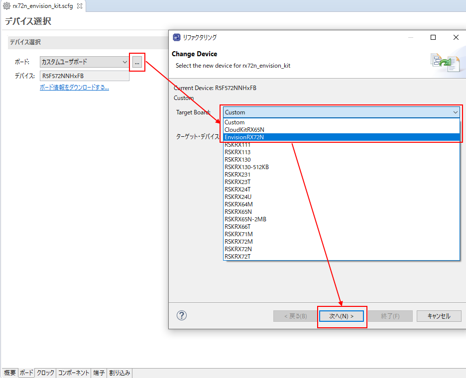
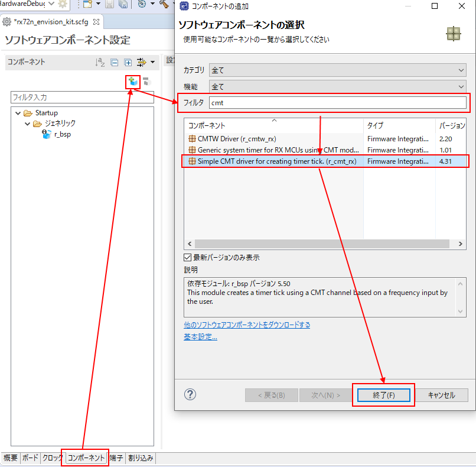
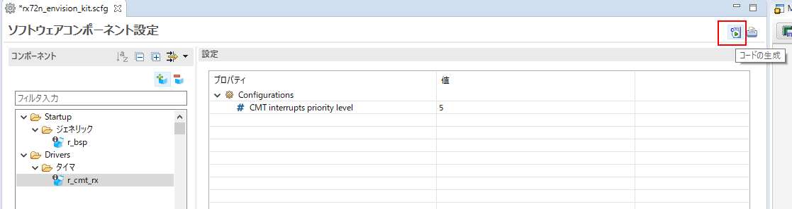
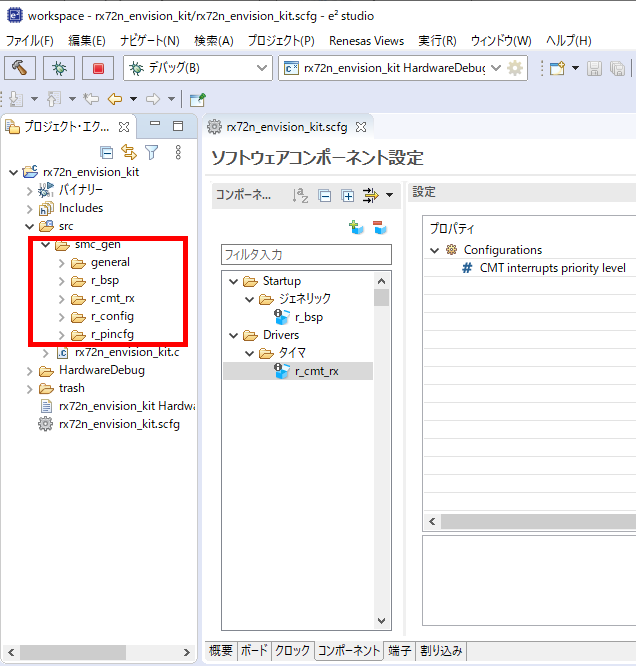
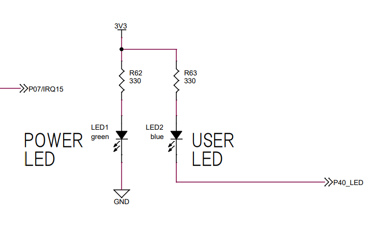
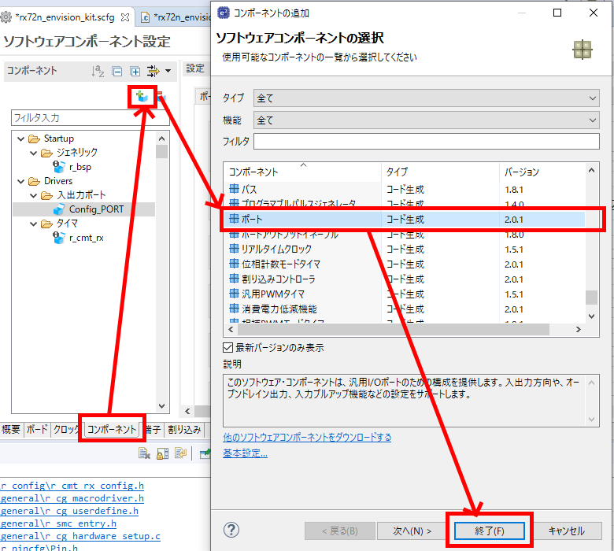
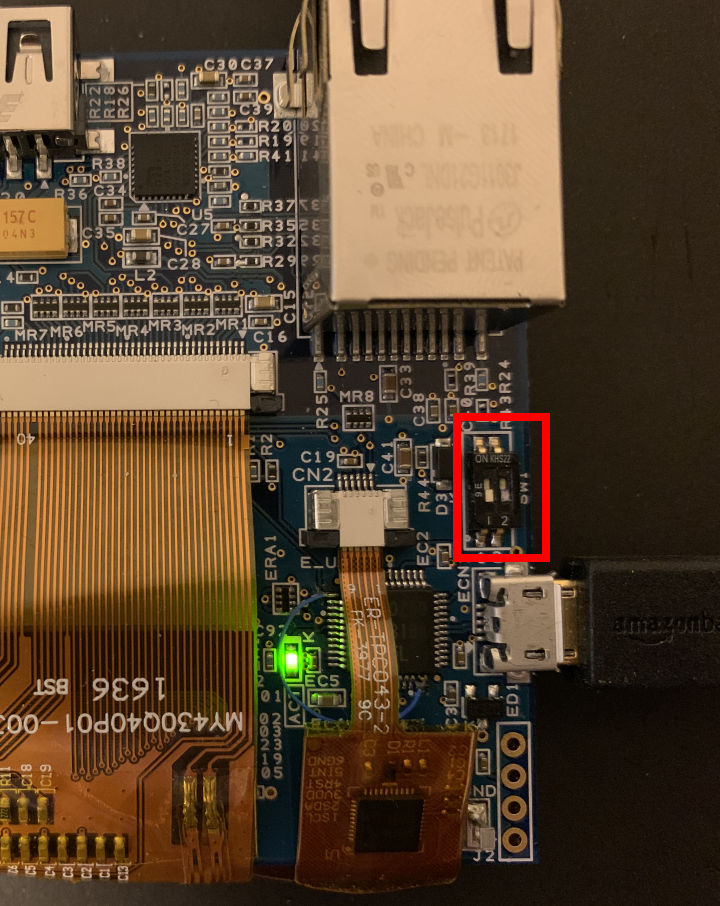
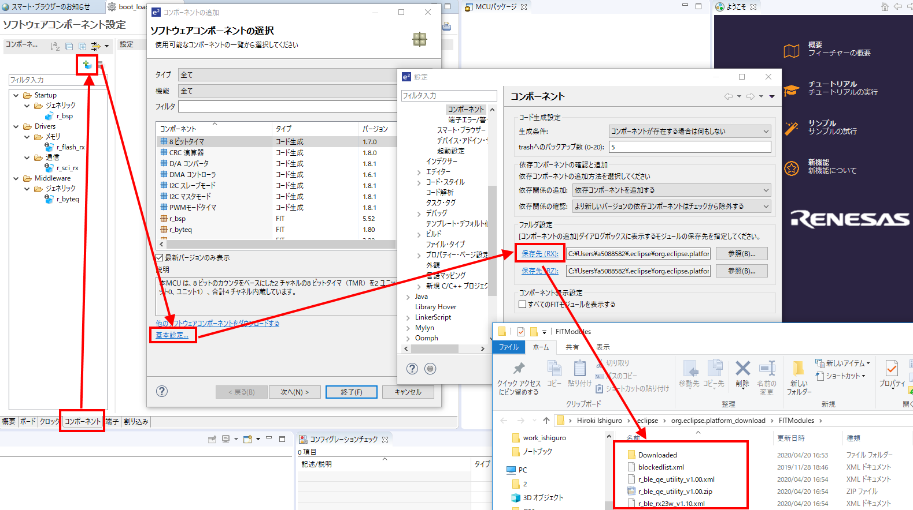
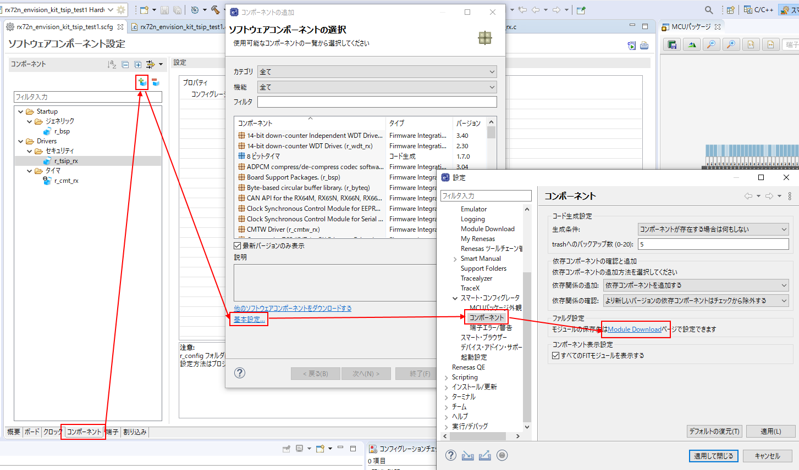
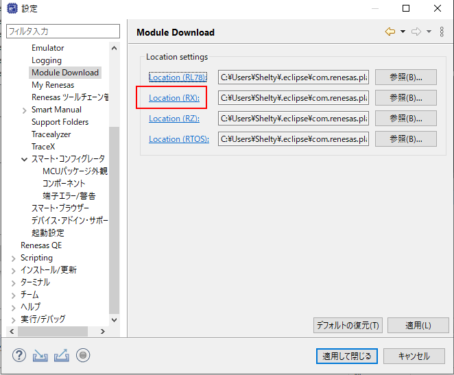

# Things to prepare
* Indispensable
    * RX72N Envision Kit × 1 unit
    * USB cable (USB Micro-B --- USB Type A) × 1 
    * Windows PC × 1 unit
        * Tools to be installed in Windows PC 
            * [e2 studio 2020-07](https://www.renesas.com/products/software-tools/tools/ide/e2studio.html)
            * [CC-RX](https://www.renesas.com/products/software-tools/tools/compiler-assembler/compiler-package-for-rx-family.html) V3.02 or later

# Boot e2 studio and generate new project
* File -> New -> Project
    * Wizard -> C/C++ -> C/C++ Project -> Next
        * All -> Renesas CC-RX C/C++ Executable Project
            * Project name = Input rx72n_envision_kit  -> Next
                * Device Settings -> Target・device -> ...button -> RX700 -> RX72N -> RX72N - 144pin -> R5F572NNHxFB (Select R5F572NNHxFB_DUAL, if you plan to try firmware update)
                * Configuration -> Create Hardware Debug configuration -> E2 Lite (RX) -> Next
                    * Check "Use smart configurator" -> Exit
* ★Future improvement★ Will enable to install BDF when generating a new project, too.

# Install a board configuration file(BDF) of RX72N Envision Kit.
* <a href="../../images/044_e2_studio_sc.png" target="_blank"></a>
    * By reading the board configuration file (BDF), "Pin setting" on Smart Configurator is automated.
        * Component and clock settings are expected to become fully automated in the future. 

# Read the board configuration file(BDF) of RX72N Envision Kit.
* <a href="../../images/045_e2_studio_sc.png" target="_blank"></a>

# Perform clock setting with Smart Configurator according to RX72N Envision Kit. 
* ★Future improvement★ This is expected to be unnecessary in e2 studio 2020-xx (future version) in tandem with BDF, but is required for e2 studio 2020-07 or earlier.
* <a href="../../images/022_e2_studio_sc1.png" target="_blank"></a>
    * Press "Clock" tab on the bottom of Smart Configurator screen.
        * Main clock -> Frequency -> Change to 16 (MHz) 
        * PLL circuit -> Change multiplying ratio to x15.0 
        * PPLL circuit -> Change division ratio to x1/2, and multiplying ratio to x25.0.
            * Check that FlashIF clock and system clock, etc., are automatically changed, working together with the above change.
    * When "code generation" button on the upper right of Smart Configurator screen is pressed, skeleton program according to the content set by Smart Configurator is outputted.
    * Project on the upper part of e2 studio screen -> Execute all builds and check that an error is not displayed on console

# Use CMT(Compare Match Timer) to generate 0.1 second periodic interrupt and turn on and off it on 0.1 second cycle.
## Register the component of CMT by Smart Configurator
* <a href="../../images/046_e2_studio_sc.png" target="_blank"></a>
    * Press "Component" tab on the bottom part of Smart Configurator.
    * Add r_cmt_rx component as described above.
    * If it is not displayed, try the following.
        * Download other software components -> Select Region -> Select the displayed RX Driver Package Ver.x.xx (Latest version) and download.
    * It's preferable to perform the following if you actively perform SCI(Serial Communication Interface) and port setting. This is not necessary if just checking the operation of CMT
        * Basic setting -> C/C++ -> Renesas -> Smart・Configurator -> Component -> Display all FIT modules
    * When pressing "code generation" button on the upper right of Smart Configurator screen, skeleton program is outputted according to the content set by Smart Configurator.
        * <a href="../../images/047_e2_studio_sc.png" target="_blank"></a>
    * Project on top of e2 studio screen -> Execute all builds and check that an error is not displayed on console.

## Check CMT component manual
* <a href="../../images/024_e2_studio_sc3.png" target="_blank"></a>
    * All codes generated by Smart Configurator are stored in smc_gen folder.
    * There are components with various functions, including the component with doc folder such as  r_cmt_rx which is used this time.
    * Doc folder contains manuals, enabling you to check API specifications of the component and how to use it.
    * Use a periodic start API of r_cmt_rx , R_CMT_CreatePeriodic() 

## Check the port number of RX72N connected to LED
* <a href="../../images/025_board_led.png" target="_blank"></a>
    * P40 is connected to USER LED.
        * The mechanism is that if voltage level of P40 is 0, the current flows from 3.3V power source to P40 via USER LED to turn on USER LED.

## Register the component of port with Smart Configurator
* <a href="../../images/026_e2_studio_sc4.png" target="_blank"></a>
    * Press "Component" tab on the bottom of Smart Configurator screen.
    * Add a component as shown in the above picture.
    * Then, select the added Config_PORT component and perform the following setting.
        * Select port tab -> PORT4
        * PORT4 tab
            * Check Output of P40 -> Output, CMOS output,1 (Turn off LED in initial state)   
    * Press "code generation" button on the upper right of Smart Configurator screen, then a skeleton program is outputted according to the content set by Smart configurator.
    * Execute Project -> Build all on the top of the e2 studio screen and check that an error is not displayed on console.

## Create main() function
* The codes generated by Smart Configurator calls main() when the  initialization of the hardware is completed.
* The Users add user code to the main() and define the user system operation.
* This time, by adding the code which uses CMT and port function, realize "Turn on and off LED in 0.1 second cycle.
* Write the following code in rx72n_envision_kit.c.
    *The source code of rx72n_envision_kit.c is stored in rx72n_envision_kit -> src in project explorer on e2 studio screen.
```rx72n_envision_kit.c
#include "r_smc_entry.h"
#include "platform.h"
#include "r_cmt_rx_if.h"

void main(void);
void cmt_callback(void *arg);

void main(void)
{
	uint32_t channel;
	R_CMT_CreatePeriodic(10, cmt_callback, &channel);
	while(1);
}

void cmt_callback(void *arg)
{
	if(PORT4.PIDR.BIT.B0 == 1)
	{
		PORT4.PODR.BIT.B0 = 0;
	}
	else
	{
		PORT4.PODR.BIT.B0 = 1;
	}
}
```
## Debugger setting
* Turn off SW1-2 of RX72N Envision Kit (on the lower part of the board)
    * <a href="../../images/017_board_sw1.jpg" target="_blank"></a>
* Next, download the firmware which build is performed on in RX72N and execute.
    * Check that rx72n_envision_kit Hardware Debug is selected with Configuration pull down menu on the top of e2 studio screen.
    * Press the gear icon on the right
        * Check that Debugger -> Debug hardware -> E2 Lite(RX) is selected.
        * Debugger -> Connection Settings
            * Change to Main・Clock・Source -> EXTAL 
            * EXTAL frequency [MHz] -> Change to 16.0000 
            * Change to Operation frequency [MHz] -> 240 
            * Change to Connection type -> Fine 
            * Change to Supply power from emulator (MAX 200mA) -> No 
    * ★Future improvement★ Automate the debugger setting, by matching to BDF.

# Check operation
* Press insect icon on the top of e2 studio screen to download the firmware in RX72N.
* Press the icon of playback button on the top of e2 studio screen to execute the firmware.
    * It breaks once in main(), then press the icon of playback button again.
* Check that blue LED(around the center of the board/lower right of RX72N) turn on and off in 0.1 second cycle.

# What is [Smart Configurator](https://www.renesas.com/products/software-tools/tools/solution-toolkit/smart-configurator.html)？
* Since RX72N is a general-purpose MCU, the multiplying/dividend ratio of clock source and internal PLL circuit can be set flexibly.
* In timer system and communication system represented by CMT and SCI respectively, the setting value to itself needs to be adjusted by software according to the clock speed of clock signal wired to itself.
* Originally, the users need to perform the coding of this software by referring to MCU manual. However, setting items range so widely that we have prepared the mechanism to support this with tools such as Smart Configurator.
* Without worrying about what MHz the clock source is or how the internal PLL setting is like, the users (especially application designer) can instruct from software to hardware on API level, such as "baud rate is 115200bps". Accordingly, software development efficiency is improved.
* In addition, designers with full knowledge of RX family products perform development and maintenance (continuous bug fix) of the driver software for RX family-mounted circuit, such as CMT, SCI, Ether, USB and SDHI with API design in “FIT module” format for major RX group  and distribute FIT module packaged by one as “RX Driver Package”.
* Accordingly, without worrying about detailed hardware difference among RX family products or hardware errata information, the users can concentrate on application development.

# FIT module of screen processing block
* FIT module of screen processor is still on the prototype stage, and is not embedded in RX Driver Package. 
* FIT module on the prototype stage lies below as early prototype, if you use this, you need to install separately.
    * https://github.com/renesas/rx-driver-package
* In addition to screen processor, some FIT modules of early prototype version of SDIO driver and various WiFi driver exist.
* By copying FIT module(*.zip, *.xml, *.mdf in FITModules folder) downloaded from the above URL in the following folder, Smart Configurator can read it.
    * e2 studio 2020-04 or earlier
        * <a href="../../images/031_e2_studio_sc8.png" target="_blank"></a>
    * e2 studio 2020-07 or later
        * <a href="../../images/042_e2_studio_sc.png" target="_blank"></a>
        * <a href="../../images/043_e2_studio_sc.png" target="_blank"></a>

# ★Items to be improved in the future
* Expand the information to improve *.scfg file,  so that not only ON/OFF of LED, but also all functions installed in RX72N Envision Kit can be easily set with Smart Configurator.<Under construction>
* By enabling to update the initial setting value held by FIT module, MDF(Module Description File) with BDF setting, FIT module can be reset with full automation by selecting board.
* BDF setting enables to flexibly select the FIT module setting to the multifunctional connector on the boards such as PMOD.
