# <a name="purpose"></a>Purpose
* Introduce a way to create interactive GUI application via liquid crystal display
  1. By using [QE for Display[RX]](https://www.renesas.com/products/software-tools/tools/solution-toolkit/qe-qe-for-display.html), perform the embedding/setting of the following driver and software. 
       > For embedding/setting method, refer to [Application note（R20AN0582xxxxxx）](https://www.renesas.com/jp/ja/software/D4800348.html) of QE for Display[RX], too.
  2. By using RX72N MCU peripheral function, graphic LCD controller (GLCDC), 2D drawing engine (DRW2D), and [emWin](https://www.segger.com/products/user-interface/emwin/) soft by SEGGER, display letters and figures on liquid crystal display.
  3. By using GUI design tool [AppWizard](https://www.segger.com/products/user-interface/emwin/tools/tools-overview/#AppWizard), set interactive GUI on crystal liquid display.
  4. Control LED lighting by touch operation of a button displayed on liquid crystal display.

# <a name="things_to_prepare"></a> Things to prepare
* Indispensable
  * RX72N Envision Kit × 1 unit
  * USB cable (USB Micro-B --- USB Type A) × 1 
  * Windows PC × 1 unit
    * Tools to be installed in Windows PC 
      * e2 studio 2020-07 or later
        * Initial booting sometimes takes time.
          * CC-RX V3.02 or later

# <a name="prerequisites"></a>Prerequisite
 * [Generate new project (bare metal)](../../bare-metal/generate-new-project.md) must be completed.
   * In this section, implements by adding the following for LED 0.1 second cycle blinking program generated by [Generate new project (bare metal)](../../bare-metal/generate-new-project.md).
      1. Utilizing QE for Display, easily embed/set  GLCD driver, DRW2D driver and emWin
      2. Using AppWizard, set GUI
      3. Add code to control GUI
  * The latest [RX Driver Package](https://www.renesas.com/products/software-tools/software-os-middleware-driver/software-package/rx-driver-package.html)(FIT module) must be used.


# <a name="preparation"></a>Advance preparations to use QE for Display
* Perform only the first time.
  * Follow [How to install](https://www.renesas.com/software/D4001360.html) to download/install QE for Display
  * Download [DRW2D FIT module](https://github.com/renesas/rx-driver-package/tree/master/FITModules), and [emWin FIT module](https://www.renesas.com/software/D4800346.html) and locate them in [Storage destination folder of FIT module](https://github.com/renesas/rx72n-envision-kit/wiki/%E3%82%B9%E3%83%9E%E3%83%BC%E3%83%88%E3%83%BB%E3%82%B3%E3%83%B3%E3%83%95%E3%82%A3%E3%82%B0%E3%83%AC%E3%83%BC%E3%82%BF%E3%81%AE%E4%BD%BF%E7%94%A8%E6%96%B9%E6%B3%95#stored_fit_folder).
    > This is because DRW2D FIT module and emWin FIT module are not supplied by RX Driver Package V1.26

# <a name="circuit"></a>Check circuit
* Check the LCD related circuits as described below.
## LCD graphic controller (GLCDC)
* 4.3 inch WQVGA TFT-LCD is installed in RX72N Envision Kit.
  * Output data format is RGB565 format （Paralle,16bit）
    * RGB565 is a format to express colors with the total 16bit(65,536 colors) of 5bit of R/B and 6bit of G.
      * By the way, the reason why G is 1bit larger than R or B is that green is the color which reacts to the human eyes most easily.
  * In the case of RGB565, the pin which outputs data to LCD （LCD signal output pin） is 16bit bus of LCD_DATA15 to LCD_DATA0.
    > Refer to (3) of 51.1.5 of RX72N [Hardware manual（R01UH0824xxxxxx）](https://www.renesas.com/search/keyword-search.html#q=R01UH0824)
    * However, the pixel array of GLCDC has two types, R-G-B and B-G-R. By using the function to switch B/R, pixel array ordering can be switched. 
      * Data pins of LCD （LCD_DATA_11~LCD_DATA_15） function as color data output pin of R in the case of R-G-B pixel array, and as color data output pin of B in the case of B-G-R pixel array.
      * Data pins of LCD （LCD_DATA_0~LCD_DATA_4）function as color data output pin of B in the case of R-G-B pixel array, and as color data output pin of R in the case of B-G-R pixel array.
      * Refer to “The bit position of LCD signal in parallel RGB(565) format” in RX72N hardware manual 47.1.5 (3) for details.
  * Also, panel clock output pin （LCD_CLK） and synchronous signal output pin （LCD_TCON3～LCD_TCON0） are used.
    > Refer to table 51.2 of 51.1 of RX72N [Hardware manual（R01UH0824xxxxxx）](https://www.renesas.com/search/keyword-search.html#q=R01UH0824).
  * <a href="../../images/096_circuit_glcdc.png" target="_blank">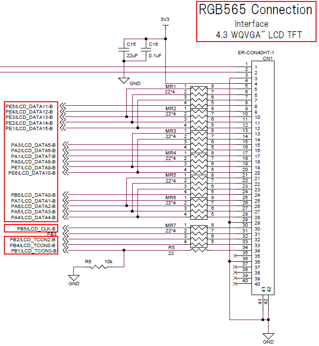</a>

## Capacitance touch controller
* The capacitance touch controller （FT5260） is installed in RX72N Envision Kit
* RX72N MCU performs data communication with the capacitance touch controller at I2C serial interface, <br>and controls controller operation.
  * <a href="../../images/083_circuit_touch.png" target="_blank">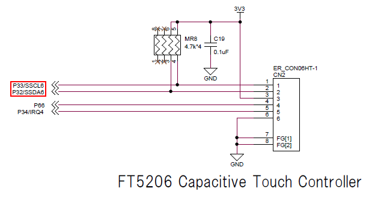</a>

# Check BDF
* Check that BDF`EnvisionRX72N` is applied to the project
  * Refer to [How to use Smart Configurator#Board setting](https://github.com/renesas/rx72n-envision-kit/wiki/How-to-use-the-Smart-Configurator#set-board)
  * If it is not applied, see the above link for how to handle this.

# Set driver software/middle software with QE for Display
## Set  the project of application destination
* Execute `Renesas Views` -> `Renesas QE` -> `LCD main RX (QE)` and open QE for Display
* Select `rx72n_envision_kit`, the project which applies QE for Display from the pulldown menu of `Select project` of QE for Display.
* After selecting it, check that `evaluation board` becomes `EnvisionRX72N (V.x.xx)`.
  * Since BDF`EnvisionRX72N` is applied to the project, `evaluation board` automatically changes when selecting a project with `Select project`
* Select `Use emWin` with `Select GUI drawing tool`
* <a href="../../images/084_qe_main1.png" target="_blank">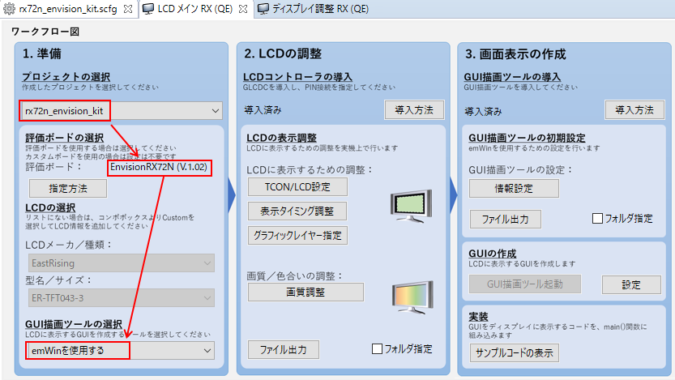</a>

## Set LCD controller
* Describe how to set LCD controller below.
  * Install LCD controller （GLCDC FIT module）into the project with Smart Configurator (SC)
    * Open SC and [Add component](https://github.com/renesas/rx72n-envision-kit/wiki/How-to-use-the-Smart-Configurator#add-component), `r_glcdc_rx`
      * If an error occurs due to FIT module dependency, the version of FIT modules might not be appropriate.
        * According to the error content, [Change version](https://github.com/renesas/rx72n-envision-kit/wiki/How-to-use-the-Smart-Configurator#change-the-version-of-component) of FIT modules.
    * Execute [Generate code](https://github.com/renesas/rx72n-envision-kit/wiki/How-to-use-the-Smart-Configurator#add-component) of SC temporarily.
  * Check that `LCD main RX (QE)` -> `LCInstall D controller` -> `Has been installed`.
  * Perform the LCD controller setting `LCD main RX (QE)` -> `Adjust LCD display` -> `Adjust display timing`
    * Since an error occurs with default "timing setting", clear the error.
      * <a href="../../images/093_qe_lcd_error.png" target="_blank">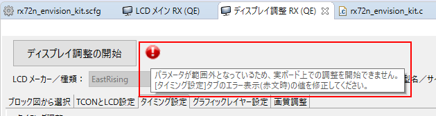</a>
      
      * Perform the setting in which refresh rate [Hz] and horizontal frequency [kHz]` meet each value which can be set, and `difference` becomes 0.0. (Example is shown below)
        * `PLL circuit frequency[MHz]`：`240`
          * Change PLL circuit frequency to the same value as [Clock setting](https://github.com/renesas/rx72n-envision-kit/wiki/How-to-use-the-Smart-Configurator#set-clock) of SC.
            * ★Future improvement★ Plan to improve to be able to automatically obtain values from the clock setting of SC.
        * `Panel clock frequency [MHz]`：`10.000000`
          * Set panel clock frequency to the value less than PCLKA
        * `HPW`：`30`
        * `HBP`：`54`
        * `HFP`：`20`
        * <a href="../../images/087_qe_lcd.png" target="_blank">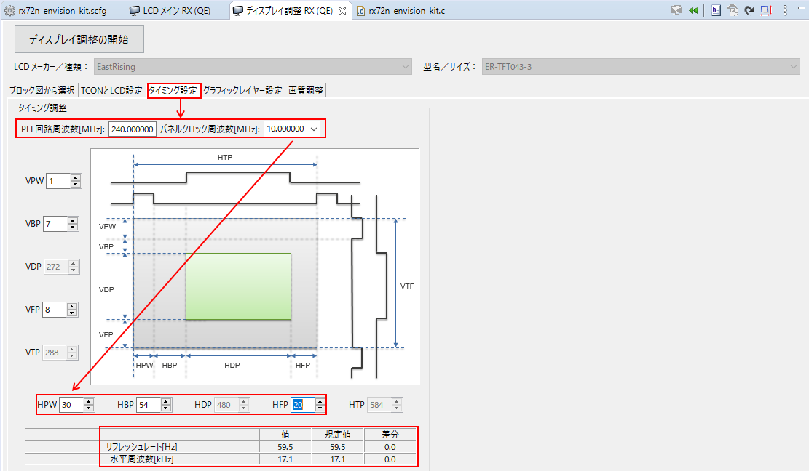</a>
    * When using QE for Display, [Set component](https://github.com/renesas/rx72n-envision-kit/wiki/How-to-use-the-Smart-Configurator#add-component) of SC regarding r_glcdc_rx **is not required**
  * Generate the setting fie of LCD controller from **QE for Display**.
     * Execute `LCD main RX (QE)` -> `Adjust LCD display` -> `Output file`
       * Output destination of default is directly under `.\rx72n_envision_kit\src`.
       * By checking `Specify folder` and executing `Output file`, you can select output destination.
       * However, avoid locating it under `.\rx72n_envision_kit\src\smc_gen`.
         * This is because the outputted file could be deleted by [Generate code](https://github.com/renesas/rx72n-envision-kit/wiki/How-to-use-the-Smart-Configurator#generate-code) of SC.
     * <a href="../../images/085_qe_main2.png" target="_blank">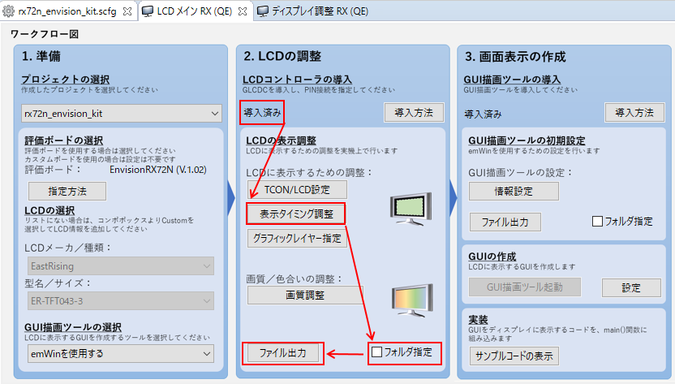</a>
* Refer to `LCD main RX (QE)` -> `Install LCD controller` -> `How to install` for details of installing method.

## Set GUI drawing tool
* Describe how to set GUI drawing tool below.
  * Introduce GUI drawing tool （emWin FIT module） into the project using SC.
    * Open SC and [Add component](https://github.com/renesas/rx72n-envision-kit/wiki/How-to-use-the-Smart-Configurator#add-component),`r_emwin_rx`.
      * FIT module which has dependency with emWin FIT is automatically added to the project by SC function.
        * r_cmt_rx
        * r_dmaca_rx
        * r_drw2d_rx
        * r_glcdc_rx
        * r_gpio_rx
        * r_sci_iic_rx
      * If an error occurs due to FIT module dependency, the version of FIT modules might not be appropriate.
        * According to the error content, [Change version](https://github.com/renesas/rx72n-envision-kit/wiki/How-to-use-the-Smart-Configurator#change-the-version-of-component) of FIT modules.
    * Execute [Generate code](https://github.com/renesas/rx72n-envision-kit/wiki/How-to-use-the-Smart-Configurator#generate-code) of SC
  * Check `LCD main RX (QE)` -> `Install GUI drawing tool` -> `Have been installed`
  * Perform the setting of emWin
    * `Frame buffer 2 address`：`0x00840000`
        * In this chapter, since the section setting is not changed from [Generate new project (bare metal)](../../bare-metal/generate-new-project.md), the above value can be used.
        * However, when this buffer address overlaps the section address, change the section address.
    * `Maximum memory size which is used in GUI`：`81920`
    * `Channel which is used in IIC`：`6`
    * `Use DRW2D`：`Use`
    * <a href="../../images/088_qe_emwin.png" target="_blank">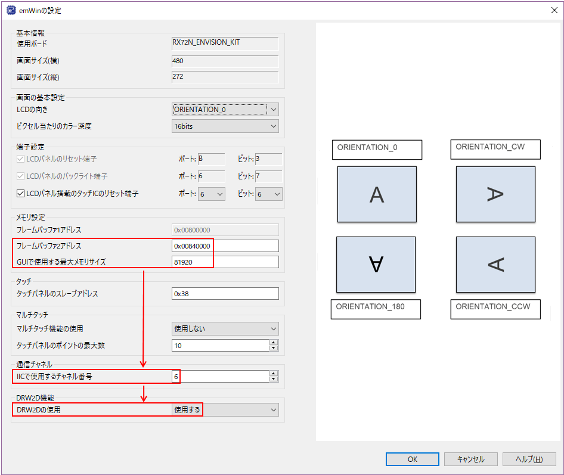</a>
    * When using QE for Display, [Set component](https://github.com/renesas/rx72n-envision-kit/wiki/How-to-use-the-Smart-Configurator#add-component) of SC regarding r_emwin_rx **is not required**
  * Generate the emWin setting file from **QE for Display**
     * Execute `LCD main RX (QE)` -> `Initial setting of GUI drawing tool` -> `Output file`
       * The output destination of default is directly under `.\rx72n_envision_kit\src`.
       * By checking `Specify file` and executing `Output file`, the output destination can be selected.
       * However, avoid putting under `.\rx72n_envision_kit\src\smc_gen`.
         * This is because the outputted file can be deleted by [Generate code](https://github.com/renesas/rx72n-envision-kit/wiki/How-to-use-the-Smart-Configurator#generate-code) of SC.
     * <a href="../../images/086_qe_main3.png" target="_blank">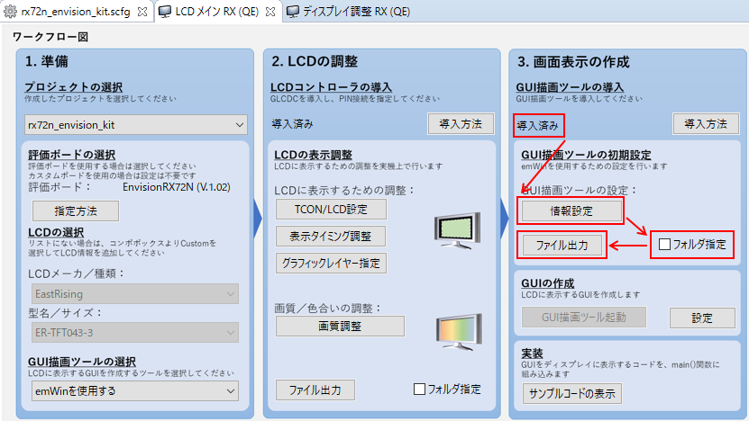</a>
* Refer to `LCD main RX (QE)` -> `Install GUI drawing tool` -> `how to install` for details of installing method.

# Set driver software/middle software with Smart Configurator (SC)
## Add component
* Since the necessary components have already been added with QE for Display, no operation is required here.

## Set component
* Perform setting for the components which are not covered by the setting of QE for Display.
### r_bsp
  * `Heap size`：`0x4000`
    * Default value of `Heap size` which is defined by BSP FIT module is insufficient for GUI drawing, specify larger size.
    * As for `Heap size`, specify larger value than that of `LCD main RX (QE)` -> `Set GUI drawing tool` -> `Maximum memory size which is used in GUI`
    * <a href="../../images/089_emwin_bsp.png" target="_blank">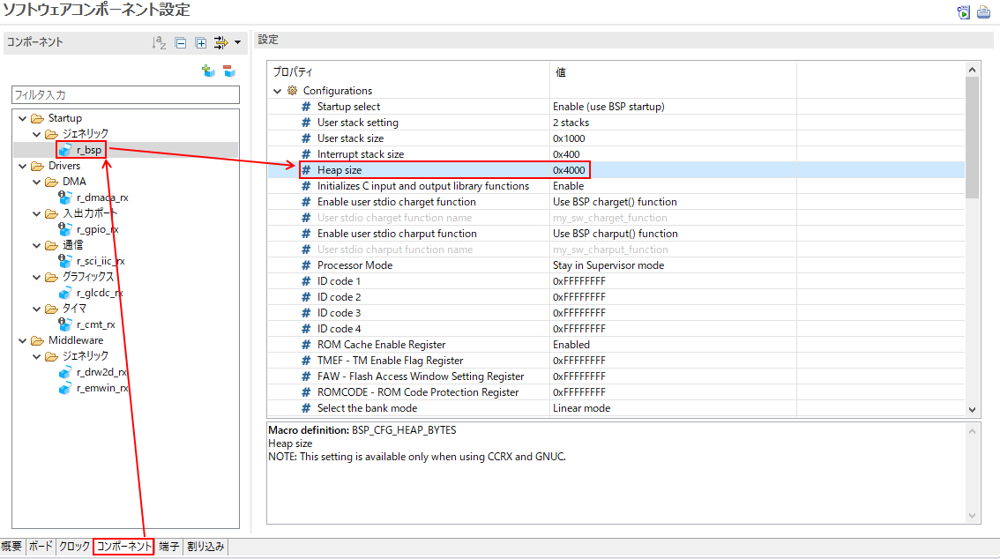</a>
### r_cmt_rx
  * No problem with default
### r_dmaca_rx
  * No problem with default
### r_drw2d_rx
  * None
### r_glcdc_rx
  * Since the setting is performed with QE for Display, no operation is required here.
### r_gpio_rx
  * No problem with default
### r_sci_iic_rx
  * `MCU supported channels for CH6`：`Supported`
  * `SCI6` -> `SSCL6 pin`：`Use`
  * `SCI6` -> `SSDA6 pin`：`Use`
  * <a href="../../images/090_emwin_iic1.png" target="_blank">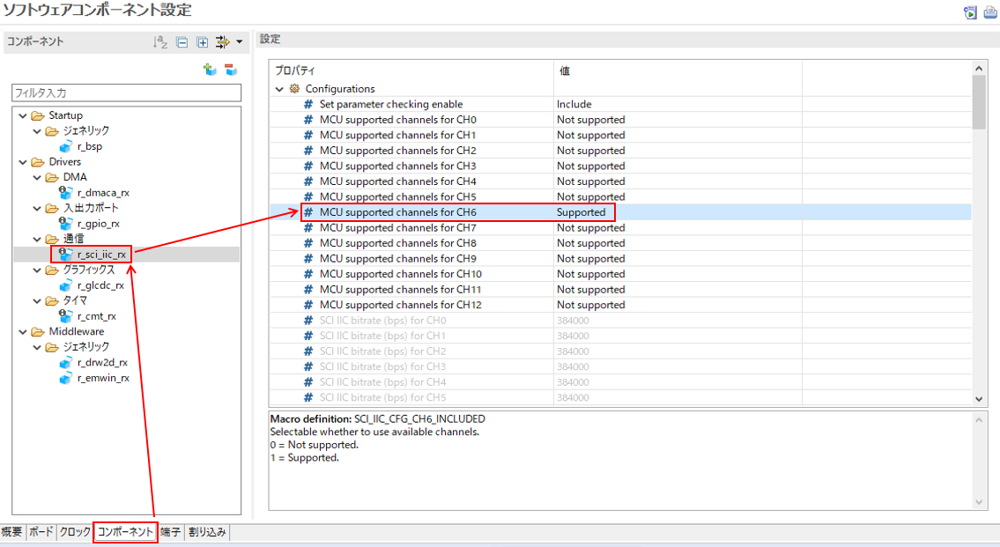</a>
  * <a href="../../images/091_emwin_iic2.png" target="_blank">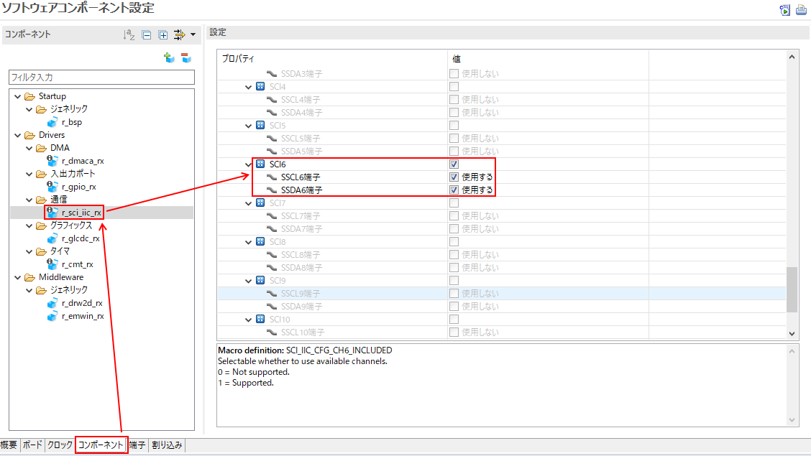</a>
### r_emwin_rx
  * Since the setting is performed with QE for Display, no operation is required here.

## Pin setting
* Since RX72N MCU assigns multiple functions to one pin, you need to perform the setting of which function to be used.
* If BDF of RX72N Envision Kit is used, the pin setting has already been performed. No operation is required.
* <a href="../../images/092_emwin_pin_iic.png" target="_blank">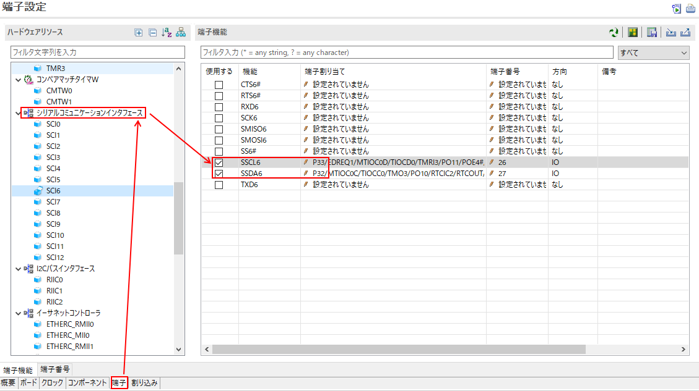</a>

## Generate code
* After all the settings mentioned above are completed, execute [Generate code](https://github.com/renesas/rx72n-envision-kit/wiki/How-to-use-the-Smart-Configurator#generate-code) of SC.

# Install GUI object with AppWizard.
## <a name="appwizard_install"></a>Install AppWizard
* Perform only for the first time
* Press `LCD main RX (QE)` -> `Create GUI` -> `Setting`, to display `Set AppWizard`window
* If `AppWizard is not installed` is displayed, <br>enter file path you want to install in `AppWizard install folder` -> <br>Press `Install AppWizarad`
* <a href="../../images/094_appwizard_install.png" target="_blank">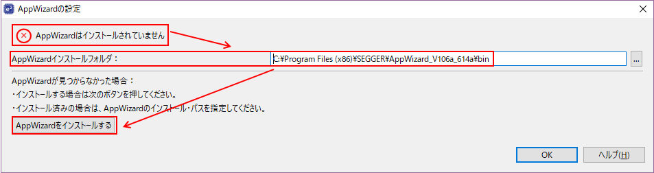</a>
* When the install wizard is displayed, follow the screen instructions to install AppWizard.
* Close `Set AppWizard` window
## Set AppWizard
* Press `LCD main RX (QE)` -> `Create GUI` -> `setting` to display `Set AppWizard` window
* If `AppWizard is installed` is displayed, press `OK`
  * <a href="../../images/095_appwizard_ok.png" target="_blank">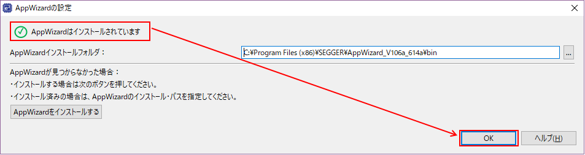</a>
* If `AppWizard is not installed` is displayed, perform either of the processings below.
  * If the display changes from `Enter file path in which AppWizard is installed in AppWizard install folder`  -> <br>`AppWizard is installed`, press `OK`
  * Execute [Install AppWizard](#appwizard_install)
## Install GUI object
### Boot AppWizard
* Press `LCD main RX (QE)` -> `Generate GUI` -> `Boot GUI drawing tool` and boot AppWizard.
* After booting AppWizard, check that `./aw/Resource` and `./aw/Source` are generated from the project tree of e2 studio.
### Design screen
* The basic flow of designing AppWizard screen is described below.
  1. Register `Resource`(`Text`, `Fonts`, `Images`, `Variables`)
  2. Locate/install GUI object
     1. Select an object which you want to locate from `Add objects` pane.
     2. Check that the object you selected is added to `Hierarchc tree` pane.
     3. Change the hierarchy of the object with `Hierarchc tree` pane.
     4. Change the location and size of the object with `Hierarchc tree` pane.
     5. Change the property of the object with `Properties` pane
  3. Register the event of the object and event handler (Slot) with `Interactions` pane.
  4.  Execute `File` -> `Export & Save` and output source code
     * <a href="../../images/097_appwizard_flow.png" target="_blank">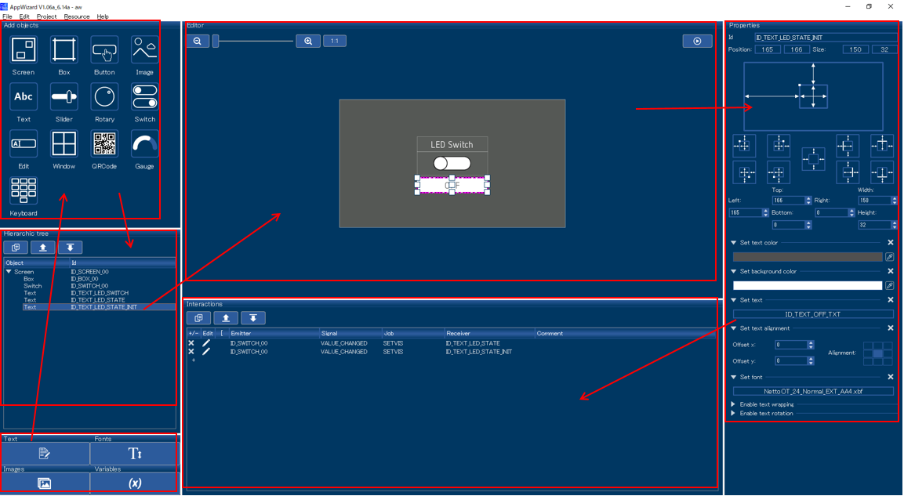</a>
* Make sure to locate an object, `Screen` on the top of `Hierarchc tree`

#### Register `Resource` 
##### <a name="text_definition"></a>`Text` resource
* Follow [How to register Text  resource](#text_resource) to generate `ID_TEXT_LED_SWITCH_TXT`と`ID_TEXT_OFF_TXT`
  * `Id`："ID_TEXT_LED_SWITCH_TXT"、`English`："LED Switch"
  * `Id`："ID_TEXT_OFF_TXT"、`English`："OFF"

#### Locate/set GUI object
##### `Screen` object
* Firstly, locate an object, `Screen`
  * Select `Add objects` -> `Screen`
  * Check that an object, `Screen` has been added at the top of `Hierarchc tree`
  * Check that an object, `Screen` is added to `Editor`.
  * Change `Properties`
    * `Id`："ID_SCREEN_00"
  * <a href="../../images/098_appwizard_screen.png" target="_blank">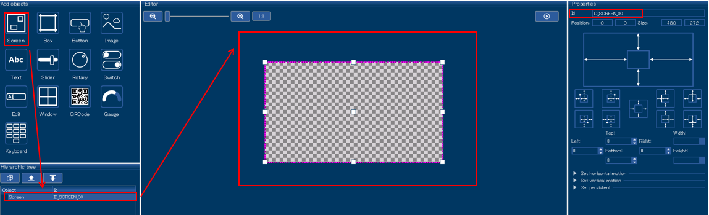</a>

##### `Box` object
* For the background, locate an object with the size of filling the `Box`screen.
  * Select `Add objects` -> `Box`
  * Check that an object, `Box` is added under `ID_SCREEN_00` with `Hierarchc tree`.
  * Check that an object, `Box` is added to `Editor`
    * Do not change the size (Full size must be used)
  * Change `Properties`
    * `Id`："ID_BOX_00"
    * Press the rectangular area in `Set color` to display color selection screen -> <br>Select the color for background（RGBA = (75, 75, 75, 255)）-> `OK`
  * <a href="../../images/099_appwizard_box.png" target="_blank">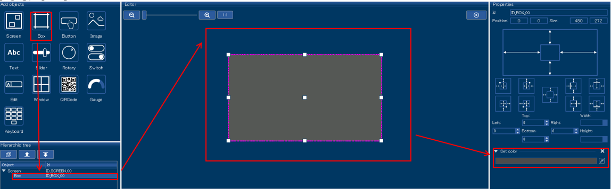</a>

##### `Switch` object
* Locate an object, `Switch` for the LED switch.
  * Select `Add objects` -> `Switch`
  * Check that an object, `Switch` is added under `ID_BOX_00` with `Hierarchc tree`
  * Check that an object, `Switch` is added to `Editor` 
  * Change the size of `Switch`, an object on `Editor`.
    * `Properties` -> `Size`：`150`, `50`
  * Drag and drop `Switch`, an object on "Editor" and move to the center of the screen
    * `Properties` -> `Position`：`165`, `111`
  * Change `Properties`
    * `Id`："ID_SWITCH_00"
    * `Set Bitmaps` -> `BG-Left`： `Left_80x30.png` -> `Select`
    * `Set Bitmaps` -> `BG-Right`： `Right_80x30.png` -> `Select`
    * `Set Bitmaps` -> `BG-Disabled`： `Disabled_80x30.png` -> `Select`
    * `Set Bitmaps` -> `Thumb-Left`： `ThumbLeft_80x30.png` -> `Select`
    * `Set Bitmaps` -> `Thumb-Right`： `ThumbRight_80x30.png` -> `Select`
    * `Set Bitmaps` -> `Thumb-Disabled`： `Disabled_80x30.png` -> `Select`
  * <a href="../../images/100_appwizard_switch.png" target="_blank">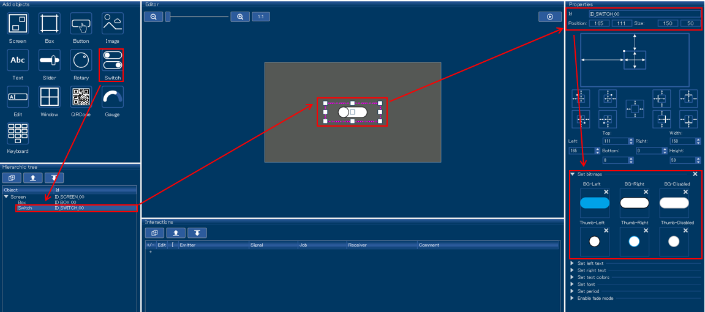</a>

##### `Text` object
* Locate `Text`, an object for letters indicating the use of the switch.
  * Select `Add objects` -> `Text`
  * Check that an object, `Text` has been added under `ID_SWITCH_00` with `Hierarchc tree`
  * Check that an object, `Text` is added to `Editor`
  * Change the size of `Text`, an object on `Editor`.
    * `Properties` -> `Size`：`150`, `32`
  * Drag and drop `Text`, an object on `Editor`, <br>and move it right above an object, `ID_SWITCH_00`.
    * `Properties` -> `Position`：`165`, `79`
  * Change `Properties`
    * `Id`："ID_TEXT_LED_SWITCH"
    * `Set text color`：RGBA = (255, 255, 255, 255) -> `OK`
    * `Set text alignment`：Center
    * `Set font`： `NettoOT_24_Normal_EXT_AA4` -> `Select`
  * <a href="../../images/101_appwizard_text1.png" target="_blank">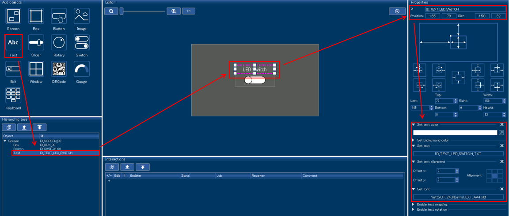</a>
* Locate `Text`, an object for letters to indicate the LED state according to the Switch state
  * Select `Add objects` -> `Text`
  * Check that an object, `Text` is added under `ID_TEXT_LED_SWITCH` with `Hierarchc tree`
  * Check that an object, `Text` is added to `Editor`
  * Change the size of `Text`, an object on `Editor`
    * `Properties` -> `Size`：`150`, `32`
  * Drag and drop `Text`, an object on the `Editor`, <br>and move it right beneath an object, `ID_SWITCH_00`
    * `Properties` -> `Position`：`165`, `79`
  * Change `Properties`
    * `Id`："ID_TEXT_LED_STATE"
    * `Set text alignment`：Center
    * `Set font`： `NettoOT_24_Normal_EXT_AA4` -> `Select`
  * <a href="../../images/102_appwizard_text2.png" target="_blank">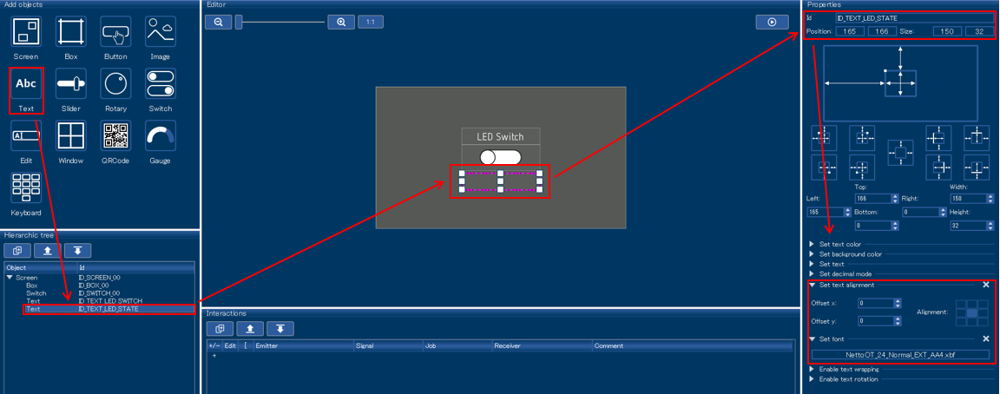</a>
* Locate `Text`, an object for letters indicating the initial state of the LED
  * Right-click `ID_TEXT_LED_STATE`of `Hierarchc tree` and select `Copy`
  * Right-click with `Hierarchc tree` and select `Paste`
  * Check that an object, `ID_TEXT_LED_COPY` is added under `ID_TEXT_LED_STATE` with `Hierarchc tree`.
  * Change `Properties`
    * `Id`："ID_TEXT_LED_STATE_INIT"
    * `Set text`：`ID_TEXT_OFF_TXT` -> `Select`
    * `Set text color`：RGBA = (80, 80, 80, 255) -> `OK`
    * `Set background color`：RGBA = (255, 255, 255, 255) -> `OK`
    * Other properties are the same as `ID_TEXT_LED_STATE`.
  * <a href="../../images/103_appwizard_text3.png" target="_blank">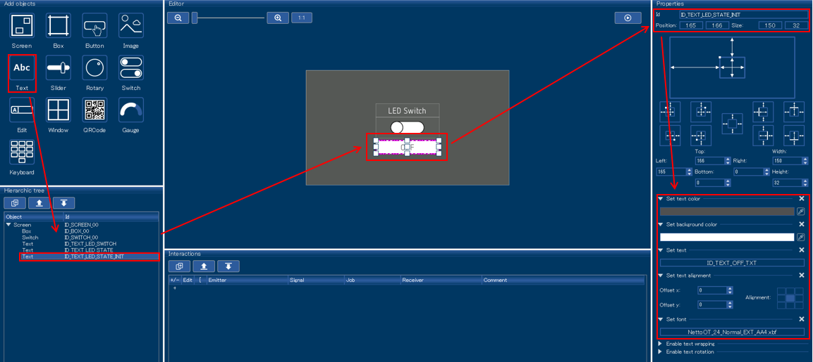</a>

#### Register Event
* Register event to display letters of LED state according to the switch state.
  * Press `Interactions` -> `+`
    * `Emitter`(Origin of the event)：`ID_SWITCH_00`
    * `Signal`(Event type)：`VALUE_CHANGED`(Event of value change)
    * `Job`(Task linked to the event occurrence )：`SETVIS`(Setting of object display/hide )
    * `Receiver`(Address of linked task)：`ID_TEXT_LED_STATE`
  * Press `pop-up set interaction parameters`window -> `Use custom defined value`
    * `Set visibility`：`On`
    * `Slot`：`ID_SCREEN_00__ID_SWITCH_00__WM_NOTIFICATION_VALUE_CHANGED__ID_TEXT_LED_STATE__APPW_JOB_SETVIS`
    * Since `Edit code`：AppWizard setting and  outputted source cord can be linked, After [Source code output](#code_generation_appwizard) of AppWizard [Edit](#code)
  * <a href="../../images/104_appwizard_interaction1.png" target="_blank">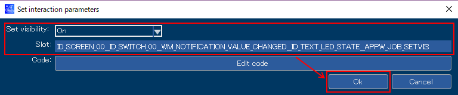</a>
* Register event to hide letters of initial value switch state.
  * Press `Interactions` -> `+`
    * `Emitter`(Origin of the event)：`ID_SWITCH_00`
    * `Signal`(Event type)：`VALUE_CHANGED`(Event of value change)
    * `Job`(Task linked to event occurrence)：`SETVIS`(Set display/hide of object)
    * `Receiver`(Address of linked task)：`ID_TEXT_LED_STATE_INIT`
  * Press pop-up `Set interaction parameters`window -> `Use custom defined value`
    * `Set visibility`：`Off`
    * `Slot`：`ID_SCREEN_00__ID_SWITCH_00__WM_NOTIFICATION_VALUE_CHANGED__ID_TEXT_LED_STATE_INIT__APPW_JOB_SETVIS`
    * `Edit code`：do not edit
  * <a href="../../images/105_appwizard_interaction2.png" target="_blank">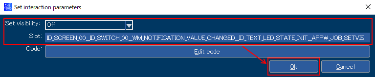</a>

#### Preview of GUI object
* When pressing the playback mark of `Editor` pane, preview of the located object is created.
  * This section is designed to preview the following state.
    * In initial state, the toggle of the switch is on the left at the center of the screen.
    * In initial state, white "LED Switch" display is right above the switch.
    * In initial state, white "LED Switch" letter display is above the switch.
    * In initial state, white square is right beneath the switch, and gray "OFF" letter display is inside it.
    * When click the switch, toggle switch moves to the right, <br>and the square and letter display right beneath the switch disappears.
      * After moving toggle, the square and letter display （`ID_TEXT_LED_STATE_INIT`） right beneath the switch disappears, which is the intended operation.
      * After moving toggle, `ID_TEXT_LED_STATE` should be displayed right beneath the switch, but letter display is changed by user source code, apparently no change.
    * When clicking the switch again, toggle switch moves to the left.
* <a href="../../images/106_appwizard_preview.png" target="_blank">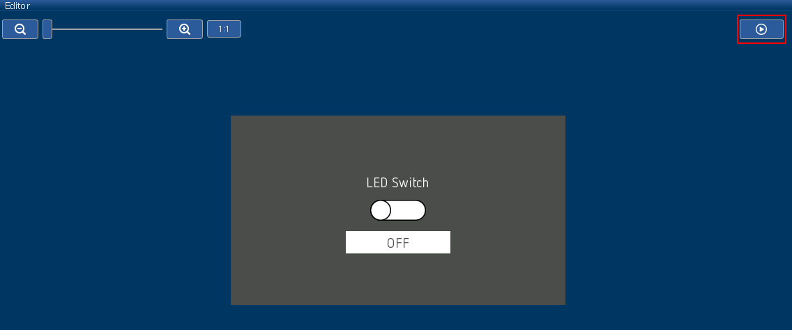</a>

#### <a name="code_generation_appwizard"></a>Output GUI object source code
* Execute `File` -> `Export & Save`
* Check that source code is outputted under `./aw/Source` (Special note is described below)
  * Related to `Resource`(Text, Fonts, Images, Variables) of Resource.h：AppWizard
  * ID_SCREEN_00.h：object `ID_SCREEN_00` and related to an object located inside it.
  * ID_SCREEN_00_Slots.c：object `ID_SCREEN_00`and related to Slot of an object located inside it.
  * Related to initialization/execution of GUI object generated with APPW_MainTask.c：AppWizard

# <a name="code"></a>Coding of user application block
## All the source code
* Describe all the source codes of `rx72n_envision_kit.c` below（Explained later）
```rx72n_envision_kit.c
#include "GUI.h"

void main(void);

void main (void)
{
    /* The follow function is generated by the AppWizard. */
    MainTask();
}
```
* Describe all the source codes of `ID_SCREEN_00_Slots.c` below（Explained later）
```ID_SCREEN_00_Slots.c
#include "Application.h"
#include "../Generated/Resource.h"
#include "../Generated/ID_SCREEN_00.h"

/*********************************************************************
*
*       Public code
*
**********************************************************************
*/
/*********************************************************************
*
*       cbID_SCREEN_00
*/
void cbID_SCREEN_00(WM_MESSAGE * pMsg) {
  GUI_USE_PARA(pMsg);
}

/*********************************************************************
*
*       ID_SCREEN_00__ID_SWITCH_00__WM_NOTIFICATION_VALUE_CHANGED__ID_TEXT_LED_STATE__APPW_JOB_SETVIS
*/
void ID_SCREEN_00__ID_SWITCH_00__WM_NOTIFICATION_VALUE_CHANGED__ID_TEXT_LED_STATE__APPW_JOB_SETVIS(APPW_ACTION_ITEM * pAction, WM_HWIN hScreen, WM_MESSAGE * pMsg, int * pResult) {
    GUI_USE_PARA(pAction);
    GUI_USE_PARA(hScreen);
    GUI_USE_PARA(pMsg);
    GUI_USE_PARA(pResult);

    int result = 0;
    /* Returns the state of a SWITCH widget. */
    result = SWITCH_GetState(pMsg->hWinSrc);
    if(SWITCH_STATE_RIGHT == result)
    {
        process_switch_on(pMsg->hWin);
    }
    else if(SWITCH_STATE_LEFT == result)
    {
        process_switch_off(pMsg->hWin);
    }
    else
    {
        process_switch_error(pMsg->hWin);
    }
}

/*********************************************************************
*
*       ID_SCREEN_00__ID_SWITCH_00__WM_NOTIFICATION_VALUE_CHANGED__ID_TEXT_LED_STATE_INIT__APPW_JOB_SETVIS
*/
void ID_SCREEN_00__ID_SWITCH_00__WM_NOTIFICATION_VALUE_CHANGED__ID_TEXT_LED_STATE_INIT__APPW_JOB_SETVIS(APPW_ACTION_ITEM * pAction, WM_HWIN hScreen, WM_MESSAGE * pMsg, int * pResult) {
  GUI_USE_PARA(pAction);
  GUI_USE_PARA(hScreen);
  GUI_USE_PARA(pMsg);
  GUI_USE_PARA(pResult);
}
```

* Describe all the source codes of `Application.h` below（Explained later）
```Application.h
#ifndef APPLICATION_H
#define APPLICATION_H
/* Custom code by Renesas */
#include "platform.h"
#include "AppWizard.h"

void process_switch_on(WM_HWIN hDisplayedText);
void process_switch_off(WM_HWIN hDisplayedText);
void process_switch_error(WM_HWIN hDisplayedText);
void led_on(void);
void led_off(void);
#endif  // RESOURCE_H
```

* Describe all the source codes of `Application.c` below （Explained later）
```Application.c
#include "Application.h"

void process_switch_on(WM_HWIN hDisplayedText)
{
    TEXT_SetText(hDisplayedText, "ON");
    TEXT_SetBkColor(hDisplayedText, GUI_WHITE);
    TEXT_SetTextColor(hDisplayedText, GUI_BLUE);
    led_on();
}

void process_switch_off(WM_HWIN hDisplayedText)
{
    TEXT_SetText(hDisplayedText, "OFF");
    TEXT_SetBkColor(hDisplayedText, GUI_WHITE);
    TEXT_SetTextColor(hDisplayedText, GUI_GRAY);
    led_off();
}

void process_switch_error(WM_HWIN hDisplayedText)
{
    TEXT_SetText(hDisplayedText, "ERROR");
    TEXT_SetBkColor(hDisplayedText, GUI_WHITE);
    TEXT_SetTextColor(hDisplayedText, GUI_RED);
    led_off();
}

void led_on(void)
{
    PORT4.PODR.BIT.B0 = 0;
}

void led_off(void)
{
    PORT4.PODR.BIT.B0 = 1;
}
```
## main() function
* Execute `MainTask()` function
  * `MainTask()` function executes the initialization and main processing of emWin and AppWizard.
  * `MainTask()` function is automatically generated by [Output source code](#code_generation_appwizard) of AppWizard.

## ID_SCREEN_00__ID_SWITCH_00__WM_NOTIFICATION_VALUE_CHANGED__ID_TEXT_LED_STATE__APPW_JOB_SETVIS() function
* Event handler when it acts on text, `ID_TEXT_LED_STATE` with toggle switch of switch, `ID_SWITCH_00` trigger
* Distribute the processing according to toggle state when switching.
  * Perform processing as switch on when toggle switches to the right.
  * Perform processing as switch off when toggle switches to the left.
  * Perform processing as error during toggle state other than the state mentioned above.

## process_switch_on() function
* Change the letter display of text, `ID_TEXT_LED_STATE` to "ON" （`TEXT_SetText()`）
* Change the background color of text, `ID_TEXT_LED_STATE` to white（`TEXT_SetBkColor()`）
* Change the letter color of text, `ID_TEXT_LED_STATE` to blue （`TEXT_SetTextColor()`）
* Turn on the LED（`led_on()`）

## process_switch_off() function
* Change the letter display of text, `ID_TEXT_LED_STATE` to "OFF" （`TEXT_SetText()`）
* Change the background color of text, `ID_TEXT_LED_STATE` to white （`TEXT_SetBkColor()`）
* Change the letter color of text, `ID_TEXT_LED_STATE` to gray （`TEXT_SetTextColor()`）
* Turn off the LED （`led_off()`）

## process_switch_error() function
* Change the letter display of text, `ID_TEXT_LED_STATE` to "ERROR"  （`TEXT_SetText()`）
* Change the background color of text `ID_TEXT_LED_STATE` to white color （`TEXT_SetBkColor()`）
* Change the letter color of text `ID_TEXT_LED_STATE` to red （`TEXT_SetTextColor()`）
* Turn off the LED（`led_off()`）

## led_on()、led_off() function
* Turn on/off each LED
* A port to control the LED is P40（[LED circuit diagram](https://github.com/renesas/rx72n-envision-kit/wiki/Generate-new-project-%28bare-metal%29#check-the-port-number-of-rx72n-connected-to-led)）

***


# <a name="additional"></a>Additional information

## About AppWizard
* Describe the key points to use AppWizard below
### AppWizard outline
* AppWizard is Windows application to support users' installment of GUI object mounted on emWin.
* Users can install and set GUI object, register event, simulate operation and even generate code while watching the screen.
### About GUI object
* The GUI object of emWin which can be used with AppWizard V1.06a_6.14a is as below （Unofficial explanation in Japanese is in the brackets below）
  * Screen（Screen which is a parent of all objects）
  * Box（Rectangle）
  * Button（Button）
  * Image（Image）
  * Text（Text display）
  * Slider（Slider bar）
  * Rotary（Round control knob）
  * Switch（Toggle switch with two values）
  * Edit（Text input column）
  * Window（Window screen）
  * QRCode（QR code）
  * Gauge（Semi-arch type progress gauge ）
  * Keyboard（Keyboard）
### AppWizard Tips
#### Relative location of GUI objects
* GUI object can store location relation with each other (similar to shape group function of Excel)
* Follow the steps below
  1. Select one of the GUI objects which you want to relate to
  2. Right-click and drag one of nine □s which appear on the four sides of GUI objects to display a red line or green line.
  3. Drag it to near the other GUI object which you want to relate to, and stop right-clicking when turning green.
  4. When releasing the relating, select location option of any of <a href="../../images/107_allign_option.png" target="_blank">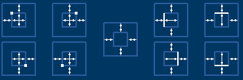</a>

#### GUI_USE_PARA macro
* Used for the purpose of preventing compiler warning caused by not using Slot routine function parameter.
  * Although all the parameters of Slot routine functions are always used in Slot routine, <br>use parameter artificially by using this macro.

#### Optimize GUI object size
* By right-clicking GUI object and selecting `Set size to content`, automatically adjust the size according to the object content

#### <a name="text_resource"></a>`Text` How to register resource
* Add `language` when first register
  * Input `New language` -> "English" -> `OK`
* Add Text definition
  * When pressing `Add text`, Text definition is added newly.
  * Press Text definition which is added newly -> Change `Id` to any identification character -> <br>Input character string which you want to define `English`page（Item created with `New language`）
* Update Text definition with `Applay`

#### Edit Slot function outputted as event handler(Slot)
* Edit content of Slot function in source file which was outputted as Slot is linked.
* However, please note that link might break and **edit content might not be reflected** in the following case.
  * Delete either Slot or Slot function in source file.
  *Change `Receiver` and so on with `Interactions` pane of AppWizard
  * Other cases might happen
