# Purpose
* Communicate with SD mode micro SD card via FAT file system "[TFAT](https://www.renesas.com/products/software-tools/software-os-middleware-driver/file-system/m3s-tfat-tiny-for-rx.html)" with SDHI.
* During micro SD card insertion, turning the LED on and off. During the removal, turn off the LED.
* After inserting micro SD card, automatically creates folder and file on micro SD card.

# Things to prepare
* Indispensable
  * RX72N Envision Kit × 1 unit
  * USB cable (USB Micro-B --- USB Type A) × 1 
  * Windows PC × 1 unit
    * Tools to be installed in Windows PC 
      * e2 studio 2020-07 or later
        * Initial booting sometimes takes time
          * CC-RX V3.02 or later
  * micro SD card (Any of SD, SDHI, or SDXC standard) × 1 

# Prerequisite
 * [Generate new project (bare metal)](../../bare-metal/generate-new-project.md) must be completed.
   * In this section, implements by adding the code to communicate with micro SD card via FAT file system, TFAT to LED0.1 second cycle blinking program which was created in [Generate new project (bare metal)](../../bare-metal/generate-new-project.md)
  * Use the latest [RX Driver Package](https://www.renesas.com/products/software-tools/software-os-middleware-driver/software-package/rx-driver-package.html)(FIT module)
  * Format the micro SD card with FAT32 in advance.
* Please understand the condition of use for about SD card Simplified Spec.
  * https://www.sdcard.org/downloads/pls/

# <a name="circuit_SDHI"></a>Check circuit
* Micro SD slot is connected to MCU via SDHI interface.
* In RX72N Envision Kit, the following signals and ports are assigned to micro SD slot.
  * <a href="../../images/067_circuit_sdhi.png" target="_blank">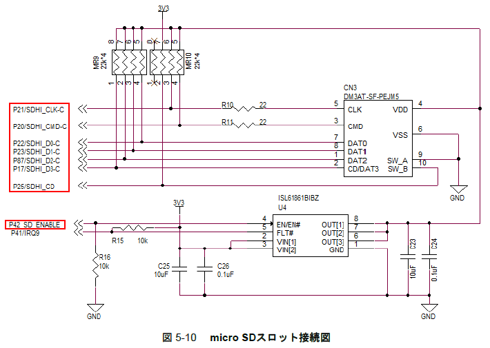</a>
  * <a href="../../images/068_pin_assign_table_sd.png" target="_blank">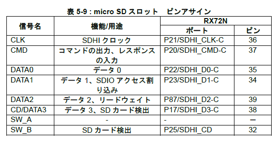</a>
* RX72N Envision Kit uses power management circuit and controls the power supply output with MCU to protect 3.3V power supply output to SDHI from overload and short circuit.
  * In this circuit, the signal line for power supply output is ```P42_SD_ENABLE```(assigned to port 42)

# Set driver software/middle software with Smart Configurator (SC)
## Check BDF
* Check that BDF```EnvisionRX72N``` is applied to the project. （Refer to [How to use Smart Configurator#Board setting](https://github.com/renesas/rx72n-envision-kit/wiki/How-to-use-the-Smart-Configurator#set-board)）
  * If it is not applied, refer to [How to use Smart Configurator#board setting](https://github.com/renesas/rx72n-envision-kit/wiki/How-to-use-the-Smart-Configurator#set-board) 

## Add component
* By referring to [How to use Smart Configurator#Component import](https://github.com/renesas/rx72n-envision-kit/wiki/How-to-use-the-Smart-Configurator#add-component), add the following five components.
  * r_sdhi_rx
  * r_sys_time_rx
  * r_sdc_sdmem_rx
  * r_tfat_driver_rx
  * r_tfat_rx
* <a href="../../images/069_setting_component.png" target="_blank">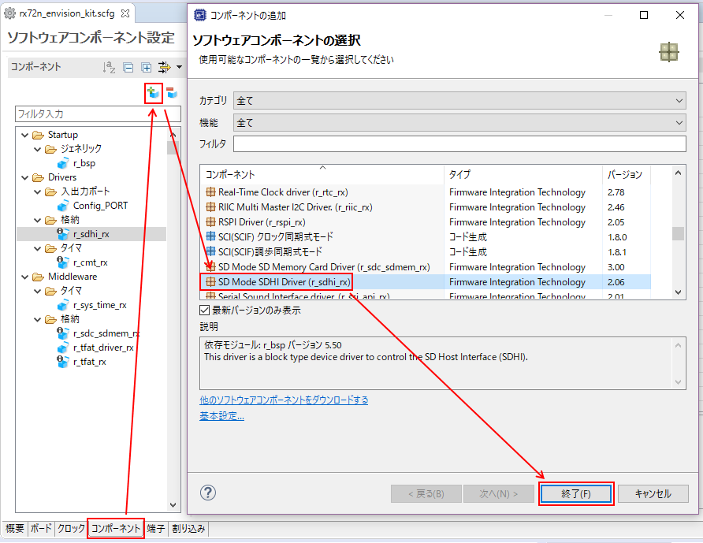</a>

## Set component
### r_sdhi_rx
* Perform SDHI related settings
  * Use SDHI channel0
  * <a href="../../images/070_setting_sdhi1.png" target="_blank">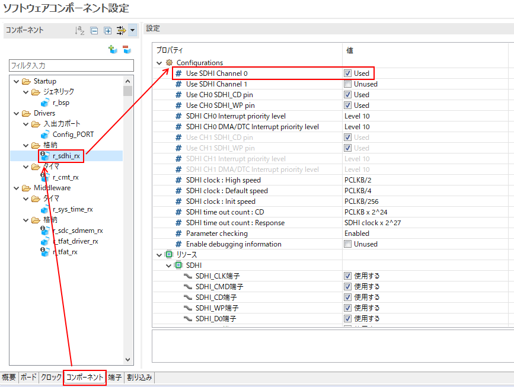</a>
* Perform Setting to use SDHI related pins
  * Use CLK, CMD, CD, WP, D0, D1, D2, D3 pins
    * :point_right: [Supplement] Although WP pin is not installed in RX72N Envision Kit, perform the setting to use it.
  
  * <a href="../../images/071_setting_sdhi2.png" target="_blank">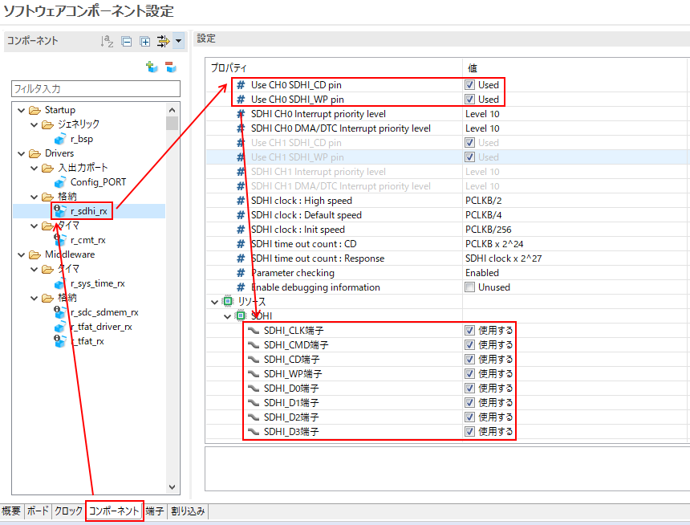</a>
### r_sys_time_rx
* None
### r_sdc_sdmem_rx
* Perform the setting of SD mode SD card control realted.
  * How to check protocol status：Hardware interrupt, Data transfer method：Software transfer
  * <a href="../../images/072_setting_sdc_sdmem.png" target="_blank">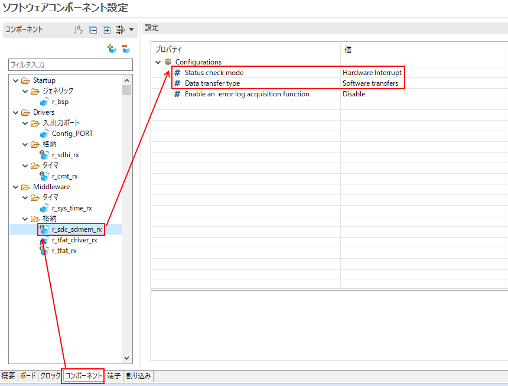</a>
### r_tfat_driver_rx
* Perform setting of TFAT driver I/F related
  * The number of drive which is used for SD card：1, The driver which is used for SD card：Drive 0
    * :point_right: [Supplement] TFAT can connect up to10 media such as SD card/USB memory/eMMC card/Serial Flash memory（[Reference](#TFAT_multi_connection)）
  * <a href="../../images/073_setting_tfat_driver_sdc.png" target="_blank">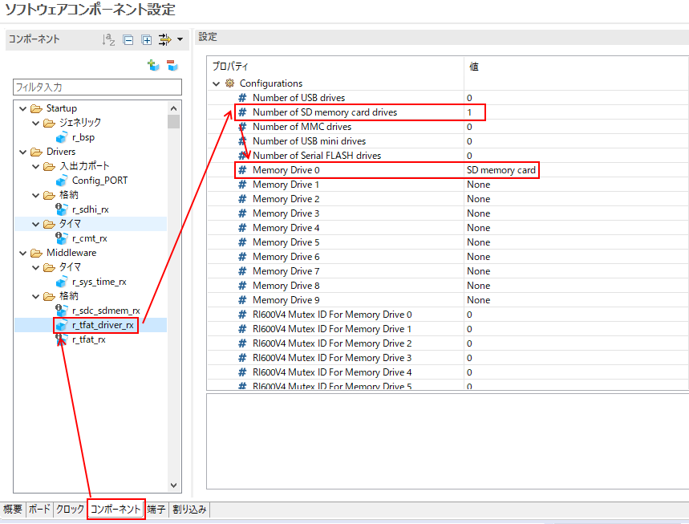</a>
### r_tfat_rx
* None
### r_bsp
  * No problem with the default setting
### r_cmt_rx
  * No problem with the default setting
## Pin setting
* Since RX72 MUC assigns multiple functions to one pin, you have to perform the setting of which function to be used with software.
* When using BDF of RX72N Envision Kit, the setting has been already performed. You don't need to perform it.
  * :point_right: [Supplement] However, although WP pin is not installed in RX72N Envision Kit, perform the setting to use it.

* <a href="../../images/074_setting_pin_sdhi.png" target="_blank">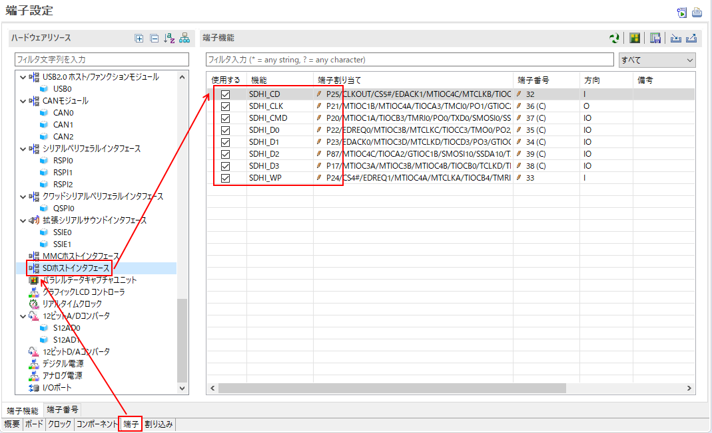</a>
## Generate code
* After completing the above mentioned settings, execute [Code generation](https://github.com/renesas/rx72n-envision-kit/wiki/how to use smart configurator#code_generation) of SC.

# Coding of user application block
## All the source code
* Describe all the source codes of ```rx72n_envision_kit.c``` below （To be explained later）
```rx72n_envision_kit.c
#include "platform.h"
#include "r_smc_entry.h"
#include "r_sdhi_rx_pinset.h"
#include "r_cmt_rx_if.h"
#include "r_sys_time_rx_if.h"
#include "r_sdc_sd_rx_if.h"
#include "r_sdc_sd_rx_config.h"
#include "r_tfat_driver_rx_config.h"

#define PERFORMANCE_MESUREMENT_DATA_SIZE 1024 * 20 /* 20KB */

typedef enum{
    NO_INITIALIZED = 0,
    IDLE,
    ON_PROCESS, /* Prevent from processing another task */
    REQUEST_SDC_DETECTION_TASK,
    REQUEST_SDC_INSERTION_TASK,
    REQUEST_SDC_REMOVAL_TASK,
} app_status_t;

uint8_t g_drv_tbl[TFAT_SDMEM_DRIVE_NUM];
uint32_t g_sdc_sd_work[TFAT_SDMEM_DRIVE_NUM][50];
FATFS g_fatfs[TFAT_SDMEM_DRIVE_NUM];
FIL g_file[TFAT_SDMEM_DRIVE_NUM];
app_status_t g_app_status = NO_INITIALIZED;
uint8_t g_oneshot_timer_flg = 0;
const uint8_t data_to_write[PERFORMANCE_MESUREMENT_DATA_SIZE] =
{
    0x52, 0x65, 0x6E, 0x65, 0x73, 0x61, 0x73, 0x0a,
}; /* 8 bytes data: Renesas\n */
uint8_t data_to_read[PERFORMANCE_MESUREMENT_DATA_SIZE];

void main(void);
static void initialize_sdc_demo (void);
sdc_sd_status_t r_sdc_sd_cd_callback (int32_t cd);
void set_status_sdc_detection(void);
void card_detection(void);
void process_on_sdc_insertion (void);
void process_on_sdc_removal (void);
void initialize_sdc_on_insertion (uint32_t sdc_no);
void deinitialize_sdc_on_insertion (uint32_t sdc_no);
sdc_sd_status_t r_sdc_sd_callback (int32_t channel);
void tfat_sample (void);
sdc_sd_status_t r_sdc_sdmem_demo_power_init(uint32_t card_no);
sdc_sd_status_t r_sdc_sdmem_demo_power_on(uint32_t card_no);
sdc_sd_status_t r_sdc_sdmem_demo_power_off(uint32_t card_no);
sys_time_err_t wait_milliseconds (uint32_t interval_milliseconds);
void set_oneshot_timer_flg (void);
static void error_trap_r_sdc_sd (uint32_t sdc_sd_card_no);
void blink_LED(void);

void cmt_1us_callback(void *arg);
void _1us_timer_reset(void);
void _1us_timer_stop(void);
void _1us_timer_start(void);
uint32_t _1us_timer_get(void);

uint32_t _1us_timer;
volatile uint32_t _1us_timer_flag;

void main (void)
{
	uint32_t cmt_channel;

    /* Initialize for this demo program */
    initialize_sdc_demo();
    R_CMT_CreatePeriodic(1000000, cmt_1us_callback, &cmt_channel);

    /* Process tasks by a current status */
    while (1)
    {
        switch (g_app_status)
        {
        case NO_INITIALIZED:
            return;
        case IDLE:
            break;
        case ON_PROCESS:
            break;
        case REQUEST_SDC_DETECTION_TASK:
            card_detection();
            break;
        case REQUEST_SDC_INSERTION_TASK:
            process_on_sdc_insertion();
            break;
        case REQUEST_SDC_REMOVAL_TASK:
            process_on_sdc_removal();
            break;
        default:
            return;
        }
    }
}

static void initialize_sdc_demo (void)
{
    uint32_t cmt_channel;
    SYS_TIME sys_time;
    sdc_sd_status_t sdc_sd_status = SDC_SD_SUCCESS;

    /* Initialize global variables for this demo */
    g_app_status = NO_INITIALIZED;
    g_oneshot_timer_flg = 0;

    /* Initialize pin settings for SDHI.
     * This function is generated by SDHI FIT's pin settings of the Smart Configurator */
    R_SDHI_PinSetInit();

    /* System timer settings */
    R_SYS_TIME_Open();
    sys_time.year = 2020;
    sys_time.month = 1;
    sys_time.day = 1;
    sys_time.hour = 0;
    sys_time.min = 0;
    sys_time.sec = 0;
    R_SYS_TIME_SetCurrentTime( &sys_time);

    /* SD card driver Initialization */
    r_sdc_sdmem_demo_power_init(SDC_SD_CARD_NO0);
    sdc_sd_status = R_SDC_SD_Open(SDC_SD_CARD_NO0, SDHI_CH0, &g_sdc_sd_work[SDC_SD_CARD_NO0]);
    if (SDC_SD_SUCCESS != sdc_sd_status)
    {
        /* Function error_trap_r_sdc_sd() can not called because R_SDC_SD_GetErrCode initially needs R_SDC_SD_Open */
        printf("ERROR: R_SDC_SD_Open. Error code (sdc_sd_status_t) is %d.\n", sdc_sd_status);
        while (1)
        {
            R_BSP_NOP();
        }
    }

    /* Register callback when SD card is inserted/removed */
    sdc_sd_status = R_SDC_SD_CdInt(SDC_SD_CARD_NO0, SDC_SD_CD_INT_ENABLE, r_sdc_sd_cd_callback);
    if (SDC_SD_SUCCESS != sdc_sd_status)
    {
        error_trap_r_sdc_sd(SDC_SD_CARD_NO0);
    }

    /* Setting of internal timer of SD card driver */
    R_CMT_CreatePeriodic(1000, (void (*) (void *)) R_SDC_SD_1msInterval, &cmt_channel);

    /* Table between SD card number of SD card driver and dirve number of TFAT */
    g_drv_tbl[SDC_SD_CARD_NO0] = TFAT_DRIVE_NUM_0;

    /* Set status to check the SD card insertion/removal every 10 ms,
     * then process file system tasks when occurring SD card's insertion */
    if (SYS_TIME_SUCCESS == R_SYS_TIME_RegisterPeriodicCallback(set_status_sdc_detection, 1))
    {
        printf("!!! Ready for this demo. Attach SD card. !!!\n");
        g_app_status = IDLE;
    }
}

sdc_sd_status_t r_sdc_sd_cd_callback (int32_t cd)
{
    sdc_sd_status_t sdc_sd_status = SDC_SD_SUCCESS;

    sdc_sd_status = R_SDC_SD_CdInt(SDC_SD_CARD_NO0, SDC_SD_CD_INT_DISABLE, 0);
    if (SDC_SD_SUCCESS != sdc_sd_status)
    {
        error_trap_r_sdc_sd(SDC_SD_CARD_NO0);
    }
    return SDC_SD_SUCCESS;
}

void set_status_sdc_detection (void)
{
    if (IDLE == g_app_status)
    {
        g_app_status = REQUEST_SDC_DETECTION_TASK;
    }
}

void card_detection (void)
{
    static sdc_sd_status_t sdc_sd_card_detection = SDC_SD_ERR;
    static sdc_sd_status_t previous_sdc_sd_card_detection = SDC_SD_ERR;

    g_app_status = ON_PROCESS;

    sdc_sd_card_detection = R_SDC_SD_GetCardDetection(SDC_SD_CARD_NO0);
    if (previous_sdc_sd_card_detection != sdc_sd_card_detection)
    {
        previous_sdc_sd_card_detection = sdc_sd_card_detection;

        if (SDC_SD_SUCCESS == sdc_sd_card_detection)
        {
            /* Detected attached SD card */
            printf("Detected attached SD card.\n");
            g_app_status = REQUEST_SDC_INSERTION_TASK;
        }
        else
        {
            /* Detected detached SD card */
            printf("Detected detached SD card.\n");
            g_app_status = REQUEST_SDC_REMOVAL_TASK;

        }
    }
    else /* if (previous_sdc_sd_card_detection != sdc_sd_card_detection) */
    {
        g_app_status = IDLE;
    }
}

void process_on_sdc_insertion (void)
{
    g_app_status = ON_PROCESS;

    /* SD card initialization */
    initialize_sdc_on_insertion(SDC_SD_CARD_NO0);

    /* Start of blinking LED per 500 ms */
    R_SYS_TIME_RegisterPeriodicCallback(blink_LED, 50);

    /* Process file system tasks */
    if (TFAT_DRIVE_NUM_0 == g_drv_tbl[SDC_SD_CARD_NO0])
    {
        tfat_sample();
    }

    /* SD card de-initialization */
    deinitialize_sdc_on_insertion(SDC_SD_CARD_NO0);

    printf("!!! Detach SD card !!!.\n");
    g_app_status = IDLE;
}

void process_on_sdc_removal (void)
{
    g_app_status = ON_PROCESS;

    r_sdc_sdmem_demo_power_off(SDC_SD_CARD_NO0);

    /* End of blinking LED */
    R_SYS_TIME_UnregisterPeriodicCallback(blink_LED);
    PORT4.PODR.BIT.B0 = 1; /* LED off */

    g_app_status = IDLE;
}

void initialize_sdc_on_insertion (uint32_t sdc_no)
{
    sdc_sd_status_t sdc_sd_status = SDC_SD_SUCCESS;
    sdc_sd_cfg_t sdc_sd_config;

    r_sdc_sdmem_demo_power_on(sdc_no);
    R_SDHI_PinSetTransfer();
    R_SDC_SD_IntCallback(sdc_no, r_sdc_sd_callback);
    sdc_sd_config.mode = SDC_SD_CFG_DRIVER_MODE;
    sdc_sd_config.voltage = SDC_SD_VOLT_3_3;
    sdc_sd_status = R_SDC_SD_Initialize(sdc_no, &sdc_sd_config,
            SDC_SD_MODE_MEM);
    if (SDC_SD_SUCCESS != sdc_sd_status)
    {
        error_trap_r_sdc_sd(sdc_no);
    }
}

void deinitialize_sdc_on_insertion (uint32_t sdc_no)
{
    sdc_sd_status_t sdc_sd_status = SDC_SD_SUCCESS;

    sdc_sd_status = R_SDC_SD_End(sdc_no, SDC_SD_MODE_MEM);
    if (SDC_SD_SUCCESS != sdc_sd_status)
    {
        error_trap_r_sdc_sd(sdc_no);
    }
}

sdc_sd_status_t r_sdc_sd_callback (int32_t channel)
{
    return SDC_SD_SUCCESS;
}

void tfat_sample (void)
{
    const char *drv0 = "0:";
    const char *path_fld = "0:FLD";
    const char *path_txt = "0:FLD/TEXT.TXT";
    uint8_t drv_no = TFAT_DRIVE_NUM_0;
    FRESULT rst;
    UINT file_rw_cnt;

    printf("Start TFAT sample.\n");

    /* Mount the file system (Note delayed mounting) */
    rst = f_mount( &g_fatfs[drv_no], drv0, 0);
    if (FR_OK != rst)
    {
        printf("TFAT Error: Drive mount.\n");
    }

    /* Create the directory */
    rst = f_mkdir(path_fld);
    if (FR_EXIST == rst)
    {
        printf("TFAT Error: Directory \"FLD\" is already existing.\n");
    }
    else if (FR_OK != rst)
    {
        printf("TFAT Error: Directory creation.\n");
    }

    /* Create the file to be written */
    rst = f_open( &g_file[drv_no], path_txt, FA_CREATE_ALWAYS | FA_WRITE);
    if (FR_OK != rst)
    {
        printf("TFAT Error: File creation and open.\n");
    }
    /* Complete file open */

	_1us_timer_reset();
	_1us_timer_start();
    /* Copy the contents to the newly created file */
    rst = f_write( &g_file[drv_no], (void *) data_to_write, sizeof(data_to_write), &file_rw_cnt);
    if (rst != FR_OK || file_rw_cnt < sizeof(data_to_write))
    {
        printf("TFAT Error: File writing operation.\n");
    }
    /* file write complete */
	_1us_timer_stop();
	printf("file write %d bytes takes %d us, throughput = %f Mbps\n", sizeof(data_to_write), _1us_timer_get(), (float)((sizeof(data_to_write) * 8) / (float)((float)_1us_timer_get() / (1000000))/1000000));

    /* Close the file */
    rst = f_close( &g_file[drv_no]);
    if (FR_OK != rst)
    {
        printf("TFAT Error: File close.\n");
    }

    /* Create the file to be written */
    rst = f_open( &g_file[drv_no], path_txt, FA_READ);
    if (FR_OK != rst)
    {
        printf("TFAT Error: File creation and open.\n");
    }
    /* Complete file open */

	_1us_timer_reset();
	_1us_timer_start();
    /* Read the contents from the file */
    rst = f_read( &g_file[drv_no], (void *) data_to_read, sizeof(data_to_read), &file_rw_cnt);
    if (rst != FR_OK || file_rw_cnt < sizeof(data_to_read))
    {
        printf("TFAT Error: File reading operation.\n");
    }
    /* file write complete */
	_1us_timer_stop();
	printf("file read %d bytes takes %d us, throughput = %f Mbps\n", sizeof(data_to_write), _1us_timer_get(), (float)((sizeof(data_to_write) * 8) / (float)((float)_1us_timer_get() / (1000000))/1000000));

    /* Close the file */
    rst = f_close( &g_file[drv_no]);
    if (FR_OK != rst)
    {
        printf("TFAT Error: File close.\n");
    }

    printf("End TFAT sample.\n");
}

sdc_sd_status_t r_sdc_sdmem_demo_power_init (uint32_t card_no)
{
    if (SDC_SD_CARD_NO0 == card_no)
    {
        PORT4.PMR.BIT.B2 = 0x00;
        PORT4.PCR.BIT.B2 = 0x00;
        PORT4.PODR.BIT.B2 = 0x00;     /* SDHI_POWER off */
        PORT4.PDR.BIT.B2 = 0x01;
    }
    return SDC_SD_SUCCESS;
}

sdc_sd_status_t r_sdc_sdmem_demo_power_on (uint32_t card_no)
{
    /* ---- Power On ---- */
    if (SDC_SD_CARD_NO0 == card_no)
    {
        PORT4.PODR.BIT.B2 = 0x01;     /* SDHI_POWER on */
        if (1 == PORT4.PODR.BIT.B2)
        {
            /* Wait for the write completion */
            R_BSP_NOP();
        }
    }

    /* ---- Supplies the Power to the SD Card and waits for 100 ms ---- */
    if(SYS_TIME_SUCCESS != wait_milliseconds(100))
    {
        return SDC_SD_ERR;
    }

    return SDC_SD_SUCCESS;
}


sdc_sd_status_t r_sdc_sdmem_demo_power_off (uint32_t card_no)
{
    /* ---- Power Off ---- */
    if (SDC_SD_CARD_NO0 == card_no)
    {
        PORT4.PODR.BIT.B2 = 0x00;     /* SDHI_POWER off */
        if (1 == PORT4.PODR.BIT.B2)
        {
            /* Wait for the write completion */
            R_BSP_NOP();
        }
    }

    /* ---- Stops the Power to the SD Card and waits for 100 ms ---- */
    if(SYS_TIME_SUCCESS != wait_milliseconds(100))
    {
        return SDC_SD_ERR;
    }

    return SDC_SD_SUCCESS;
}

sys_time_err_t wait_milliseconds (uint32_t interval_milliseconds)
{
    sys_time_err_t sys_time_err = SYS_TIME_ERR_BAD_INTERVAL;
    uint32_t interval_10milliseconds;

    if (1 == g_oneshot_timer_flg)
    {
        return sys_time_err;
    }
    interval_10milliseconds = interval_milliseconds / 10;
    sys_time_err = R_SYS_TIME_RegisterPeriodicCallback(set_oneshot_timer_flg, interval_10milliseconds);
    if (SYS_TIME_SUCCESS != sys_time_err)
    {
        return sys_time_err;
    }
    while(0 == g_oneshot_timer_flg)
    {
        R_BSP_NOP();
    }
    sys_time_err = R_SYS_TIME_UnregisterPeriodicCallback(set_oneshot_timer_flg);
    g_oneshot_timer_flg = 0;
    return sys_time_err;
}

void set_oneshot_timer_flg (void)
{
    g_oneshot_timer_flg = 1;
}

static void error_trap_r_sdc_sd (uint32_t sdc_sd_card_no)
{
    sdc_sd_status_t err_code;

    err_code = R_SDC_SD_GetErrCode(sdc_sd_card_no);

    R_SDC_SD_Log(0x00000001, 0x0000003f, 0x0001ffff);

    printf("ERROR: error code (sdc_sd_status_t) is %d.\n", err_code);
    while (1)
    {
        R_BSP_NOP();
    }
}

void blink_LED(void)
{
    if(PORT4.PIDR.BIT.B0 == 1)
    {
        PORT4.PODR.BIT.B0 = 0;
    }
    else
    {
        PORT4.PODR.BIT.B0 = 1;
    }
}

void cmt_1us_callback(void *arg)
{
	if(_1us_timer_flag)
	{
		_1us_timer++;
	}
}

void _1us_timer_reset(void)
{
	_1us_timer = 0;
}

void _1us_timer_stop(void)
{
	_1us_timer_flag = 0;
}

void _1us_timer_start(void)
{
	_1us_timer_flag = 1;
}

uint32_t _1us_timer_get(void)
{
	return _1us_timer;
}
```
## Check operation
* Build
* Download
    * https://github.com/renesas/rx72n-envision-kit/wiki/%E6%96%B0%E8%A6%8F%E3%83%97%E3%83%AD%E3%82%B8%E3%82%A7%E3%82%AF%E3%83%88%E4%BD%9C%E6%88%90%E6%96%B9%E6%B3%95#%E5%8B%95%E4%BD%9C%E7%A2%BA%E8%AA%8D
* Open Renesas Debug Virtual Console of e2 studio which is the output destination of printf() in advance.
    * Renesas view -> Debug -> Renesas Debug Virtual Console
* Execute
    * Outputted on Renesas Debug Virtual Console as shown below.
```
!!! Ready for this demo. Attach SD card. !!!
Detected attached SD card.
Start TFAT sample.
TFAT Error: Directory "FLD" is already existing.
file write 20480 bytes takes 5802 us, throughput = 28.238539 Mbps
file read 20480 bytes takes 3368 us, throughput = 48.646080 Mbps
End TFAT sample.
!!! Detach SD card !!!.
```

* Using CRC arithmetic unit mounted on MCU realize higher-speed?　★Consideration required
    * CRC arithmetic unit mounted on SDHI have been used.
        * But, SDIO driver side seems to process software. This could be solved.
            * https://github.com/renesas/rx-driver-package/blob/153ad8704a7b9b368f53546d006d763c83799664/source/r_sdc_sdio_rx/r_sdc_sdio_rx_vx.xx/r_sdc_sdio_rx/src/sdio/r_sdc_sdio_crc.c

## main() function
* Execute the following processing
  * Initialize demo program ```initialize_sdc_demo()```
  * Loop which separates the execution processing according to the state of the application.
## initialize_sdc_demo() function
* Execute the following processing
  * Initialize SDHI pin
  * Initialize r_sys_time_rx
  * Initialize SDHI power supplying pin ```r_sdc_sdmem_demo_power_init()```
  * Initialize r_sdc_sdmem_rx
  * Register the function to require SD card insertion and removal status check ```set_status_sdc_detection()``` on <br>Cycle Execution Handler ```R_SYS_TIME_RegisterPeriodicCallback()```.
    * :point_right: [Supplement] Up to 30 function pointers can be registered in ```R_SYS_TIME_RegisterPeriodicCallback()```
  * Another initialization processing
## card_detection() function
* Execute the following processing（Executed during ```REQUEST_SDC_DETECTION_TASK``` status）
  * Check the status of SD card insertion and removal
## process_on_sdc_insertion() function
* Execute the following processing （Executed during ```REQUEST_SDC_INSERTION_TASK``` status）
  * Initialize the SD card connection after the SD card insertion ```initialize_sdc_on_insertion()```
  * Start turning on and off the LED
  * Utilize the file system ```tfat_sample()```
  * End SD connection ```deinitialize_sdc_on_insertion()```
## initialize_sdc_on_insertion() function
* Execute the following processing
  * Turn on the SDHI power supply ```r_sdc_sdmem_demo_power_on()```
  * Initialize the SD card ```R_SDC_SD_Initialize()```
## tfat_sample() function
* Execute the following processing
  * Utilize the file system
    * Mount ```f_mount()```
    * Create folder ```f_mkdir()```
    * Open file ```f_open()```
    * Write file ```f_write()```
    * Close file ```f_close()```
## deinitialize_sdc_on_insertion() function
* Execute the following processing
  * End the SD connection ```R_SDC_SD_End()```
## process_on_sdc_removal() function
* Execute the following processing （Executed during ```REQUEST_SDC_REMOVAL_TASK``` status）
  * Turn off the SDHI power supply ```r_sdc_sdmem_demo_power_off()```
  * End turning on and off the LED
## r_sdc_sdmem_demo_power_init()、r_sdc_sdmem_demo_power_on()、r_sdc_sdmem_demo_power_off() function
* Execute the following processing
  * Initialize to supply power for SDHI and turn on/off power supply 
    * The port to control the SDHI power supply is P42 （[SDHI circuit diagram](#circuit_SDHI)）
## blink_LED() function
* Execute the following processing
  * Turn on and off the LED
    * The port to control the LED is P40（[LED circuit diagram](https://github.com/renesas/rx72n-envision-kit/wiki/%E6%96%B0%E8%A6%8F%E3%83%97%E3%83%AD%E3%82%B8%E3%82%A7%E3%82%AF%E3%83%88%E4%BD%9C%E6%88%90%E6%96%B9%E6%B3%95%28%E3%83%99%E3%82%A2%E3%83%A1%E3%82%BF%E3%83%AB%29)）
***

# Additional information
## <a name="TFAT_multi_connection"></a> It's preferable to connect USB memory/eMMC card/Serial Flash memory
* TFAT supports not only SD card but also the following storage media.
  * USB memory
  * eMMC card
  * Serial Flash memory
* Change the following to connect the USB memory
  * :point_right: [Supplement] Demo project（Target board:Renesas Starter Kit+ for RX72M） can be downloaded from the webpage below <br>
    [Open source FAT File system M3S-TFAT-Tiny module Firmware Integration Technology](https://www.renesas.com/software-tool/fat-file-system-m3s-tfat-tiny-rx-family)
    * Set TFAT driver FIT component
      * ```Number of USB drivers```：```1``` - ```10```（The number of USB memories which you want to connect at the same time）
      * ```Memory Drive x```：```USB```
      * <a href="../../images/075_setting_tfat_driver_usb.png" target="_blank">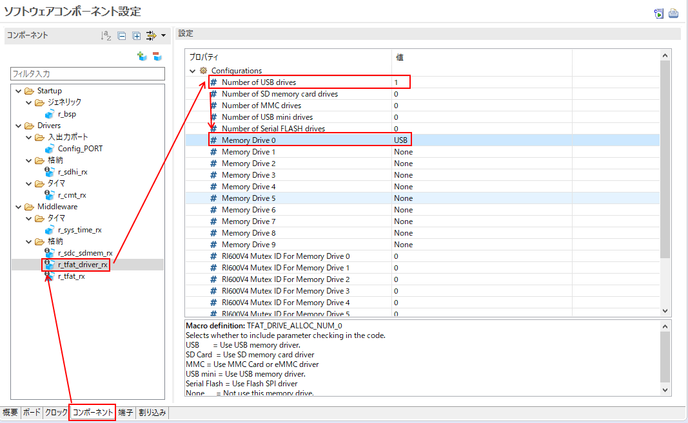</a>
    * Set USB basic FIT component
      * ```USB operating mode setting```：```USB Host mode```
      * ```Device class setting```：```Host Mass Storage Class```
      * ```USB0_VBUSEN pin```：```Use```
      * ```USB0_OVRCURA pin```：```Use```
      * <a href="../../images/076_setting_usb.png" target="_blank">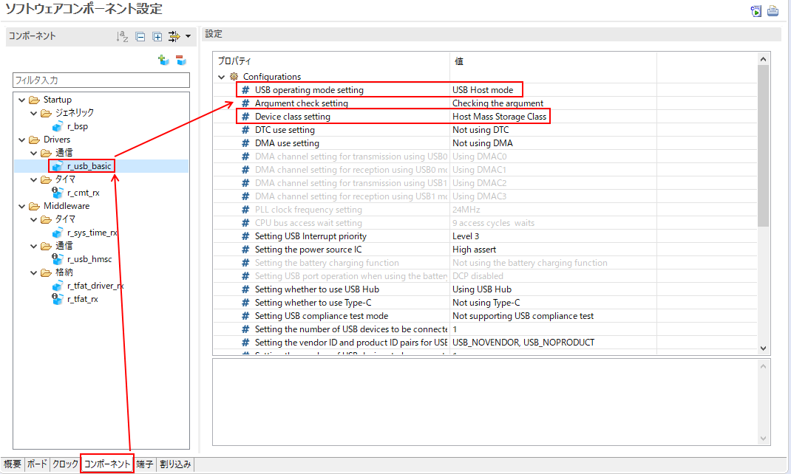</a>
      * <a href="../../images/077_setting_usb2.png" target="_blank">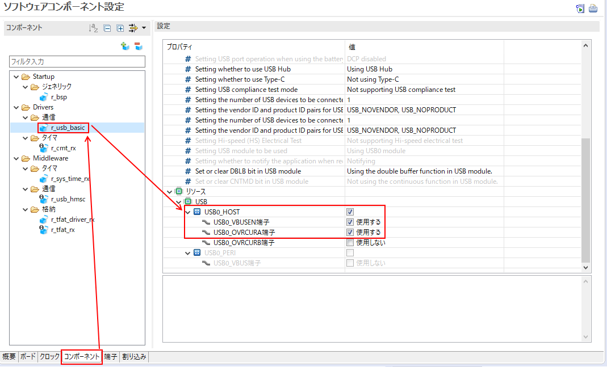</a>
    * Set USB pin
      * ```USB0_OVRCURA```：```P14```
      * ```USB0_VBUSEN```：```P16```
      * <a href="../../images/078_setting_pin_usb.png" target="_blank">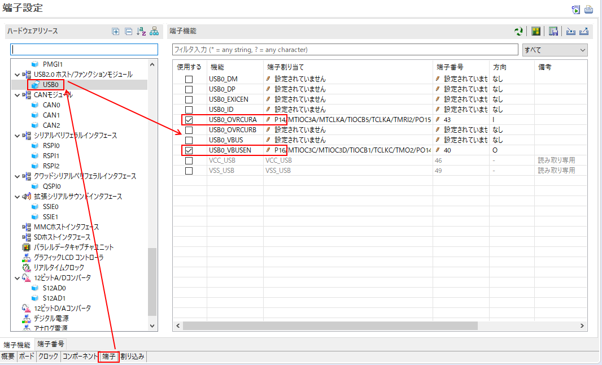</a>
* Change the following to connect the eMMC card
    * Set TFAT driver FIT component
      * ```Number of MMC drivers```：```1``` - ```10```（The number of eMMC cards which you want to connect at the same time）
      * ```Memory Drive x```：```MMC```
  * (Under construction)
* Change the following to connect the Serial Flash memory
    * Set TFAT driver FIT component
      * ```Number of Serial FLASH drivers```：```1``` - ```10```（The number of Serial Flash memories which you want to connect at the same time)
      * ```Memory Drive x```：```Serial FLASH```
  * (Under construction)
* TFAT can connect one to 10 media (software specifications) such as SD card, USB memory and eMMC card at the same time.
  * Change the following to connect at the same time
    * TFAT FITの```ffconf.h```
      * ```FF_VOLUMES```：```1``` - ```10```（The number which you want to connect at the same time）
    * Set TFAT driver FIT component
      * ```Number of xxx drivers```：```1``` - ```10```（The number of storage media which you want to connect at the same time）
      * ```Memory Drive x```：```USB```、```SD memory card```、```MMC```、```USB mini```, or```Serial FLASH```
        （Storage media which are linked to drives）
      * The following is a setting example to connect two USBs and one SD card at the same time
        * <a href="../../images/079_setting_tfat_multi.png" target="_blank">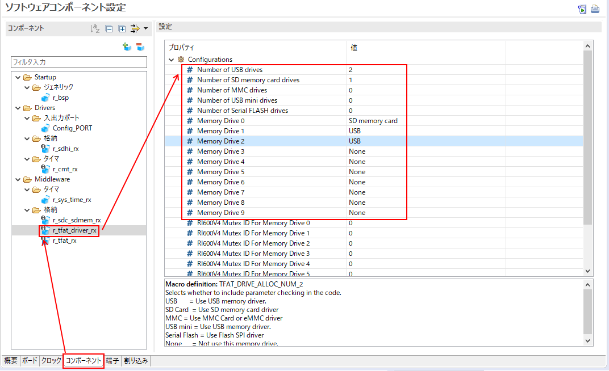</a>
  * In the future, Serial Flash memory will be able to be connected at the same time, too.

## It's preferable to use FAT file system with real time OS (RTOS)
* TFAT supports FreeRTOS and [RI600V4](https://www.renesas.com/products/software-tools/software-os-middleware-driver/itron-os/ri600v4-for-rx-family.html)(μITRON for Renesas RX family)
* Enable to easily create FreeRTOS and the project which supports RI600V4 SC from e2 studio
  * Select RTOS which you want to use from the pulldown menu when generating the project.
  * <a href="../../images/080_rtos_selection.png" target="_blank">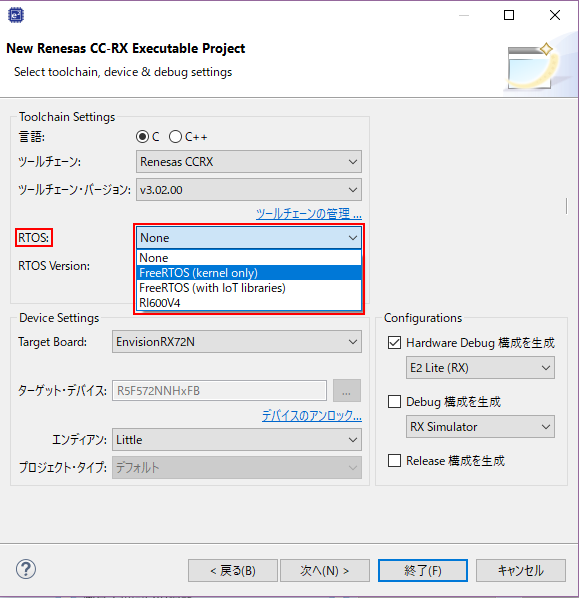</a>
    * Only in the case in which RI600V4 has been installed, RI600V4 can be selected.
## It's preferable to use Long Filename format of FAT file system
* TFAT is set in Short Filename format(SFN) which is also called 8.3 format by default.
  * SFN(8.3 format)
    * Up to 8 bytes for the part other than "." and extension. Up to 3 bytes for extension
    * Lower case letters are converted into uppercase.
  * LFN
    * In FAT file system, the maximum length of the file name is 250 letters (maximum length of the path is 259 letters)
    * Distinguish between uppercase and lowercase letters
* Change the following source code to enable LFN
  * TFAT FITの```ffconf.h```
    * Any of ```FF_USE_LFN```：```1```、```2```、```3```
    * Any of ```FF_MAX_LFN``` ：```12```~```255```（However, basically you can use default, ```255``` ）


## It's preferable to use RTC rather than CMT to obtain date in file system
* Although RX72N Envision Kit does not install RTC, introduce as reference information.
* By embedding RTC FIT module into the project using SC, you can change from CMT to RTC easily.
* Just change the following part of source code. (Operation has not been checked)
  * ```get_fattime()```of```r_tfat_drv_if.c```of TFAT driver FIT function
    * Change to obtain date by using the API of RTC FIT module instead of system timer Fit module
  * ```initialize_sdc_demo()```of```rx72n_envidion_kit.c``` function
    * Initialize RTC FIT module instead of system timer FIT module.

## It's preferable to obtain correct date via network
* Simple Network Time Protocol (SNTP) is used as a method to obtain the correct date.
* Refer to [AWS project demo](https://github.com/renesas/rx72n-envision-kit/blob/master/vendors/renesas/boards/rx72n-envision-kit/aws_demos/application_code/renesas_code/sntp_task.c) for how to obtain date from [NICT Time Server](https://jjy.nict.go.jp/tsp/PubNtp/index.html) using SNTP.
  * ```sntp_task()```of```sntp_task.c```

# Note
* R_CMT_CreatePeriodic() 1st argument unit is Hz, this argument upper limit is different for each MCUs
* So please adjusting by changing 1000000 -> 100000 (unit 1us -> 10us) for porting from this page's sample code to RX65N board etc.
 
