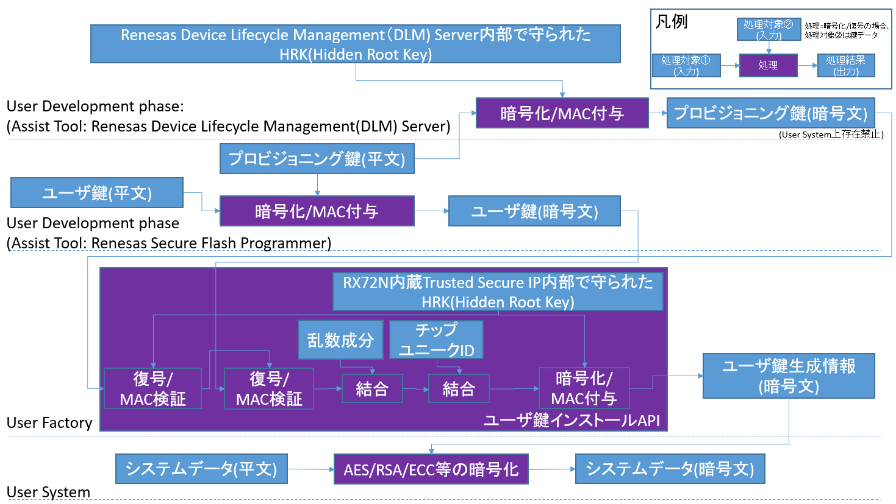
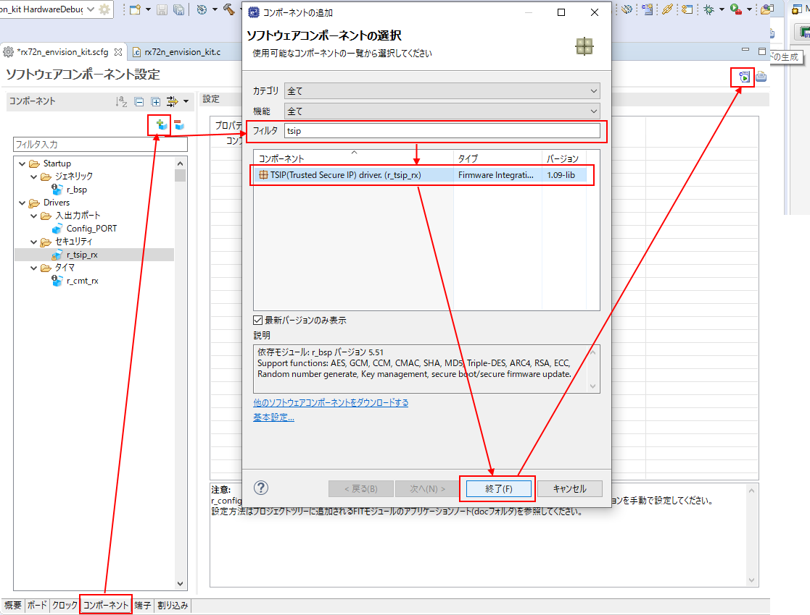
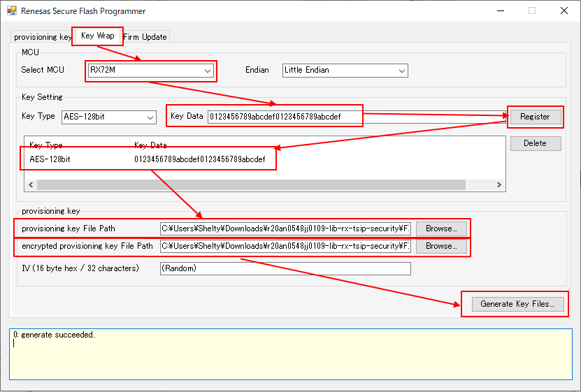
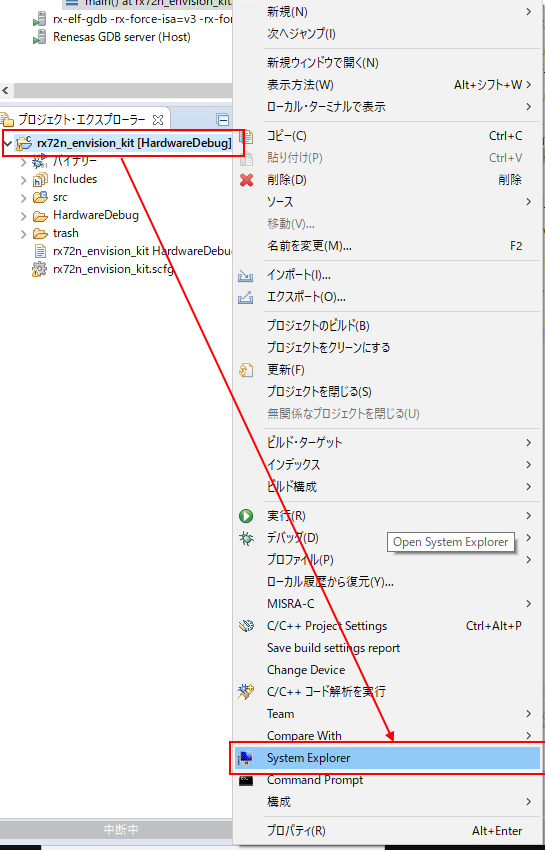
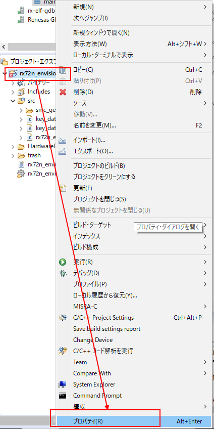
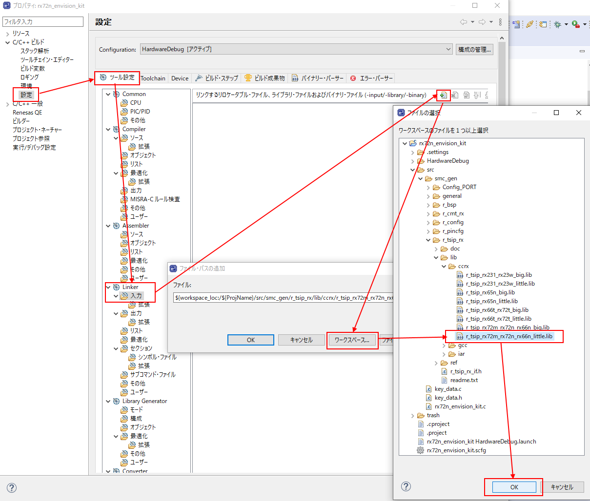
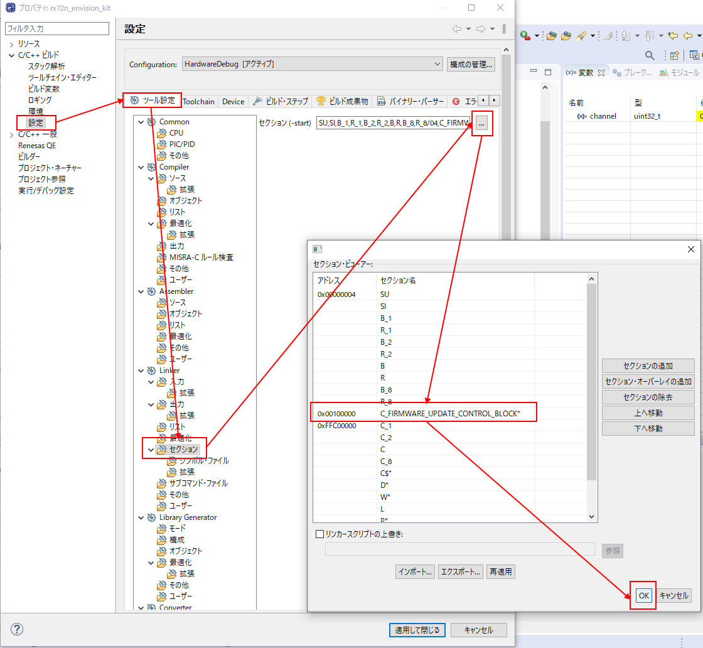
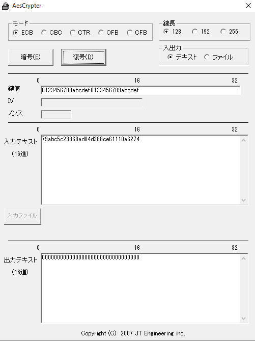

# Things to prepare
* Indispensable
    * RX72N Envision Kit × 1 unit
    * USB cable (USB Micro-B --- USB Type A) × 1 
    * Windows PC × 1 unit
        * Tools to be installed in Windows PC 
            * [e2 studio 2020-07](https://www.renesas.com/products/software-tools/tools/ide/e2studio.html)
            * [CC-RX](https://www.renesas.com/products/software-tools/tools/compiler-assembler/compiler-package-for-rx-family.html) V3.02 or later

# Prerequisite
* [Generate new project (bare metal)](../../bare-metal/generate-new-project.md) must be completed.
    *  In this section, implement by adding the code of TSIP(Trusted Secure IP) to LED 0.1 second cycle blinking program which was generated in [Generate new project (bare metal)](../../bare-metal/generate-new-project.md) 

# Trusted Secure IP features
* High-speed cryptographic operation
    * Reference: [Benchmark by wolfSSL](https://www.wolfssl.com/renesas-rx72n-envision-kit-supported/)
* Low-power consumption system
    * Reference: [Benchmark by Zurich University](https://digitalcollection.zhaw.ch/handle/11475/25777)
* Capable of embedding cryptographic functions with advanced security into mass-produced products at low cost.
* Capable of executing cryptographic algorithm of the global standard such as AES.
* Supports AES-GCM algorithm which is common in smart meter's required specifications
* Provides functions to securely perform firmware update
* Can be controlled easily by RX MCUs or device drivers for RE or RZ.
* Can satisfy the NIST: National Institute of Standards and Technology FIPS140-2 Cryptographic Module Validation Program (CMVP) level3 requirements
  * News release
    * https://www.renesas.com/about/press-room/renesas-rx-mcu-becomes-world-s-first-general-purpose-mcu-obtain-cmvp-level-3-certification-under
  * Validation result
    * https://csrc.nist.gov/projects/cryptographic-module-validation-program/certificate/3849

# Concept of Trusted Secure IP driver key control
* Trusted secure IP has a feature of not treating user key data as plaintext on the system (on RX72N) and on source code.
* User key is encrypted with provisioning key.
* Provisioning key is encrypted with HRK(Hidden Root Key).
* HRK is protected inside Renesas Device Lifecycle Management (DLM) Server and Trusted Secure IP.
* A user key encrypted by provisioning key is encrypted by HRK which is protected inside Trusted Secure IP with install API (User key + random number component + chip unique ID) . Through the process it is made into key generation information.
    * Since the key generation information is encrypted, this can protect user key consists of plaintext from various threats including leaks of source code or firmware and memory dump which utilizes software malfunction.
    * Also, the user key generation information includes the following data which is required as key data attribute.
        * ①Data to check falsification (MAC value)
        * ②Data which is based on the chip unique ID to prevent dead copy
        * ③Data based on the random number value to prevent replay attack
        * ④Attribute data to limit the usage purpose
    * The attribute information mentioned above is checked when various APIs are inputted, and if abnormality is detected, the key generation information can not be accepted in various API.
    * The key generation information is expressed as KeyIndex in English and on source code.
    * The concrete instance of install API is R_TSIP_GenerateAes128KeyIndex().
    * In mass production, to increase the safety of the system, it is preferable to bring into the market after removing the encrypted provisioning key which is an input value of install API.
    * The following is the concept of the above mentioned key control.

        * <a href="../../images/049_tsip_system_block.png" target="_blank"></a>

* Trusted Secure IP driver which can be downloaded from website is a binary version and includes a sample provisioning key which has been encrypted with Device Lifecycle Management (DLM) Server.
    * \r20an0548jjxxxx-lib-rx-tsip-security\FITDemos\rx72m_rx72n_rx66n_key
        *Accordingly, all Trusted Secure IP drivers are the same provisioning keys for binary version users.
            * This is a risk that user key of plaintext could be leaked, since the user key encrypted in User Factory could be decrypted. 
                * Accordingly, if you consider mass produced products, it is recommended that you use your own provisioning key, using the source code version of Trusted Secure IP driver and Device Lifecycle Management (DLM) Server.
* Refer to the website of Trusted Secure IP driver for how to obtain the source code version of Trusted Secure IP driver.
    * https://www.renesas.com/products/software-tools/software-os-middleware-driver/security-crypto/trusted-secure-ip-driver.html
    * By the way, since the commercial encryption exception rule is applied to the Trusted Secure IP-mounted device, the binary version is provided from the website. Accordingly, there is no special reason for security installation.
    * The source code version is provided after transaction examination is conducted to consumers individually.

# Check circuit
* When checking Trusted Secure IP operation, a circuit on the board is not especially required.

# Set Trusted Secure IP driver with Smart Configurator
## Download Trusted Secure IP driver.
* Trusted Secure IP driver has not become a standard component of RX Driver Package yet
* Download manually from the following URL ★will be included in RX Driver Package in the future★
    * https://www.renesas.com/products/software-tools/software-os-middleware-driver/security-crypto/trusted-secure-ip-driver.html
        * Can be downloaded from download button

## Install Trusted Secure IP driver software
* Unfreeze the download package (ZIP file) and copy the following two files.
    * \r20an0548jjxxxx-lib-rx-tsip-security\FITModules\r_tsip_rx_v1.09_lib.zip
    * \r20an0548jjxxxx-lib-rx-tsip-security\FITModules\r_tsip_rx_v1.09_lib.xml
* Paste the above two files on FIT module install folder of e2 studio administration.
    * Refer to the following explanation for the paste destination.
        * https://github.com/renesas/rx72n-envision-kit/wiki/Generate-new-project-%28bare-metal%29#fit-module-of-screen-processing-block

## Add component
* <a href="../../images/048_e2_studio_sc.png" target="_blank"></a>
    * Add component as shown in the above picture
        * r_tsip_rx 
    * Generate code

## Set component
### r_tsip_rx
* TSIP driver (binary version) which can be downloaded from the website does not have an item which can be configured. 

## Encrypt user key with Renesas Secure Flash Programmer
* Boot the following exe file.
    * \r20an0548jjxxxx-lib-rx-tsip-security\tool\renesas_secure_flash_programmer\Renesas Secure Flash Programmer\bin\Debug
        * Renesas Secure Flash Programmer.exe
* Perform the following setting.
    * <a href="../../images/050_tsip.png" target="_blank"></a>
        * Select Key Wrap tab
            * Select [RX72M] in MCU -> Select MCU ★Will fix so that [RX72N] can be selected in the future★
            * Input [0123456789abcdef0123456789abcdef] in Key Setting -> Key Data  (any value of 128bit）
                * Check that the input value is registered on the table by pressing register button.
                * Any number of the key data can be registered.
                * Key data of not only AES but also RSA and ECC and so on can be registered. 
            * Specify the file path of plaintext provisioning key to provisioning key -> provisioning key File Path
                * \r20an0548jjxxxx-lib-rx-tsip-security\FITDemos\rx72m_rx72n_rx66n_key\sample.key
            * Specify the file path of the provisioning key of cipher text to provisioning key -> encrypted provisioning key File Path
                * \r20an0548jjxxxx-lib-rx-tsip-security\FITDemos\rx72m_rx72n_rx66n_key\sample_enc.key
            * Press Generate Key Files button
                * C language source file of the encrypted user key (key_data.c, key_data.h) is outputted.
                * When opening the C language source file of an encrypted user key with text editor, you can see the user key value [0123456789abcdef0123456789abcdef] does not exist anywhere.

## Register C language source file of encrypted user key on Project
* Open the project file storage with project explorer 
    * Right-click the project name on the project explorer to select System Explorer
        * <a href="../../images/051_e2_studio.png" target="_blank"></a>
    * Paste the C language source file (key_data.c, key_data.h) of the user key encrypted in [src] folder in the opened explorer 

## Register Trusted Secure IP driver binary on project
* This setting★is expected to be unnecessary in the future version.★
* Right-click the project name on the project explorer to select property
    * <a href="../../images/052_e2_studio.png" target="_blank"></a>
        * Specify Trusted Secure IP driver binary to linker.
            * <a href="../../images/053_e2_studio.png" target="_blank"></a>

## Register section setting on data flash which will be key data storage for Trusted Secure IP driver and so on.
* This setting★is expected to be unnecessary in the future version.★
* Right-click the project name on the project explorer to select property
    * <a href="../../images/052_e2_studio.png" target="_blank"></a>
        * Specify the section setting on data flash which will be the key data storage to linker.
            * <a href="../../images/054_e2_studio.png" target="_blank"></a>
            * Register C_FIRMWARE_UPDATE_CONTROL_BLOCK*  at an address of 0x00100000 

## Coding of main() function (Check AES128 operation)
*Add code to rx72n_envision_kit.c as described below.
* This code transfer printf() output to Renesas Debug Virtual Console.

```rx72n_envision_kit.c
#include <stdio.h>

#include "r_smc_entry.h"
#include "r_tsip_rx_if.h"
#include "key_data.h"
#include "r_cmt_rx_if.h"

void main(void);
void cmt_callback(void *arg);

uint8_t plain[R_TSIP_AES_BLOCK_BYTE_SIZE];
uint8_t cipher[R_TSIP_AES_BLOCK_BYTE_SIZE];

void main(void)
{
	uint32_t channel;

	tsip_aes_key_index_t tsip_aes_key_index;
	tsip_aes_handle_t tsip_aes_handle;
	uint32_t cipher_length;
	int i;

	R_CMT_CreatePeriodic(10, cmt_callback, &channel);

	R_TSIP_Open(NULL, NULL);
	R_TSIP_GenerateAes128KeyIndex(
			(uint8_t *)g_user_key_block_data.encrypted_provisioning_key,
			(uint8_t *)g_user_key_block_data.iv,
			(uint8_t *)g_user_key_block_data.encrypted_user_aes128_key,
			&tsip_aes_key_index);

	R_TSIP_Aes128EcbEncryptInit(&tsip_aes_handle, &tsip_aes_key_index);
	R_TSIP_Aes128EcbEncryptUpdate(&tsip_aes_handle, plain, cipher, sizeof(plain));
	R_TSIP_Aes128EcbEncryptFinal(&tsip_aes_handle, cipher, &cipher_length);

	printf("plain: ");
	for(i = 0; i < R_TSIP_AES_BLOCK_BYTE_SIZE; i++)
	{
		printf("%02x", plain[i]);
	}
	printf("\n");

	printf("cipher: ");
	for(i = 0; i < R_TSIP_AES_BLOCK_BYTE_SIZE; i++)
	{
		printf("%02x", cipher[i]);
	}
	printf("\n");

	while(1);
}

void cmt_callback(void *arg)
{
	if(PORT4.PIDR.BIT.B0 == 1)
	{
		PORT4.PODR.BIT.B0 = 0;
	}
	else
	{
		PORT4.PODR.BIT.B0 = 1;
	}
}
```

## Check operation
* Build
    * The warning of Duplicate Symbol is issued in large amount. Ignore it. ★Expected to be improved in the future version.★
    * The library version always consumes the maximum capacity (about 130KB) of TSIP driver. ★The source code version enables configuration. (might be improved if devising a good way during library generation (Under consideration))★
* Download
    * https://github.com/renesas/rx72n-envision-kit/wiki/Generate-new-project-%28bare-metal%29#debugger-setting
* Open Renesas Debug Virtual Console on e2 studio which is the printf() destination beforehand.
    * Renesas view -> Debug -> Renesas Debug Virtual Console
* Execute
    * It is outputted in Renesas Debug Virtual Console as below.
```
plain: 00000000000000000000000000000000
cipher: 79abc5c23868ad84d388ce61110a6274
```

*User key is [0123456789abcdef0123456789abcdef] as mentioned above.
* By using AesCrypter of Windows application, decrypt cipher[79abc5c23868ad84d388ce61110a6274] to plain[00000000000000000000000000000000] using user key [0123456789abcdef0123456789abcdef].
    * [AesCrypter](https://www.vector.co.jp/soft/winnt/util/se424956.html)
        * <a href="../../images/055_aes.png" target="_blank"></a>

## Coding of main() function (Check major API performance)
* Measure the capacity of AES128, SHA256, random number generation, RSA1024 key generation, RSA2048 key generation, ECC P-256 key generation, and output the execution results to Renesas Debug Virtual Console.
```rx72n_envision_kit.c
#include <stdio.h>

#include "r_smc_entry.h"
#include "r_tsip_rx_if.h"
#include "key_data.h"
#include "r_cmt_rx_if.h"

#define GENERATE_RSA_KEY_NUMBER 10
#define GENERATE_ECC_KEY_NUMBER 10

void main(void);
void cmt_callback(void *arg);
void cmt_1us_callback(void *arg);
void _1us_timer_reset(void);
void _1us_timer_stop(void);
void _1us_timer_start(void);
uint32_t _1us_timer_get(void);

uint8_t plain[R_TSIP_AES_BLOCK_BYTE_SIZE * 1024];
uint8_t cipher[R_TSIP_AES_BLOCK_BYTE_SIZE * 1024];
uint32_t _1us_timer;
volatile uint32_t _1us_timer_flag;

void main(void)
{
	uint32_t cmt_channel1, cmt_channel2;

	tsip_aes_key_index_t tsip_aes_key_index;
	tsip_aes_handle_t tsip_aes_handle;
	uint32_t cipher_length;
	int i;

	tsip_sha_md5_handle_t tsip_sha_md5_handle;
	uint8_t digest[R_TSIP_SHA256_HASH_LENGTH_BYTE_SIZE];
	uint32_t digest_length;
	uint32_t random;
	uint32_t tmp;
	tsip_rsa1024_key_pair_index_t tsip_rsa1024_key_pair_index;
	tsip_rsa2048_key_pair_index_t tsip_rsa2048_key_pair_index;
	tsip_ecc_key_pair_index_t tsip_ecc_key_pair_index;

	R_CMT_CreatePeriodic(10, cmt_callback, &cmt_channel1);
	R_CMT_CreatePeriodic(1000000, cmt_1us_callback, &cmt_channel2);

	R_TSIP_Open(NULL, NULL);
	R_TSIP_GenerateAes128KeyIndex(
			(uint8_t *)g_user_key_block_data.encrypted_provisioning_key,
			(uint8_t *)g_user_key_block_data.iv,
			(uint8_t *)g_user_key_block_data.encrypted_user_aes128_key,
			&tsip_aes_key_index);

	R_TSIP_Aes128EcbEncryptInit(&tsip_aes_handle, &tsip_aes_key_index);
	R_TSIP_Aes128EcbEncryptUpdate(&tsip_aes_handle, plain, cipher, sizeof(plain));
	R_TSIP_Aes128EcbEncryptFinal(&tsip_aes_handle, cipher, &cipher_length);

	printf("plain: ");
	for(i = 0; i < R_TSIP_AES_BLOCK_BYTE_SIZE; i++)
	{
		printf("%02x", plain[i]);
	}
	printf("\n");

	printf("cipher: ");
	for(i = 0; i < R_TSIP_AES_BLOCK_BYTE_SIZE; i++)
	{
		printf("%02x", cipher[i]);
	}
	printf("\n");

	_1us_timer_reset();
	_1us_timer_start();
	R_TSIP_Aes128EcbEncryptInit(&tsip_aes_handle, &tsip_aes_key_index);
	R_TSIP_Aes128EcbEncryptUpdate(&tsip_aes_handle, plain, cipher, sizeof(plain));
	R_TSIP_Aes128EcbEncryptFinal(&tsip_aes_handle, cipher, &cipher_length);
	_1us_timer_stop();
	printf("AES128 encrypt %d bytes takes %d us, throughput = %f Mbps\n", sizeof(plain), _1us_timer_get(), (float)((sizeof(plain) * 8) / (float)((float)_1us_timer_get() / (1000000))/1000000));

	_1us_timer_reset();
	_1us_timer_start();
	R_TSIP_Sha256Init(&tsip_sha_md5_handle);
	R_TSIP_Sha256Update(&tsip_sha_md5_handle, plain, sizeof(plain));
	R_TSIP_Sha256Final(&tsip_sha_md5_handle, digest, &digest_length);
	_1us_timer_stop();
	printf("SHA256 hash %d bytes takes %d us, throughput = %f Mbps\n", sizeof(plain), _1us_timer_get(), (float)((sizeof(plain) * 8) / (float)((float)_1us_timer_get() / (1000000))/1000000));

	_1us_timer_reset();
	_1us_timer_start();
	for(i = 0; i < sizeof(plain) / 4; i += 4)
	{
		R_TSIP_GenerateRandomNumber(&random);
	}
	_1us_timer_stop();
	printf("Generate random %d bytes takes %d us, throughput = %f Mbps\n", sizeof(plain), _1us_timer_get(), (float)((sizeof(plain) * 8) / (float)((float)_1us_timer_get() / (1000000))/1000000));

	tmp = 0;
	for(i = 0; i < GENERATE_RSA_KEY_NUMBER; i++)
	{
		_1us_timer_reset();
		_1us_timer_start();
		R_TSIP_GenerateRsa1024RandomKeyIndex(&tsip_rsa1024_key_pair_index);
		_1us_timer_stop();
		printf("(%2d/%2d): Generate RSA1024 key pair takes %d us\n", i + 1, GENERATE_RSA_KEY_NUMBER, _1us_timer_get());
		tmp += _1us_timer_get();
	}
	printf("---------------------------------------------------------\n");
	printf("Generate RSA1024 key pair takes %d us as average.\n", tmp / GENERATE_RSA_KEY_NUMBER);
	printf("---------------------------------------------------------\n");

	tmp = 0;
	for(i = 0; i < GENERATE_RSA_KEY_NUMBER; i++)
	{
		_1us_timer_reset();
		_1us_timer_start();
		R_TSIP_GenerateRsa2048RandomKeyIndex(&tsip_rsa2048_key_pair_index);
		_1us_timer_stop();
		printf("(%2d/%2d): Generate RSA2048 key pair takes %d us\n", i + 1, GENERATE_RSA_KEY_NUMBER, _1us_timer_get());
		tmp += _1us_timer_get();
	}
	printf("---------------------------------------------------------\n");
	printf("Generate RSA2048 key pair takes %d us as average.\n", tmp / GENERATE_RSA_KEY_NUMBER);
	printf("---------------------------------------------------------\n");

	tmp = 0;
	for(i = 0; i < GENERATE_ECC_KEY_NUMBER; i++)
	{
		_1us_timer_reset();
		_1us_timer_start();
		R_TSIP_GenerateEccP256RandomKeyIndex(&tsip_ecc_key_pair_index);
		_1us_timer_stop();
		printf("(%2d/%2d): Generate ECC P-256 key pair takes %d us\n", i + 1, GENERATE_ECC_KEY_NUMBER, _1us_timer_get());
		tmp += _1us_timer_get();
	}
	printf("---------------------------------------------------------\n");
	printf("Generate ECC P-256 key pair takes %d us as average.\n", tmp / GENERATE_ECC_KEY_NUMBER);
	printf("---------------------------------------------------------\n");

	while(1);
}

void cmt_callback(void *arg)
{
	if(PORT4.PIDR.BIT.B0 == 1)
	{
		PORT4.PODR.BIT.B0 = 0;
	}
	else
	{
		PORT4.PODR.BIT.B0 = 1;
	}
}

void cmt_1us_callback(void *arg)
{
	if(_1us_timer_flag)
	{
		_1us_timer++;
	}
}

void _1us_timer_reset(void)
{
	_1us_timer = 0;
}

void _1us_timer_stop(void)
{
	_1us_timer_flag = 0;
}

void _1us_timer_start(void)
{
	_1us_timer_flag = 1;
}

uint32_t _1us_timer_get(void)
{
	return _1us_timer;
}
```

* Output results

```
plain: 00000000000000000000000000000000
cipher: 79abc5c23868ad84d388ce61110a6274
AES128 encrypt 16384 bytes takes 667 us, throughput = 196.509750 Mbps
SHA256 hash 16384 bytes takes 442 us, throughput = 296.542999 Mbps
Generate random 16384 bytes takes 5120 us, throughput = 25.600000 Mbps
( 1/10): Generate RSA1024 key pair takes 540086 us
( 2/10): Generate RSA1024 key pair takes 334216 us
( 3/10): Generate RSA1024 key pair takes 768522 us
( 4/10): Generate RSA1024 key pair takes 264502 us
( 5/10): Generate RSA1024 key pair takes 1312443 us
( 6/10): Generate RSA1024 key pair takes 614302 us
( 7/10): Generate RSA1024 key pair takes 96265 us
( 8/10): Generate RSA1024 key pair takes 72716 us
( 9/10): Generate RSA1024 key pair takes 1173135 us
(10/10): Generate RSA1024 key pair takes 219992 us
---------------------------------------------------------
Generate RSA1024 key pair takes 539617 us as average.
---------------------------------------------------------
( 1/10): Generate RSA2048 key pair takes 5514318 us
( 2/10): Generate RSA2048 key pair takes 8576225 us
( 3/10): Generate RSA2048 key pair takes 6450949 us
( 4/10): Generate RSA2048 key pair takes 13272585 us
( 5/10): Generate RSA2048 key pair takes 5337163 us
( 6/10): Generate RSA2048 key pair takes 9399025 us
( 7/10): Generate RSA2048 key pair takes 6139061 us
( 8/10): Generate RSA2048 key pair takes 5138732 us
( 9/10): Generate RSA2048 key pair takes 9920193 us
(10/10): Generate RSA2048 key pair takes 5580538 us
---------------------------------------------------------
Generate RSA2048 key pair takes 7532878 us as average.
---------------------------------------------------------
( 1/10): Generate ECC P-256 key pair takes 1305 us
( 2/10): Generate ECC P-256 key pair takes 1277 us
( 3/10): Generate ECC P-256 key pair takes 1293 us
( 4/10): Generate ECC P-256 key pair takes 1298 us
( 5/10): Generate ECC P-256 key pair takes 1282 us
( 6/10): Generate ECC P-256 key pair takes 1253 us
( 7/10): Generate ECC P-256 key pair takes 1303 us
( 8/10): Generate ECC P-256 key pair takes 1276 us
( 9/10): Generate ECC P-256 key pair takes 1304 us
(10/10): Generate ECC P-256 key pair takes 1298 us
---------------------------------------------------------
Generate ECC P-256 key pair takes 1288 us as average.
---------------------------------------------------------
```