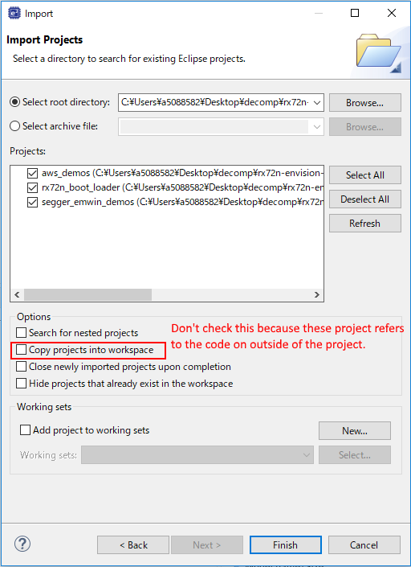
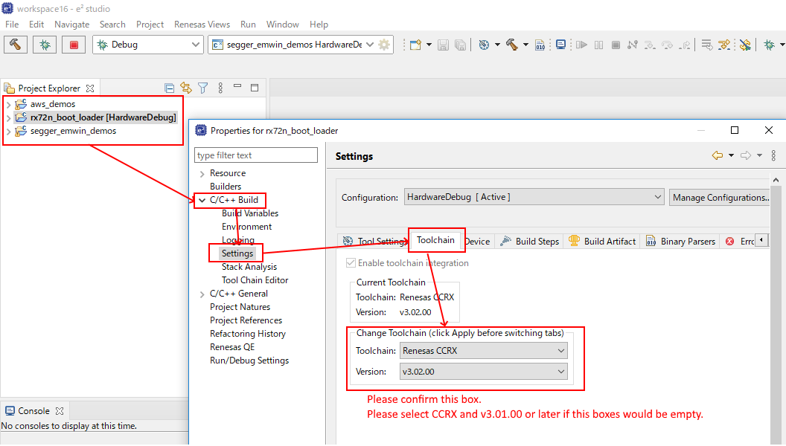
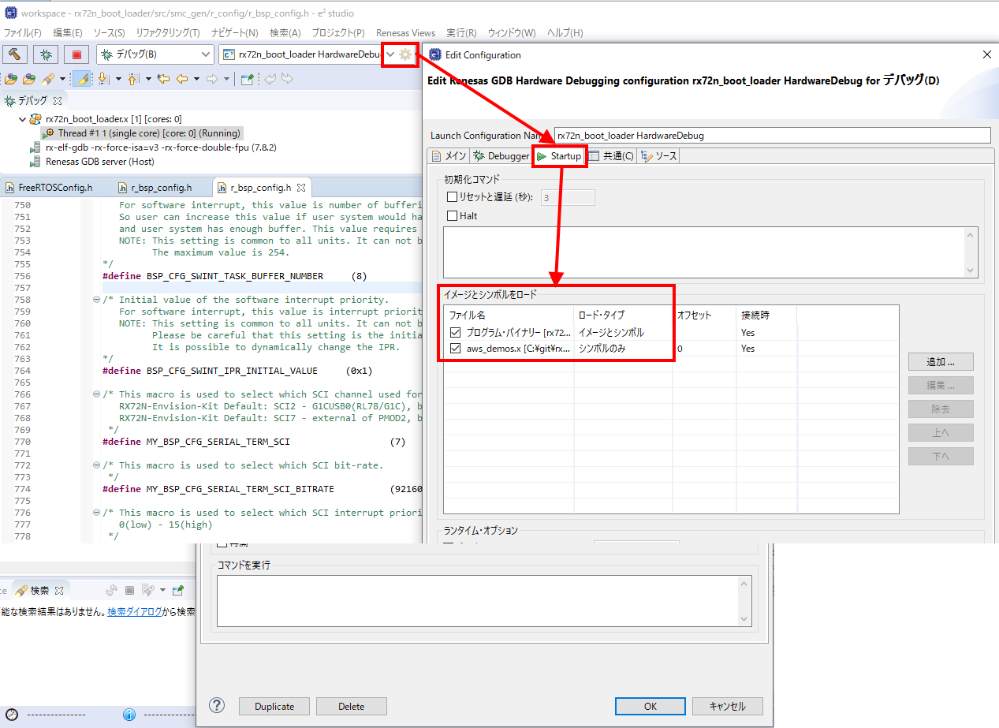

# Things to prepare
* Indispensable
    * RX72N Envision Kit × 1 unit
    * USB cable (USB Micro-B --- USB Type A) × 2 
    * Windows PC × 1 unit
        * Tools to be installed in Windows PC 
            * [e2 studio 2020-04](https://www.renesas.com/products/software-tools/tools/ide/e2studio.html) or later
                * Initial boot sometimes takes time
            * [CC-RX](https://www.renesas.com/products/software-tools/tools/compiler-assembler/compiler-package-for-rx-family.html) V3.02 or later
            * [Tera Term](https://osdn.net/projects/ttssh2/) 4.105 or later
                *Turn off [High-speed file transfer with serial connection](https://teratermproject.github.io/manual/5/en/setup/teraterm-trans.html#FileSendHighSpeedMode): FileSendHighSpeedMode=off 
                    * Tera Term -> setting -> Read setting -> open TERATERM.INI  with text editor -> Change setting -> Save -> reboot Tera Term

# Prerequisite
* When you want to add debug or functions of the initial firmware of RX72N Envision Kit.
* When you want to learn the system of the firmware update
    * When the system of firmware update is not necessary and the evaluation of the function of single item RX72N is necessary, refer to [Generate new project (bare metal)](../bare-metal/generate-new-project.md).

# Download a set of source codes
* Download the latest version of a code
```
git clone https://github.com/renesas/rx72n-envision-kit.git
```

* Return to a build which steadily operates (In the case where the latest version of a souce code can not be built, and so on)
```
cd rx72n-envision-kit
git checkout 07469396d612f805ab158b5dae99a4d1bcea2aed
```

# Definition of base folder
* describe a root folder cloned by git as ${base_folder}  
* Demos and libraries folders are in ${base_folder}  
* Make sure that the path of the base folder is short, placing it right under c drive and so on. If the total length of a path exceeds 256 letters, e2 studio outputs an error during build.

# Boot e2 studio 
* File -> Import -> General -> Move existing project to workspace -> Select root directory
    * ${base_folder}/projects/renesas/rx72n_envision_kit/e2studio
* The following three projects are read.
    * aws_demos
    * rx72n_boot_loader
    * segger_emwin_demos
* Remove check box like:
    * <a href="../../images/109_e2_studio_project_import.png" target="_blank"></a>
* Finish button

# Confirm compiler setting
* Please confirm your compiler CCRX is installed like:
    * <a href="../../images/110_e2_studio_project_build.png" target="_blank"></a>
* Please install CCRX if you would not select any version.
    * https://www.renesas.com/software-tool/cc-compiler-package-rx-family

# preparation
* Turn off SW1-2 of RX72N Envision Kit (at the bottom of the board)
    * <a href="../../images/017_board_sw1.jpg" target="_blank"></a>

* Connect CN8(USB Micro-B) to the USB port (PC etc.) with USB cable.
    * <a href="../../images/009_board_serial_terminal2.jpg" target="_blank"></a>
        * Boot Teraterm on Windows PC and select the COM port (COMx: RSK USB Serial Port(COMx)) and connect it.
            * Setting -> Perform the following setting with serial port 
                * baud rate: 115200 bps
                * Data: 8 bit
                * Parity: none
                * Stop: 1 bit
                * Flow control: none
            * Setting -> Perform the following setting on the terminal
                * Newline code
                    * Receipt: AUTO
                    * Transmit: CR+LF
                * Local echo
                    * Uncheck the box

# Execute build/download
* Build
    * Project -> Build all
        * Be careful, as a compiler error appears, If the path of ${base_folder} is long or Japanese language is included in the path, 
* Download
    * Launch Configuration (Near a gear mark on the upper part of the  screen） -> rx72n_boot_loader HardwareDebug -> Insect mark（on the upper left of the screen）
    * Check that the function of resetprg.c, R_BSP_POR_FUNCTION() is displayed.
* Execute
    * Press resume button (on the upper part of the screen)
    * Check that main() function is displayed.
    * Press resume button (on the upper part of the screen)
    * If the following log is outputted on Teraterm, it has succeeded.
        * The same indication appears on the liquid crystal display.
```
-------------------------------------------------
RX72N secure boot program
-------------------------------------------------
Checking data flash ROM status.
Loading user code signer public key: not found.
provision the user code signer public key: OK.
Checking code flash ROM status.
bank 0 status = 0xff [LIFECYCLE_STATE_BLANK]
bank 1 status = 0xff [LIFECYCLE_STATE_BLANK]
bank info = 1. (start bank = 0)
start installing user program.
erase bank1 secure boot mirror area...OK
copy secure boot (part1) from bank0 to bank1...OK
copy secure boot (part2) from bank0 to bank1...OK
========== install user program phase ==========
erase install area (data flash): OK
erase install area (code flash): OK
send "userprog.rsu" via UART.
```
# Mechanism of firmware update
* [Design memo](../developer/design-memo.md)

# Give a signature to MOT file of aws_demos
* ${base_folder}/vendors/renesas/tools/mot_file_converter/Renesas Secure Flash Programmer/bin/Debug
    * Renesas Secure Flash Programmer.exe
* Initial Firm tab
    * Settings
        * Select MCU -> "RX72N(ROM 4MB)/Secure Bootloader=256KB"
        * Select Firmware Verification Type -> sig-sha256-ecdsa
        * Private Key Path (PEM Format) -> ${base_folder}/sample_keys
            * secp256r1.privatekey
        * Select Output Format -> Bank0 User Program (Binary Format)
    * Bank0 User Program
        * Firmware Sequence Number -> 1
        * File Path (Motorola Format) -> ${base_folder}/projects/renesas/rx72n_envision_kit/e2studio/aws_demos/HardwareDebug
            * aws_demos.mot
* Press Generate button
    * Save userprog.rsu on desktop

# Download aws_demos via boot loader (CN8(SCI2)).
* Teraterm -> File -> Transfer file -> Option -> Check "binary"
* Specify userprog.rsu on desktop
* After the following log is transmitted to Teraterm and liquid crystal display, check that aws_demos (benchmark) boots

```
========== install user program phase ==========
erase install area (data flash): OK
erase install area (code flash): OK
send "userprog.rsu" via UART.
installing firmware...1%(32/1792KB).
installing firmware...3%(64/1792KB).
installing firmware...5%(96/1792KB).
installing firmware...7%(128/1792KB).
installing firmware...8%(160/1792KB).
installing firmware...10%(192/1792KB).
installing firmware...12%(224/1792KB).
installing firmware...14%(256/1792KB).
installing firmware...16%(288/1792KB).
installing firmware...17%(320/1792KB).
installing firmware...19%(352/1792KB).
installing firmware...21%(384/1792KB).
installing firmware...23%(416/1792KB).
installing firmware...25%(448/1792KB).
installing firmware...26%(480/1792KB).
installing firmware...28%(512/1792KB).
installing firmware...30%(544/1792KB).
installing firmware...32%(576/1792KB).
installing firmware...33%(608/1792KB).
installing firmware...35%(640/1792KB).
installing firmware...37%(672/1792KB).
installing firmware...39%(704/1792KB).
installing firmware...41%(736/1792KB).
installing firmware...42%(768/1792KB).
installing firmware...44%(800/1792KB).
installing firmware...46%(832/1792KB).
installing firmware...48%(864/1792KB).
installing firmware...50%(896/1792KB).
installing firmware...51%(928/1792KB).
installing firmware...53%(960/1792KB).
installing firmware...55%(992/1792KB).
installing firmware...57%(1024/1792KB).
installing firmware...58%(1056/1792KB).
installing firmware...60%(1088/1792KB).
installing firmware...62%(1120/1792KB).
installing firmware...64%(1152/1792KB).
installing firmware...66%(1184/1792KB).
installing firmware...67%(1216/1792KB).
installing firmware...69%(1248/1792KB).
installing firmware...71%(1280/1792KB).
installing firmware...73%(1312/1792KB).
installing firmware...75%(1344/1792KB).
installing firmware...76%(1376/1792KB).
installing firmware...78%(1408/1792KB).
installing firmware...80%(1440/1792KB).
installing firmware...82%(1472/1792KB).
installing firmware...83%(1504/1792KB).
installing firmware...85%(1536/1792KB).
installing firmware...87%(1568/1792KB).
installing firmware...89%(1600/1792KB).
installing firmware...91%(1632/1792KB).
installing firmware...92%(1664/1792KB).
installing firmware...94%(1696/1792KB).
installing firmware...96%(1728/1792KB).
installing firmware...98%(1760/1792KB).
installing firmware...100%(1792/1792KB).
completed installing firmware.
integrity check scheme = sig-sha256-ecdsa
bank1(temporary area) on code flash integrity check...OK
installing const data...5%(1/20KB).
installing const data...10%(2/20KB).
installing const data...15%(3/20KB).
installing const data...20%(4/20KB).
installing const data...25%(5/20KB).
installing const data...30%(6/20KB).
installing const data...35%(7/20KB).
installing const data...40%(8/20KB).
installing const data...45%(9/20KB).
installing const data...50%(10/20KB).
installing const data...55%(11/20KB).
installing const data...60%(12/20KB).
installing const data...65%(13/20KB).
installing const data...70%(14/20KB).
installing const data...75%(15/20KB).
installing const data...80%(16/20KB).
installing const data...85%(17/20KB).
installing const data...90%(18/20KB).
installing const data...95%(19/20KB).
installing const data...100%(20/20KB).
completed installing const data.
software reset...
-------------------------------------------------
RX72N secure boot program
-------------------------------------------------
Checking data flash ROM status.
Loading user code signer public key: found.
Checking code flash ROM status.
bank 0 status = 0xff [LIFECYCLE_STATE_BLANK]
bank 1 status = 0xfe [LIFECYCLE_STATE_TESTING]
bank info = 1. (start bank = 0)
integrity check scheme = sig-sha256-ecdsa
bank1(temporary area) on code flash integrity check...OK
update LIFECYCLE_STATE from [LIFECYCLE_STATE_TESTING] to [LIFECYCLE_STATE_VALID]
bank1(temporary area) block0 erase (to update LIFECYCLE_STATE)...OK
bank1(temporary area) block0 write (to update LIFECYCLE_STATE)...OK
swap bank...
-------------------------------------------------
RX72N secure boot program
-------------------------------------------------
Checking data flash ROM status.
Loading user code signer public key: found.
Checking code flash ROM status.
bank 0 status = 0xf8 [LIFECYCLE_STATE_VALID]
bank 1 status = 0xff [LIFECYCLE_STATE_BLANK]
bank info = 0. (start bank = 1)
integrity check scheme = sig-sha256-ecdsa
bank0(execute area) on code flash integrity check...OK
integrity check(parts of SHA256 process) needs 1211340 us.
integrity check(parts of ECDSA process) needs 93750 us.
jump to user program
```

# Download aws_demos via boot loader(CN6(SCI7)) with high-speed.
* In the case of CN8(SCI2),  as the speed is limited by RL78/G1C chip on the communication route, it is set to 115200 bps which is low speed. Accordingly, it takes two minutes to download firmware of 2MB. 
* In the case of CN6(SCI7), as FTDI chip on the communication route supports 912600 bps, which enables high-speed setting, download of 2MB firmware takes just 20 seconds.              
    * <a href="../../images/013_board_network.jpg" target="_blank"></a>
        * (Ignore the red frame on the right side. Change the picture later.)
        * Connect [USB-serial conversion PMOD module](https://store.digilentinc.com/pmod-usbuart-usb-to-uart-interface/) to CN6.
            * As CN6 is 12pin and [USB-serial conversion PMOD module](https://store.digilentinc.com/pmod-usbuart-usb-to-uart-interface/) is 6pin, be careful to insert to the correct position and direction. Put together 1, typing near CN6 on the board and 1, typing on [USB-serial conversion PMOD module](https://store.digilentinc.com/pmod-usbuart-usb-to-uart-interface/)
        * Connect USB cable to [USB-serial conversion PMOD module](https://store.digilentinc.com/pmod-usbuart-usb-to-uart-interface/) and connect the USB port of communication counterpart (PC, etc.) using the USB cable.
            * Boot Teraterm on Windows PC and select COM port (COMx: USB Serial Port(COMx)) to connect
                * Setting -> Perform the following setting with serial port.
                    * Baud rate: 912600bps
                    * Data: 8 bit
                    * Parity: none
                    * Stop: 1 bit
                    * Flow control: none
                * Setting -> Perform the following setting on the terminal
                   * Newline code
                        * Receipt: AUTO
                        * Transmit: CR+LF
                    * Local echo
                        * Uncheck the box

* Change the BSP setting of boot loader and change the number of SCI channel for terminal connection from 2 to 7, and baud rate from 115200bps to 912600bps.
    * [Code subject of change](https://github.com/renesas/rx72n-envision-kit/blob/f4d7ee62a3c52da856f882fdf3e1329059336f7e/projects/renesas/rx72n_envision_kit/e2studio/boot_loader/src/smc_gen/r_config/r_bsp_config.h#L770)
        * /rx72n-envision-kit/projects/renesas/rx72n_envision_kit/e2studio/boot_loader/src/smc_gen/r_config/r_bsp_config.h

```
/* This macro is used to select which SCI channel used for debug serial terminal.
   RX72N-Envision-Kit Default: SCI2 - G1CUSB0(RL78/G1C), bit rate 115200bps.
   RX72N-Envision-Kit Default: SCI7 - external of PMOD2, bit rate ~921600bps if user would attach FTDI chip.
 */
#define MY_BSP_CFG_SERIAL_TERM_SCI                  (7)

/* This macro is used to select which SCI bit-rate.
 */
#define MY_BSP_CFG_SERIAL_TERM_SCI_BITRATE          (921600)

/* This macro is used to select which SCI interrupt priority.
   0(low) - 15(high)
 */
```

# Debug boot_loader and aws_demos 
* The firmware which was downloaded with the debugger function of e2 studio is boot_loader
* Boot_loader can be debugged immediately after being downloaded.
* Meanwhile, aws_demos is downloaded via boot_loader, it can not be debugged by a regular method.
* This problem is prevented by performing the setting of downloading the symbol information of aws_demos, too, on the setting of downloading boot_loader, as shown in the picture below.
    * <a href="../../images/019_pc_e2studio_settings.png" target="_blank"></a>
