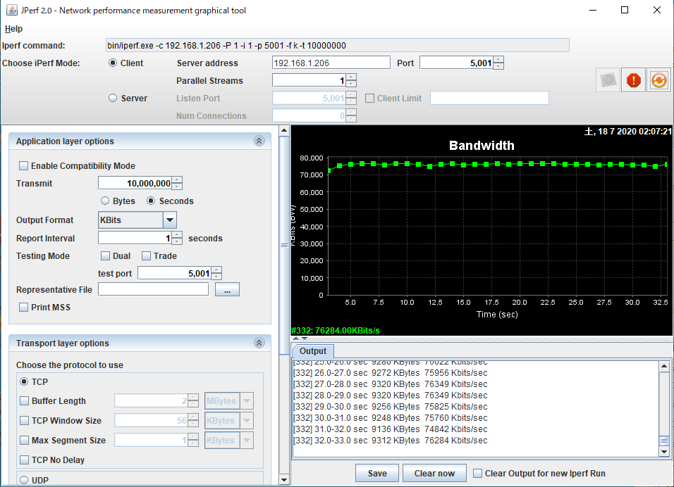
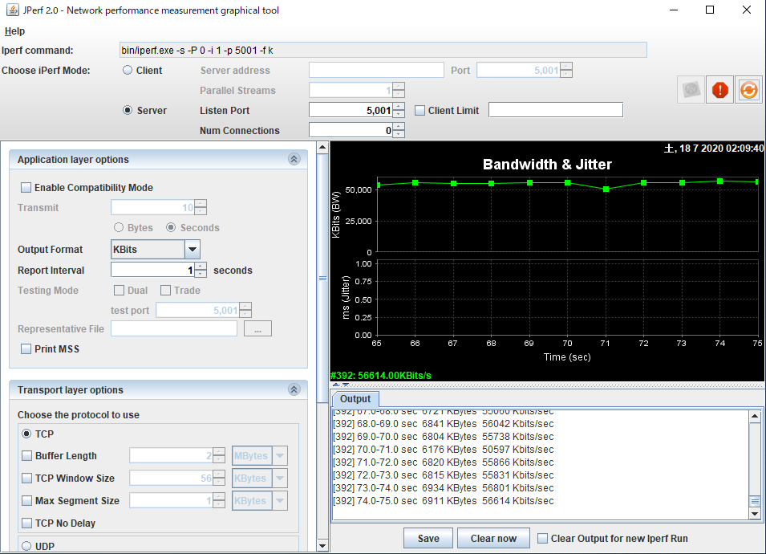

# Things to prepare
* Indispensable
    * RX72N Envision Kit × 1 unit
    * USB cable (USB Micro-B --- USB Type A) × 2 
    * Windows PC × 1 unit
        *Tools installed in Windows PC 
            * [jperf-2.0.0](https://osdn.net/projects/sfnet_iperf/downloads/jperf/jperf%202.0.0/jperf-2.0.0.zip/)
    * LAN cable × 2 
    * router × 1 unit (which operates as DHCP server)

# Prerequisite
*  Installed firmware is version v1.0.4 or later.
    * Method of writing = [Update firmware from SD card](../../quick-start/update-firmware-from-sd-card.md)
* Operation of command response has been checked
    * Refer to serial terminal demo in the following page
        * [Confirm factory image behavior](../../quick-start/confirm-factory-image-behavior.md)

# Method to execute benchmark
* Set RX72N Envision Kit to operating state
* Boot jperf
* Check IP address displayed on the bottom of the next screen of the title screen of  RX72N Envision Kit. (Assigned from DHCP server and becomes a value such as 192.168.1.206)

## In case of measuring TCP receipt
* Select Client with Choose iPerf Mode of jperf. Input IP address of RX72N Envision Kit. Port number is 5001.
* Press Run Iperf! button on the upper right of jperf

## In case of measuring TCP transfer
* Select Server with Choose iPerf Mode of jperf
* Register IP address and port number of PC with command response of RX72N Envision Kit
    * Register IP address (When IP address of PC is 192.168.1.6)
        * $ dataflash write tcpsendperformanceserveripaddress 192.168.1.6
    * Register port number (When port number of PC is 5001)
        * $ dataflash write tcpsendperformanceserverportnumber 5001
* Press Run Iperf! button on the upper right of jperf 
* Execute software reset with command response of RX72N Envision Kit (iperf connection is established on system start phase)
  * $ reset

### Note for measuring TCP transfer
* After 2 times mesuring, jperf behavior would be invalid that cannot accept connection from RX72N Envision kit
  * In this case, change port number to 5002, etc.
  * And Register PC port number to 5002 with command response of RX72N Envision Kit
    * $ dataflash write tcpsendperformanceserverportnumber 5002
* Execute software reset with command response of RX72N Envision Kit (iperf connection is established on system start phase)
  * $ reset

# Performance evaluation
* TCP receipt: about 76Mbps / CPU load rate about 40% 
    * 
* TCP transfer: about 57Mbps / CPU load rate about 90%  <does not seem to be ideal state,  Require tuning>
    * 

# Network setting
* FreeRTOS+TCP
    * https://github.com/renesas/rx72n-envision-kit/blob/master/vendors/renesas/boards/rx72n-envision-kit/aws_demos/config_files/FreeRTOSIPConfig.h
* Ethernet Driver
    * https://github.com/renesas/rx72n-envision-kit/blob/master/vendors/renesas/boards/rx72n-envision-kit/aws_demos/src/smc_gen/r_config/r_ether_rx_config.h
