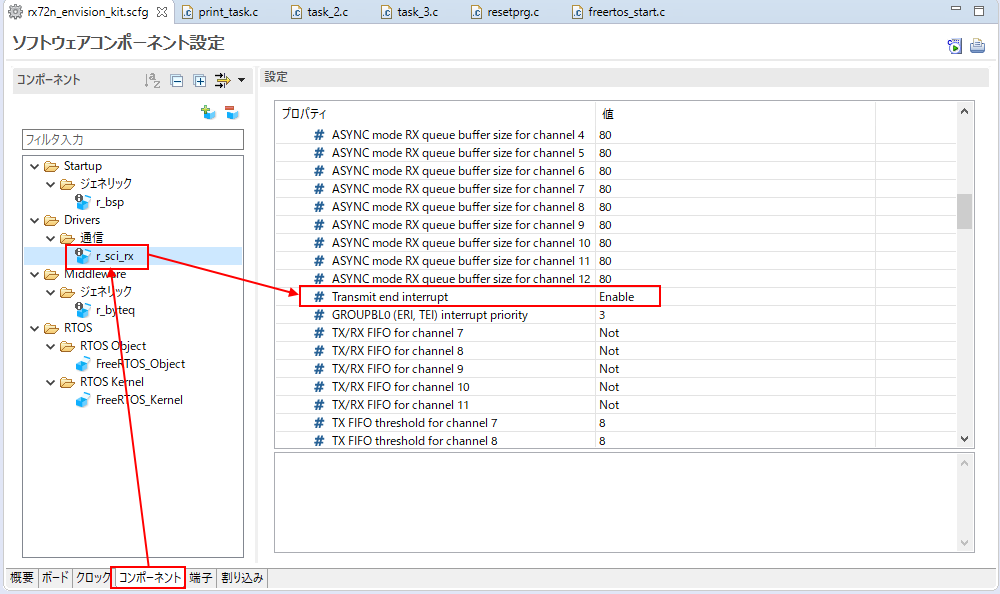
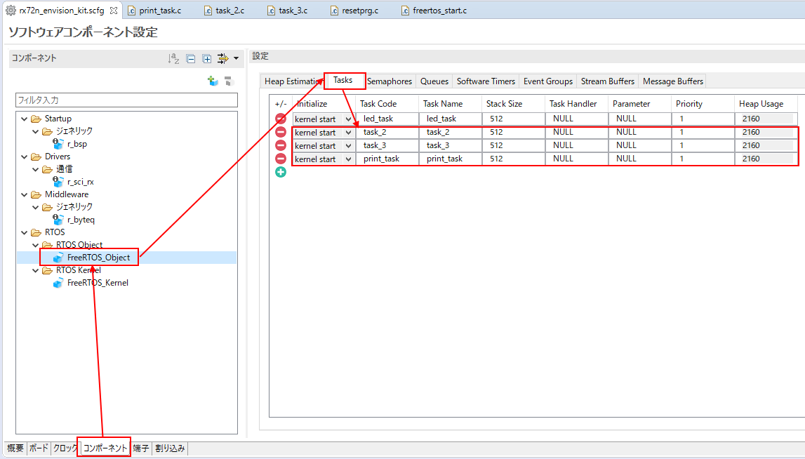
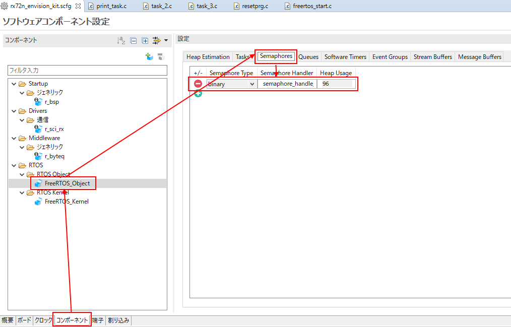
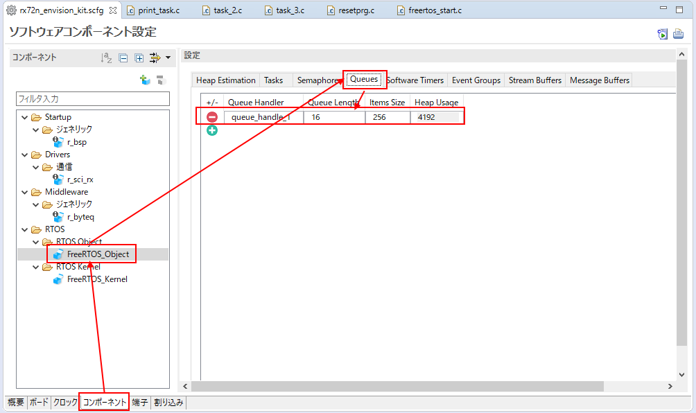

# Things to prepare
* Indispensable
    * RX72N Envision Kit × 1 unit
    * USB cable (USB Micro-B --- USB Type A) × 2 
    * Windows PC × 1 unit
        * Tools to be installed in Windows PC 
            * [e2 studio 2020-07](https://www.renesas.com/products/software-tools/tools/ide/e2studio.html)
            * [CC-RX](https://www.renesas.com/products/software-tools/tools/compiler-assembler/compiler-package-for-rx-family.html) V3.02 or later
            * [Tera Term](https://osdn.net/projects/ttssh2/) 4.105 or later
                * Turn off [High-speed file transfer in serial connection](https://teratermproject.github.io/manual/5/ja/setup/teraterm-trans.html#FileSendHighSpeedMode) 
                    * Tera Term -> Setting -> Read setting -> Open TERATERM.INI with text editor -> Change setting -> Save -> Tera Term reboot

# Prerequisite
* [Generate new project (FreeRTOS(Kernel Only))](../../freertos/generate-new-project-kernel-only.md)  must be completed.
    * In this section, implements by adding the code to communicate with PC to LED0.1 second cycle blinking program created with [Generate new project (FreeRTOS(Kernel Only))](../../freertos/generate-new-project-kernel-only.md) using UART mode of SCI(Serial Communication Interface)

# Serialize means
* Line up requirement in serial (continuously)
* An appropriate data structure as implementation is queue 
* This method is effective when there are multiple tasks to use the hardware for one hardware.
* As typical examples, explain the serialize of print debug.
    * Receive string transmission requirement from multiple tasks and run into the transmission function of SCI
    * Since the transmission function of SCI is non-blocking call, the process itself has not completed when the function ends.
    * Process complete is the format notified by callback function
    * After the transmission function of SCI ends, take semaphore and is in wait state.
    * Give semaphore when callback transmission complete notice of SCI, and release wait state.

# Check circuit
* [Reference](https://github.com/renesas/rx72n-envision-kit/wiki/1-SCI_#check-circuit)

# Set SCI driver software with Smart Configurator
## Add component
* [Reference](https://github.com/renesas/rx72n-envision-kit/wiki/1-SCI_#add-component)
## Set component
* r_sci_rx
    * [Reference](https://github.com/renesas/rx72n-envision-kit/wiki/1-SCI_#r_sci_rx)
    * Enable "setting to generate interrupt when transmission completes" as setting not included in the above reference.
        * <a href="../../images/062_e2_studio_sc.png" target="_blank"></a>
* FreeRTOS_Object
    * Register task
        * <a href="../../images/059_e2_studio_sc.png" target="_blank"></a>
        * Select FreeRTOS_Object -> Task
        * Enter task_2, task_3, print_task in Task Code and Task Name
    * Register semaphore
        * <a href="../../images/060_e2_studio_sc.png" target="_blank"></a>
        * Select FreeRTOS_Object -> Semaphores 
        * Select binary in Semaphore Type
    * Register queue
        * <a href="../../images/061_e2_studio_sc.png" target="_blank"></a>
        * Select FreeRTOS_Object -> Queues 
        * Enter 16 in Queue Length
        * Enter 256 in Item Size.
            * Setting to make up to sixteen queues with 256 character data.
# Pin setting
* [Reference](https://github.com/renesas/rx72n-envision-kit/wiki/1-SCI_#pin-setting)

# print_task.c coding
```print_task.c
#include "task_function.h"
/* Start user code for import. Do not edit comment generated here */
#include "r_sci_rx_if.h"
#include "r_sci_rx_pinset.h"
#include "platform.h"
#include <string.h>

void sci_callback(void *arg);

static sci_hdl_t sci_handle;
static signed portBASE_TYPE xHigherPriorityTaskWoken;

extern QueueHandle_t queue_handle_1;
extern SemaphoreHandle_t semaphore_handle_1;

/* End user code. Do not edit comment generated here */

void print_task(void * pvParameters)
{
/* Start user code for function. Do not edit comment generated here */
	sci_cfg_t   my_sci_config;
	static char string[256];

    /* Set up the configuration data structure for asynchronous (UART) operation. */
    my_sci_config.async.baud_rate    = 115200;
    my_sci_config.async.clk_src      = SCI_CLK_INT;
    my_sci_config.async.data_size    = SCI_DATA_8BIT;
    my_sci_config.async.parity_en    = SCI_PARITY_OFF;
    my_sci_config.async.parity_type  = SCI_EVEN_PARITY;
    my_sci_config.async.stop_bits    = SCI_STOPBITS_1;
    my_sci_config.async.int_priority = 15; /* disable 0 - low 1 - 15 high */

    R_SCI_Open(SCI_CH2, SCI_MODE_ASYNC, &my_sci_config, sci_callback, &sci_handle);
    R_SCI_PinSet_SCI2();

    while(1)
    {
    	xQueueReceive(queue_handle_1, string, portMAX_DELAY);
    	R_SCI_Send(sci_handle, (uint8_t *)string, strlen(string));
    	xSemaphoreTake( semaphore_handle_1, portMAX_DELAY );
    }
/* End user code. Do not edit comment generated here */
}
/* Start user code for other. Do not edit comment generated here */
void sci_callback(void *arg)
{
	xHigherPriorityTaskWoken = pdFALSE;
	xSemaphoreGiveFromISR(semaphore_handle_1, &xHigherPriorityTaskWoken);
	portYIELD_FROM_ISR( xHigherPriorityTaskWoken );
}

/* End user code. Do not edit comment generated here */
```

# task_2.c coding
```task_2.c
#include "task_function.h"
/* Start user code for import. Do not edit comment generated here */
#include "platform.h"

extern QueueHandle_t queue_handle_1;
/* End user code. Do not edit comment generated here */

void task_2(void * pvParameters)
{
/* Start user code for function. Do not edit comment generated here */
	char string[256];
	while(1)
	{
		vTaskDelay(1000);
		sprintf(string, "task_2: aaaaaaaaaaaaaaaaaaaaaaaaaaaaaaaaaaaaaaaaaaaaaaaaaaaaaaaaaaaaaaaaaaa\n");
		xQueueSend(queue_handle_1, string, portMAX_DELAY);
	}
/* End user code. Do not edit comment generated here */
}
/* Start user code for other. Do not edit comment generated here */
/* End user code. Do not edit comment generated here */
```

# task_3.c coding
```task_3.c
#include "task_function.h"
/* Start user code for import. Do not edit comment generated here */
#include "platform.h"

extern QueueHandle_t queue_handle_1;
/* End user code. Do not edit comment generated here */

void task_3(void * pvParameters)
{
/* Start user code for function. Do not edit comment generated here */
	char string[256];
	while(1)
	{
		vTaskDelay(1000);
		sprintf(string, "task_3: bbbbbbbbbbbbbbbbbbbbbbbbbbbbbbbbbbbbbbbbbbbbbbbbbbbbbbbbbbbbbbbbbbb\n");
		xQueueSend(queue_handle_1, string, portMAX_DELAY);
	}
/* End user code. Do not edit comment generated here */
}
/* Start user code for other. Do not edit comment generated here */
/* End user code. Do not edit comment generated here */
```
# Adjust heap capacity
* [Reference](https://github.com/renesas/rx72n-envision-kit/wiki/Generate-new-project-%28FreeRTOS%28Kernel-Only%29%29#adjust-heap-capacity)

# Check operation
* Boot Teraterm on Windows PC and select COM port (COMx: RSK USB Serial Port(COMx)) to connect
    * Setting -> Perform the setting below with serial port
        * Baud rate: 115200 bps
        * Data: 8 bit
        * Parity: none
        * Stop: 1 bit
        * Flow control: none
    * Setting -> Perform the setting below with terminal
        * Newline code
            * Reciept: AUTO
            * Transmission: CR+LF
        * Local echo
            * Uncheck the box
* Execution：[Reference](https://github.com/renesas/rx72n-envision-kit/wiki/Generate-new-project-%28bare-metal%29#check-operation)
* Check that the following log is outputted every second
```
task_2: aaaaaaaaaaaaaaaaaaaaaaaaaaaaaaaaaaaaaaaaaaaaaaaaaaaaaaaaaaaaaaaaaaa
task_3: bbbbbbbbbbbbbbbbbbbbbbbbbbbbbbbbbbbbbbbbbbbbbbbbbbbbbbbbbbbbbbbbbbb
task_2: aaaaaaaaaaaaaaaaaaaaaaaaaaaaaaaaaaaaaaaaaaaaaaaaaaaaaaaaaaaaaaaaaaa
task_3: bbbbbbbbbbbbbbbbbbbbbbbbbbbbbbbbbbbbbbbbbbbbbbbbbbbbbbbbbbbbbbbbbbb
task_2: aaaaaaaaaaaaaaaaaaaaaaaaaaaaaaaaaaaaaaaaaaaaaaaaaaaaaaaaaaaaaaaaaaa
task_3: bbbbbbbbbbbbbbbbbbbbbbbbbbbbbbbbbbbbbbbbbbbbbbbbbbbbbbbbbbbbbbbbbbb
```
* Check that the print outputs from task_2 and task_3 are outputted without running into each other.
* If R_SCI_Send() is called directly without xQueueSend() from task_2 and task_3, the transmission of task_3 is mixed into that of task_2, accordingly, it is not possible to output without running into each other as described above.
