# Preparing items
* must
    * RX72N Envision Kit x 1
    * USB Cable(USB Micro-B --- USB Type A) x 1
* option
    * USB Cable(USB Micro-B --- USB Type A) x 2 (total 3)
    * LAN Cable(can connect to Internet) x 1
    * micro SD Card x 1
    * [USB-Serial Convert PMOD Module](https://store.digilentinc.com/pmod-usbuart-usb-to-uart-interface/) x 1
    * Windows PC x 1
        * Install items to Windows PC
            * [Tera Term](https://osdn.net/projects/ttssh2/) 4.105 is confirmed
                * Turn off [High-speed file transfer with serial connection](https://teratermproject.github.io/manual/5/en/setup/teraterm-trans.html#FileSendHighSpeedMode): FileSendHighSpeedMode=off
                    * Tera Term -> Settings -> Import Settings -> Open TERATERM.INI by text editor -> change settings -> save -> Restart Tera Term

# SPORTS GAMES demo
* Connect ECN1(USB Micro-B) to power source USB port(PC, etc)
    * <a href="../../images/001_board_power_on.jpg" target="_blank">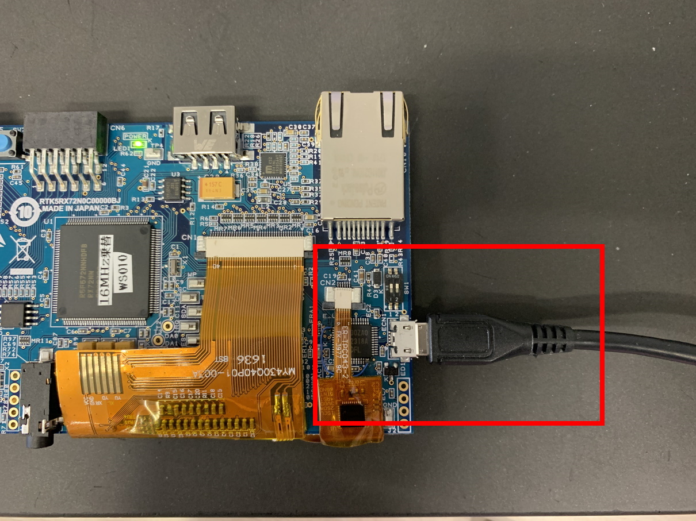</a>

* Confirm SPORT GAMES starting on display
    * <a href="../../images/002_board_sports_games.jpg" target="_blank">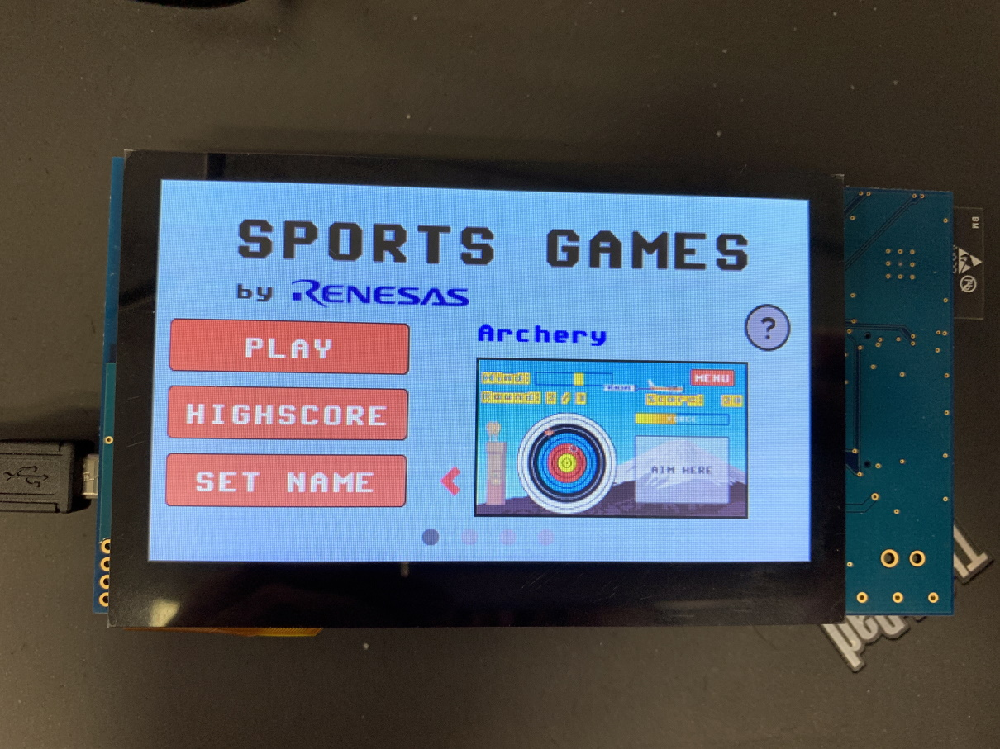</a>
    * User can select 4 types of Games with sliding on title display, and user can start by pushing [PLAY] button.
        * Archery
        * 400m Race
        * Weightlifting
        * Bicycle Race
    * This game is made by Segger and using [emWin middleware](https://www.segger.com/products/user-interface/emwin/) and LCD controller [GLCDC], 2d Graphic Engine [DRW2D] in RX72N MCU.
    * System specification for display
        * resolution: 480x272(WQVGA)
        * display flame buffer size = (480x272)x16bit color = 2,088,960bit = 256KB
        * double buffers (1: LCD controller transferring, 1: updating data)
        * 512KB RAM occupies on 1MB internal RAM on RX72N as display buffer
        * display update occurring every 16.66 ms (>60fps).

# Bank swap
* Image of bank swap
    * RX72N internal memory map
        * <a href="../../images/003_rx72n_memory_map.png" target="_blank">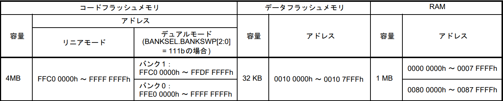</a>
        * Dual mode is recommended for firmware update system with 1 chip
        * Dual mode can select start bank, bank0 or bank1.
            * <a href="../../images/004_rx72n_dual_mode.png" target="_blank">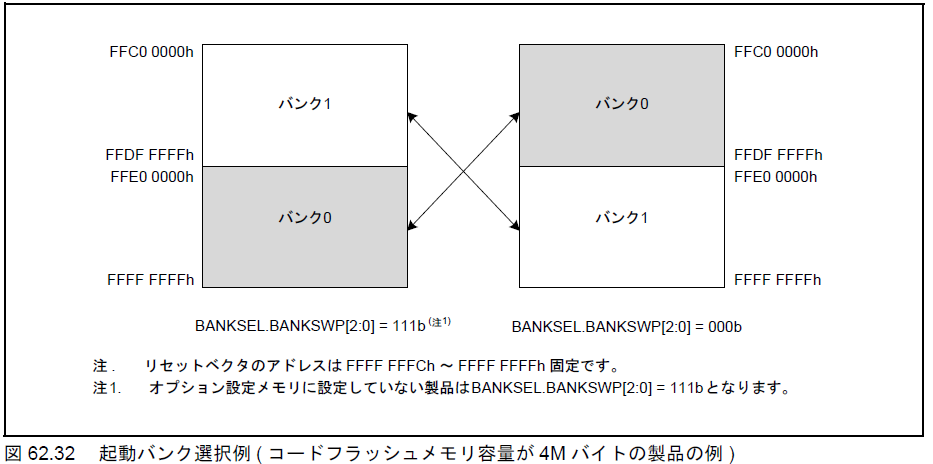</a>
    * SPORTS GAMES demos on Bank0, Benchmark demos on Bank1 in RX72N Envision Kit case
    * Push SW2 3 times during 3 seconds on RX72N Envision Kit 
        * <a href="../../images/005_board_SW2.jpg" target="_blank">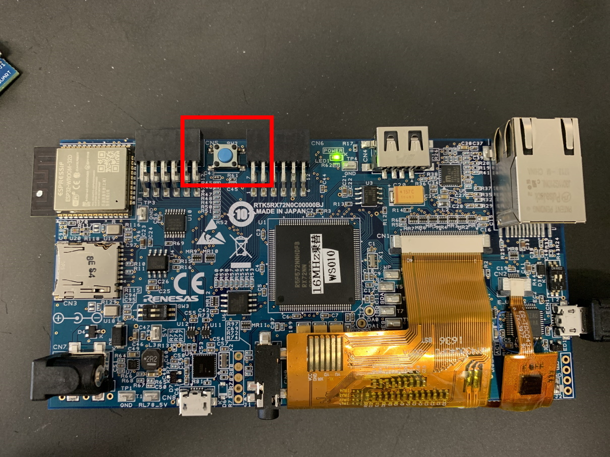</a>

# Benchmark demo
* Title
    * <a href="../../images/006_board_power_on2.jpg" target="_blank">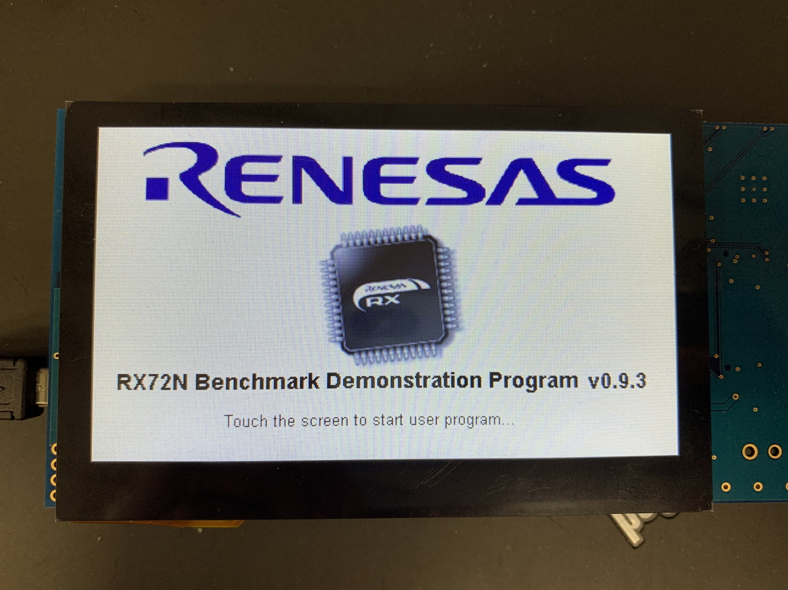</a>
        * Go to next screen by touching
* Firmware Update via SD Card demo
    * <a href="../../images/007_board_sd_firmware_update.jpg" target="_blank">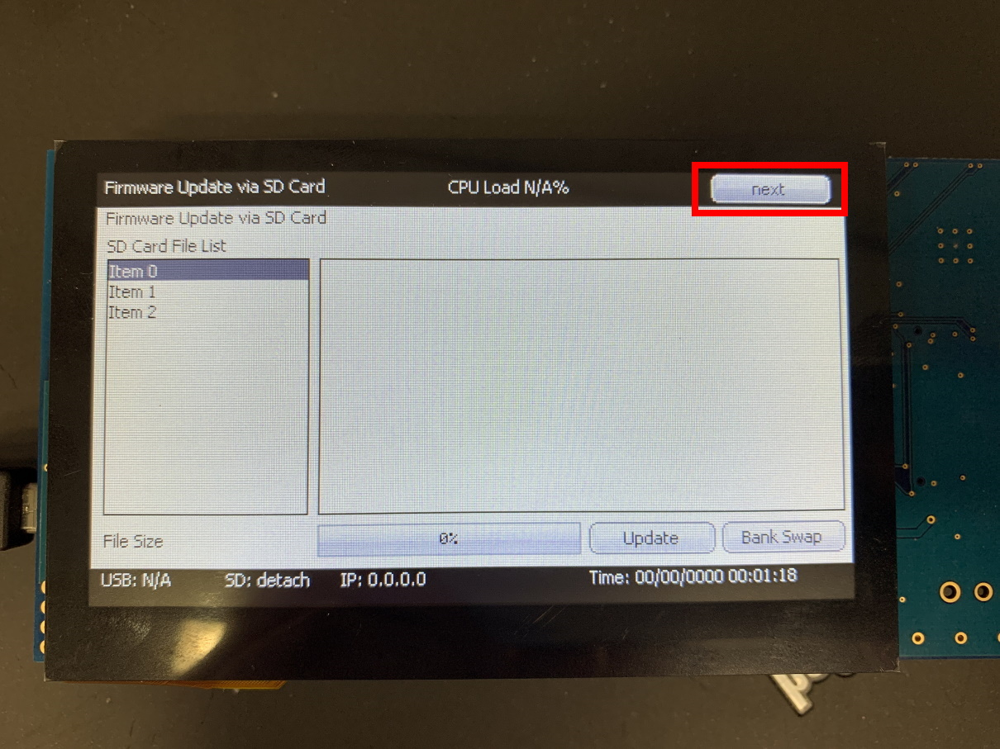</a>
        * Please refer to [Update firmware from SD card](../quick-start/update-firmware-from-sd-card.md) for more details
        * Push [next] button
* Serial terminal demo (followings are options)
    * This demo display does not exist in later firmware version v2.0.0. But serial terminal alive in background.
    * <a href="../../images/008_board_serial_terminal.jpg" target="_blank">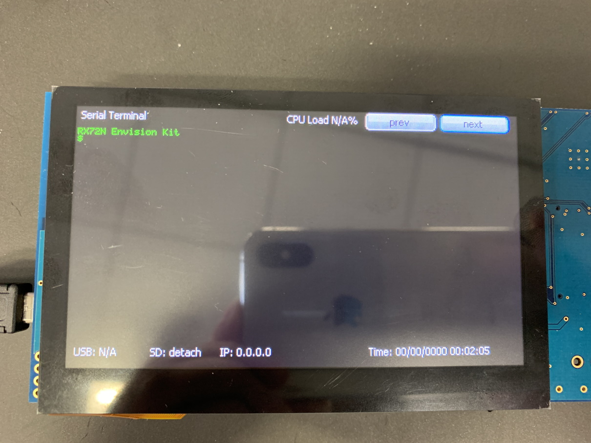</a>
        * Connect CN8(USB Micro-B) to USB port(PC, etc) using USB cable
            * <a href="../../images/009_board_serial_terminal2.jpg" target="_blank">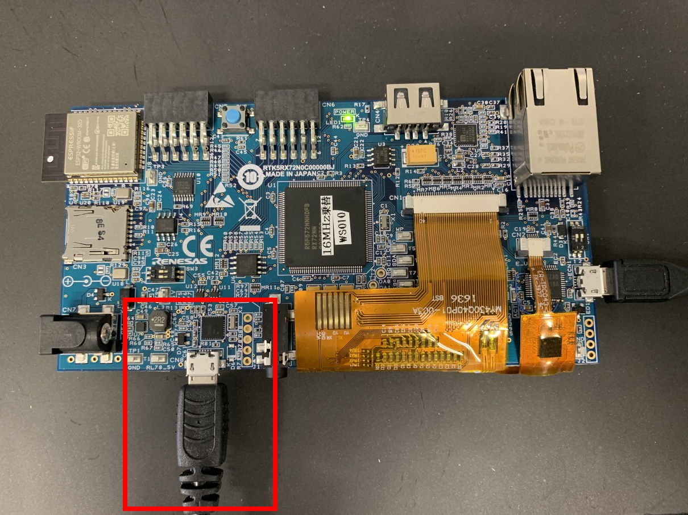</a>
        * Execute terminal soft (Teraterm, etc) and select COM port (COMx: RSK USB Serial Port(COMx))
            * Settings -> Serial port
                * Baud rate: 115200 bps
                * data: 8 bit
                * parity: none
                * stop: 1 bit
                * flow control: none
            * Settings -> terminal
                * CR/LF code
                    * reception: AUTO
                    * transmit: CR+LF
                * Local echo
                    * remove checkbox
    * Following commands are supported on initial firmware
        * version : read version info
        * freertos cpuload read : read FreeRTOS CPU usage info
        * freertos cpuload reset : reset FreeRTOS CPU usage info
    * Command response behavior
        * <a href="../../images/011_pc_teraterm2.png" target="_blank">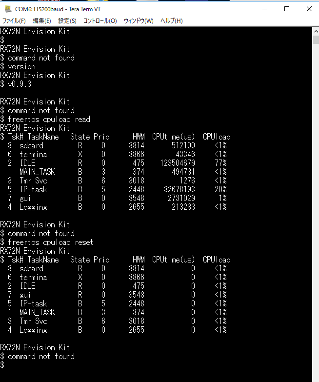</a>
        * <a href="../../images/012_board_serial_terminal3.jpg" target="_blank">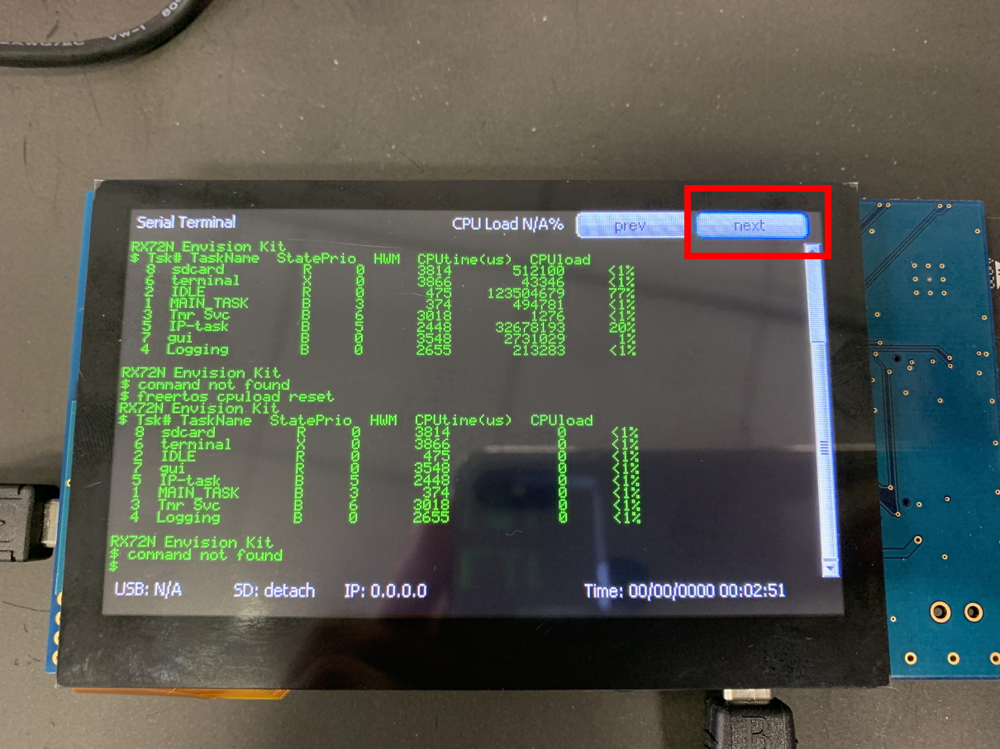</a>
            * Same Teraterm text will be displayed on RX72N Envision Kit
            * Push [next] button
* Amazon FreeRTOS demo
    * <a href="../../images/013_board_network.jpg" target="_blank">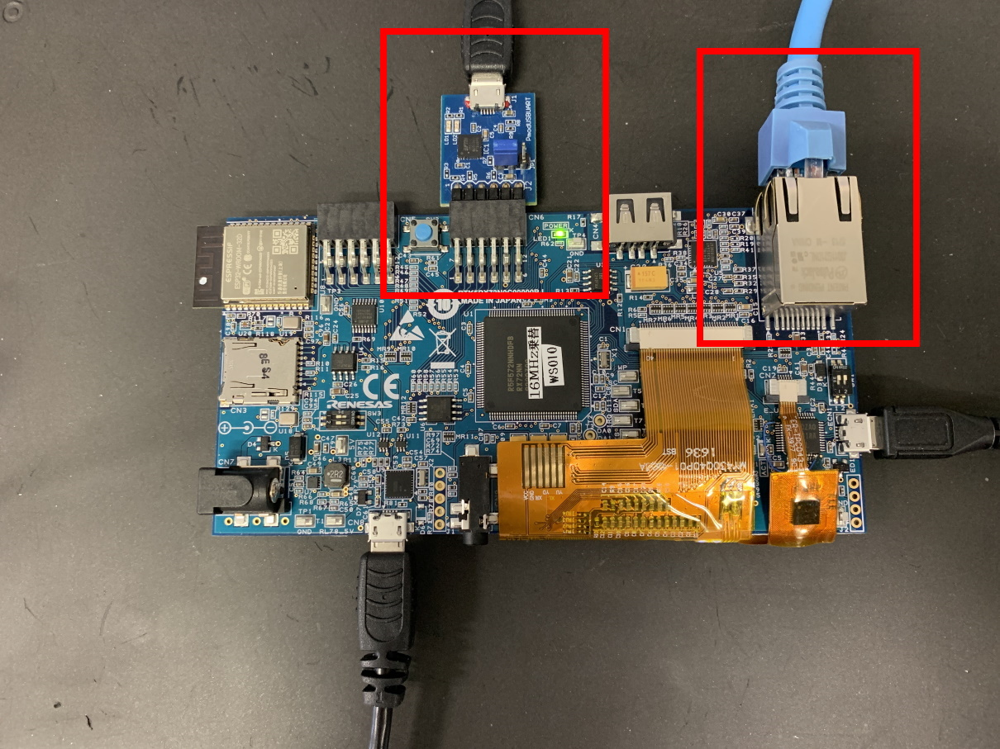</a>
        * Connect LAN Cable(can connect to internet) to CN10(LAN connector)
        * Connect CN6 [USB-serial convertor PMOD module](https://store.digilentinc.com/pmod-usbuart-usb-to-uart-interface/)
            * Please be careful for CN6 because CN6 is 12pins and [USB-serial convertor PMOD module](https://store.digilentinc.com/pmod-usbuart-usb-to-uart-interface/) is 6pins, please confirm corresponding printed "1" near the CN6 on board and printed "1" on  [USB-serial convertor PMOD module](https://store.digilentinc.com/pmod-usbuart-usb-to-uart-interface/)
        * Connect  [USB-serial convertor PMOD module](https://store.digilentinc.com/pmod-usbuart-usb-to-uart-interface/) to USB cable and connect it to USB port (PC, etc) (If user would confirm whole of log data)
            * Execute terminal soft (Teraterm, etc) and select COM port (COMx: USB Serial Port(COMx))
                * Settings -> Serial port
                    * Baud rate: 912600 bps
                    * data: 8 bit
                    * parity: none
                    * stop: 1 bit
                    * flow control: none
                * Settings -> terminal
                    * CR/LF code
                        * reception: AUTO
                        * transmit: CR+LF
                    * Local echo
                        * remove checkbox
    * <a href="../../images/015_pc_network3.png" target="_blank">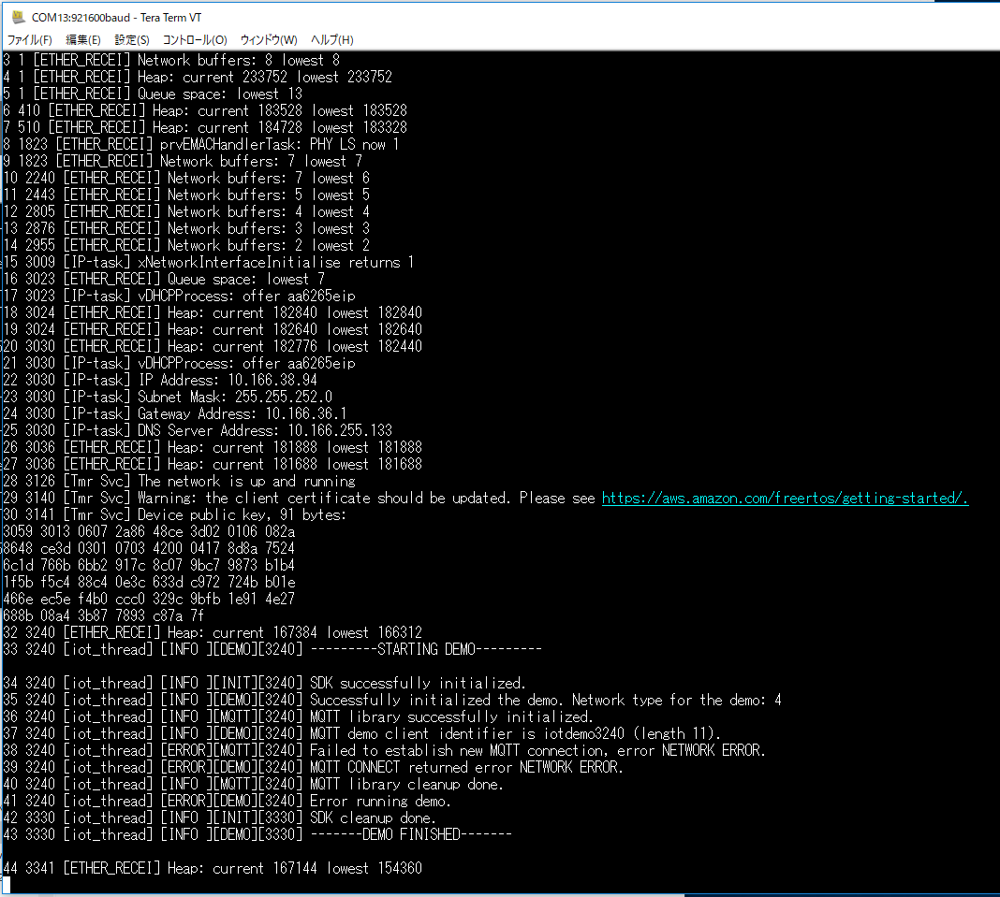</a>
    * <a href="../../images/014_board_network2.jpg" target="_blank">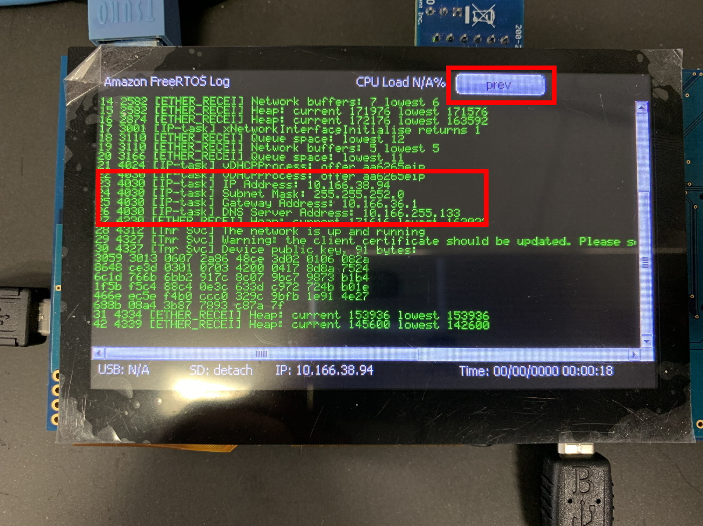</a>
        * Confirm start up network with allocated IP address
        * AWS connection error will be occurred because AWS credential is not installed
            * User can confirm AWS connection demo after firmware version x.x.x (now developing)
            * Firmware can be updated by using micro SD card
            * Please refer to how to update firmware via SD card [Update firmware from SD card](../quick-start/update-firmware-from-sd-card.md)
            * Please refer to details of AWS connection experiment [AWS with FreeRTOS demos](#)
        * Push [prev] button 2 times, return to [Firmware Update via SD Card]
* How to swap bank on Benchmark demo on RX72N Envision Kit
    * Push [bankswap] button on RX72N Envision Kit
        * <a href="../../images/016_board_bankswap.jpg" target="_blank">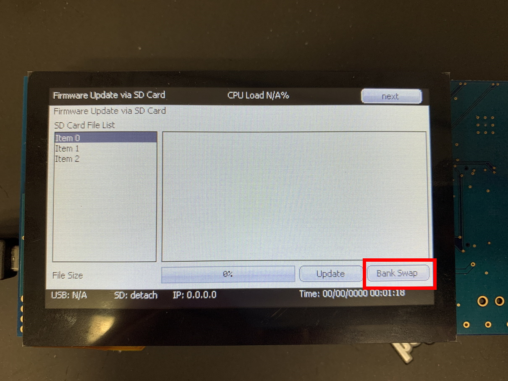</a>

