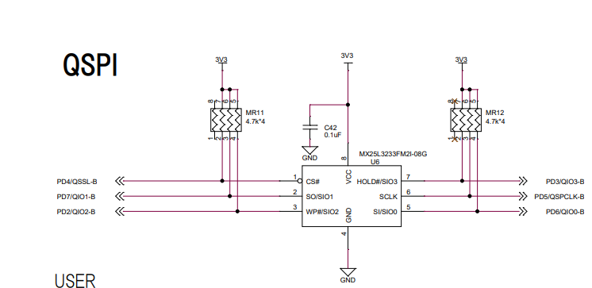
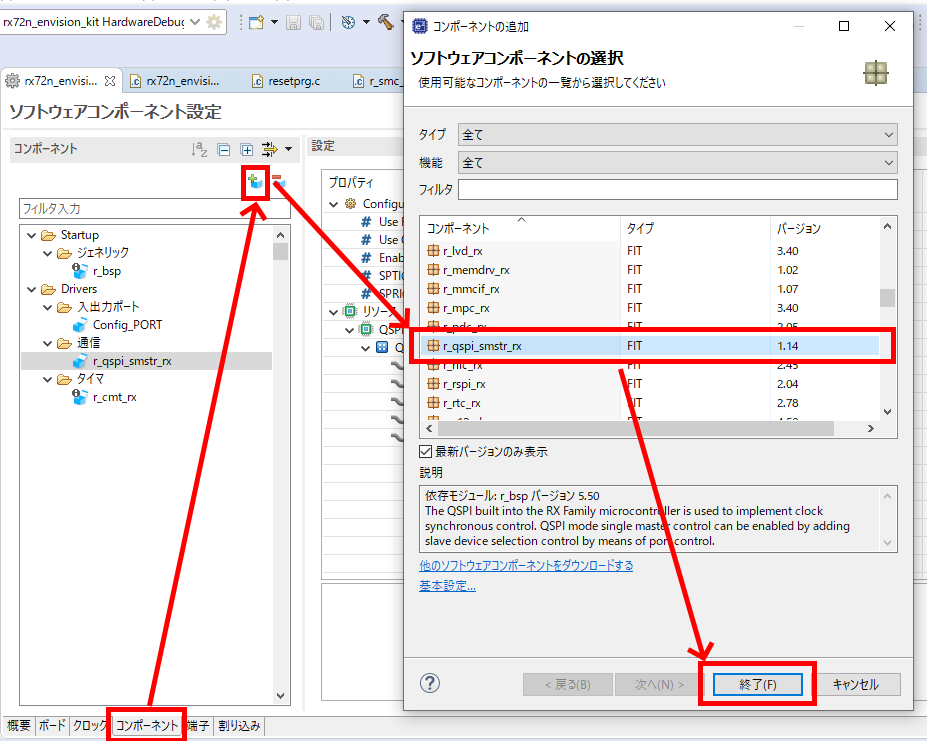
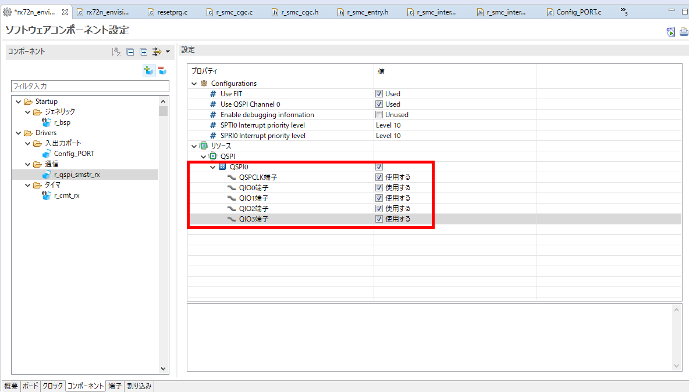
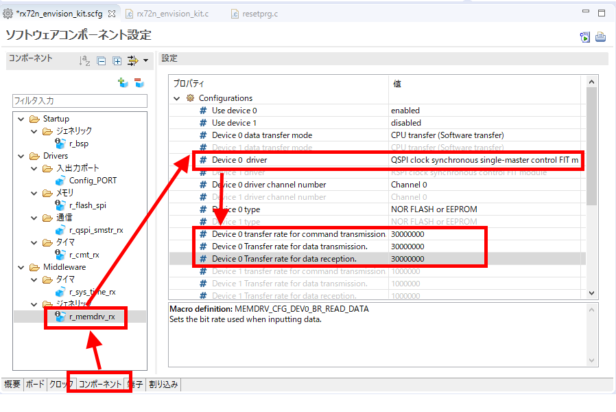
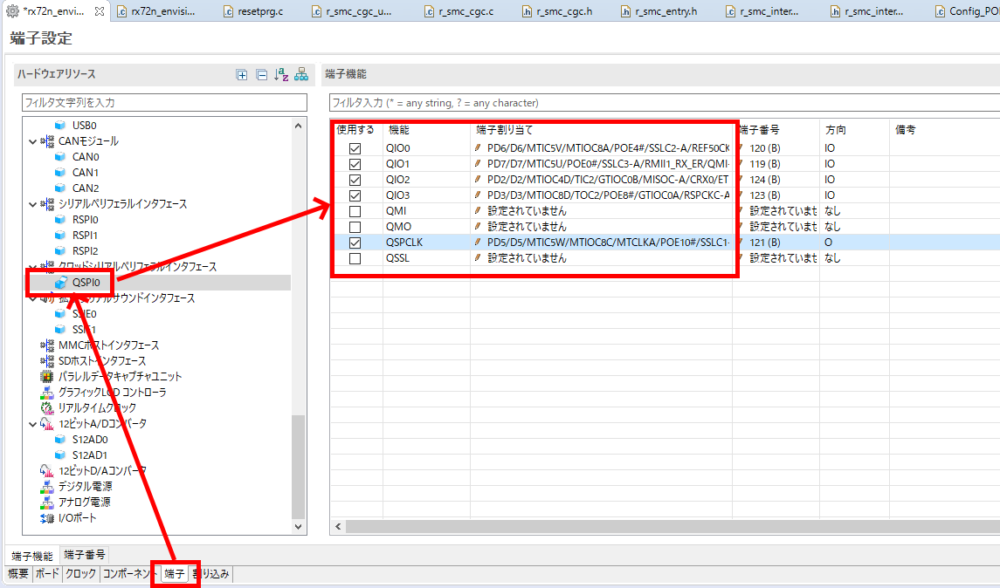

# 準備する物
* 必須
    * RX72N Envision Kit × 1台
    * USBケーブル(USB Micro-B --- USB Type A) × 2 本
    * Windows PC × 1 台
        * Windows PC にインストールするツール
            * [e2 studio 2020-04](https://www.renesas.com/products/software-tools/tools/ide/e2studio.html)
                * 初回起動時に時間がかかることがある
            * [CC-RX](https://www.renesas.com/products/software-tools/tools/compiler-assembler/compiler-package-for-rx-family.html) V3.02以降

# 前提条件
* [新規プロジェクト作成方法(ベアメタル)](../bare-metal/generate-new-project.md) を完了すること
    * 本稿では、[新規プロジェクト作成方法(ベアメタル)](../bare-metal/generate-new-project.md)で作成したLED0.1秒周期点滅プログラムにMacronixシリアルフラッシュアクセス方法のコードを追加する形で実装する

# 回路確認
* <a href="../../images/027_board_serial_flash.png" target="_blank"></a>
    * QSPI(Quad Serial Peripheral Interface)とは、上記回路のSIO0-SIO3のようにデータ信号線が4本、データ同期クロック信号線が1本、チップセレクト信号線が1本の計6本のインタフェースである
    * 通常SPIはデータ信号線が1本であり、それに対しQSPIではデータ信号線が4本である
    * 従ってQSPIはSPIに対し1クロックあたりの転送効率が4倍になっているため高速である

# スマートコンフィグレータによるQSPI用ドライバソフトウェアの設定
## コンポーネント追加
* <a href="../../images/028_e2_studio_sc5.png" target="_blank"></a>
    * 上記のように4個のコンポーネントを追加する
        * r_qspi_smstr_rx (上記スクリーンショットで説明)
        * r_flash_spi
        * r_memdrv_rx
        * r_sys_time_rx

## コンポーネント設定
### r_qspi_smstr_rx
* QSPI関連の端子を使用する設定にする
    * <a href="../../images/029_e2_studio_sc6.png" target="_blank"></a>

### r_flash_spi
* 無し（あとでソースコードの微調整が必要）

### r_memdrv_rx
* メモリドライバをQSPIに接続する
* QSPIの転送クロック周波数を30MHzに変更
    * <a href="../../images/032_e2_studio_sc9.png" target="_blank"></a>

### r_sys_time_rx
* 無し

## 端子設定
* <a href="../../images/030_e2_studio_sc7.png" target="_blank"></a>
    * RX72N マイコンは、1個の端子に複数機能が割り当たっているため、どの機能を使用するかの設定をソフトウェアにより施す必要がある
    * RX72N Envision KitではQSPIシリアルフラッシュはPD2, PD3, PD5, PD6, PD7の5本で制御を行う
    * PD4は#CS(チップセレクト)に繋いであり、この端子のみQSPI機能ではなく汎用ポート機能を用いて制御するため、r_flash_spi側のFITモジュールにより個別に設定を行う（要改善）
    * 上記のようにスマートコンフィグレータ上で端子設定を行い、コード生成する
    * ボードコンフィグレーションファイル(BDF)を読み込むことで、スマートコンフィグレータ上の「端子設定」が自動化される

### r_flash_spi (ソースコードの微調整)
* /src/smc_gen/r_config/r_flash_spi_pin_config.h
```
#define FLASH_SPI_CS_DEV0_CFG_PORTNO    'D'     /* Device 0 Port Number : FLASH SS#    */
#define FLASH_SPI_CS_DEV0_CFG_BITNO     '4'     /* Device 0 Bit Number  : FLASH SS#    */
```

## main()関数のコーディング
* 以下のように rx72n_envision_kit.c にコード追加を行う
* このコードでは、「0x12345678, 0x9abcdef0」のパタンの繰り返しをシリアルフラッシュに書込み/読み出しを1MB分繰り返す
* シリアルフラッシュは上書きができないため、消去してから書き込みを行う必要がある。main()ではSERIAL_FLASH_STATE_ERASEで消去を実行。
```rx72n_envision_kit.c
#include "r_smc_entry.h"
#include "platform.h"
#include "r_cmt_rx_if.h"
#include "r_flash_spi_if.h"
#include "r_flash_spi_config.h"
#include "r_sys_time_rx_if.h"

/*******************************************************************************
Macro definitions
*******************************************************************************/
#define SERIAL_FLASH_TASK_DATA_SIZE (0x00100000)
#define SERIAL_FLASH_64KB_SIZE (0x00010000)
#define SERIAL_FLASH_PAGE_SIZE (256)

/*******************************************************************************
Typedef definitions
*******************************************************************************/
typedef enum e_serial_flash_state
{
    SERIAL_FLASH_STATE_ERASE,
    SERIAL_FLASH_STATE_ERASE_WAIT_COMPLETE,
    SERIAL_FLASH_STATE_WRITE,
    SERIAL_FLASH_STATE_WRITE_WAIT_COMPLETE,
    SERIAL_FLASH_STATE_READ,
    SERIAL_FLASH_STATE_FINISH,
    SERIAL_FLASH_STATE_ERROR
} serial_flash_state_t;

/*******************************************************************************
Imported global variables and functions (from other files)
*******************************************************************************/

/*******************************************************************************
Exported global variables and functions (to be accessed by other files)
*******************************************************************************/
const uint32_t cbuf1[SERIAL_FLASH_PAGE_SIZE/sizeof(uint32_t)] = {
        0x12345678, 0x9abcdef0, 0x12345678, 0x9abcdef0, 0x12345678, 0x9abcdef0, 0x12345678, 0x9abcdef0,
        0x12345678, 0x9abcdef0, 0x12345678, 0x9abcdef0, 0x12345678, 0x9abcdef0, 0x12345678, 0x9abcdef0,
        0x12345678, 0x9abcdef0, 0x12345678, 0x9abcdef0, 0x12345678, 0x9abcdef0, 0x12345678, 0x9abcdef0,
        0x12345678, 0x9abcdef0, 0x12345678, 0x9abcdef0, 0x12345678, 0x9abcdef0, 0x12345678, 0x9abcdef0,
        0x12345678, 0x9abcdef0, 0x12345678, 0x9abcdef0, 0x12345678, 0x9abcdef0, 0x12345678, 0x9abcdef0,
        0x12345678, 0x9abcdef0, 0x12345678, 0x9abcdef0, 0x12345678, 0x9abcdef0, 0x12345678, 0x9abcdef0,
        0x12345678, 0x9abcdef0, 0x12345678, 0x9abcdef0, 0x12345678, 0x9abcdef0, 0x12345678, 0x9abcdef0,
        0x12345678, 0x9abcdef0, 0x12345678, 0x9abcdef0, 0x12345678, 0x9abcdef0, 0x12345678, 0x9abcdef0
};
static uint32_t cbuf2[SERIAL_FLASH_PAGE_SIZE/sizeof(uint32_t)];
static uint8_t  gDevNo;
static uint8_t  gStat;
static serial_flash_state_t g_serial_flash_state;

/*******************************************************************************
Private global variables and functions
*******************************************************************************/
void main(void);
void cmt_callback(void *arg);
static serial_flash_state_t serial_flash_update(void);

void main(void)
{
	uint32_t channel;
	R_CMT_CreatePeriodic(10, cmt_callback, &channel);

    serial_flash_state_t state;
    /* wait completing gui initializing */
    R_SYS_TIME_RegisterPeriodicCallback(R_FLASH_SPI_1ms_Interval, 1);
    gDevNo = FLASH_SPI_DEV0;
    R_FLASH_SPI_Open(gDevNo);
    R_FLASH_SPI_Set_4byte_Address_Mode(gDevNo);
    R_FLASH_SPI_Quad_Enable(gDevNo);
    R_FLASH_SPI_Read_Status(gDevNo, &gStat); // debug (gStat & 0x40) != 0x00
    R_FLASH_SPI_Set_Write_Protect(gDevNo, 0);
    R_FLASH_SPI_Read_Status(gDevNo, &gStat); // debug gStat & (0x0f << 2) !=0x00
    g_serial_flash_state = SERIAL_FLASH_STATE_ERASE;
    while(1)
    {
        serial_flash_update();
    }
}

void cmt_callback(void *arg)
{
	if(PORT4.PIDR.BIT.B0 == 1)
	{
		PORT4.PODR.BIT.B0 = 0;
	}
	else
	{
		PORT4.PODR.BIT.B0 = 1;
	}
}

static serial_flash_state_t serial_flash_update(void)
{
    static uint32_t serial_flash_address = 0;
    static flash_spi_info_t Flash_Info_W;
    static flash_spi_info_t Flash_Info_R;
    static flash_spi_erase_info_t Flash_Info_E;

    switch (g_serial_flash_state)
    {
        case SERIAL_FLASH_STATE_ERASE:
            Flash_Info_E.addr   = serial_flash_address;
            Flash_Info_E.mode   = FLASH_SPI_MODE_B64K_ERASE;
            if (R_FLASH_SPI_Erase(gDevNo, &Flash_Info_E) == FLASH_SPI_SUCCESS)
            {
                g_serial_flash_state = SERIAL_FLASH_STATE_ERASE_WAIT_COMPLETE;
            }
            else
            {
                g_serial_flash_state = SERIAL_FLASH_STATE_ERROR;
            }
            break;
        case SERIAL_FLASH_STATE_ERASE_WAIT_COMPLETE:
            if (R_FLASH_SPI_Polling(gDevNo, FLASH_SPI_MODE_ERASE_POLL) == FLASH_SPI_SUCCESS)
            {
				serial_flash_address += SERIAL_FLASH_64KB_SIZE;
				if (SERIAL_FLASH_TASK_DATA_SIZE == serial_flash_address)
				{
					serial_flash_address = 0;
					Flash_Info_W.cnt     = SERIAL_FLASH_TASK_DATA_SIZE;
					g_serial_flash_state = SERIAL_FLASH_STATE_WRITE;
				}
				else
				{
					g_serial_flash_state = SERIAL_FLASH_STATE_ERASE;
				}
            }
            break;
        case SERIAL_FLASH_STATE_WRITE:
            Flash_Info_W.addr    = serial_flash_address;
            Flash_Info_W.p_data  = (uint8_t *)cbuf1;
            Flash_Info_W.op_mode = FLASH_SPI_QUAD;
            if (R_FLASH_SPI_Write_Data_Page(gDevNo, &Flash_Info_W) == FLASH_SPI_SUCCESS)
            {
                g_serial_flash_state = SERIAL_FLASH_STATE_WRITE_WAIT_COMPLETE;
            }
            else
            {
                g_serial_flash_state = SERIAL_FLASH_STATE_ERROR;
            }
            break;
        case SERIAL_FLASH_STATE_WRITE_WAIT_COMPLETE:
            if (R_FLASH_SPI_Polling(gDevNo, FLASH_SPI_MODE_PROG_POLL) == FLASH_SPI_SUCCESS)
            {
				serial_flash_address += SERIAL_FLASH_PAGE_SIZE;
				if (SERIAL_FLASH_TASK_DATA_SIZE == serial_flash_address)
				{
					serial_flash_address = 0;
					g_serial_flash_state = SERIAL_FLASH_STATE_READ;
				}
				else
				{
					g_serial_flash_state = SERIAL_FLASH_STATE_WRITE;
				}
            }
            break;
        case SERIAL_FLASH_STATE_READ:
            Flash_Info_R.cnt     = SERIAL_FLASH_PAGE_SIZE;
            Flash_Info_R.addr    = serial_flash_address;
            Flash_Info_R.p_data  = (uint8_t *)cbuf2;
            Flash_Info_R.op_mode = FLASH_SPI_QUAD;
            if (R_FLASH_SPI_Read_Data(gDevNo, &Flash_Info_R) == FLASH_SPI_SUCCESS)
            {
				serial_flash_address += SERIAL_FLASH_PAGE_SIZE;
				if (SERIAL_FLASH_TASK_DATA_SIZE == serial_flash_address)
				{
                     serial_flash_address = 0;
                     g_serial_flash_state = SERIAL_FLASH_STATE_FINISH;
                }
            }
            else
            {
                g_serial_flash_state = SERIAL_FLASH_STATE_ERROR;
            }
            break;
        case SERIAL_FLASH_STATE_FINISH:
            /* If do not want to repeat SERIAL_FLASH_STATE_FINISH, update the state. */
            break;
        case SERIAL_FLASH_STATE_ERROR:
            R_FLASH_SPI_Write_Di(gDevNo);
            break;
        default:
            break;
    }
    return g_serial_flash_state;
}
```
