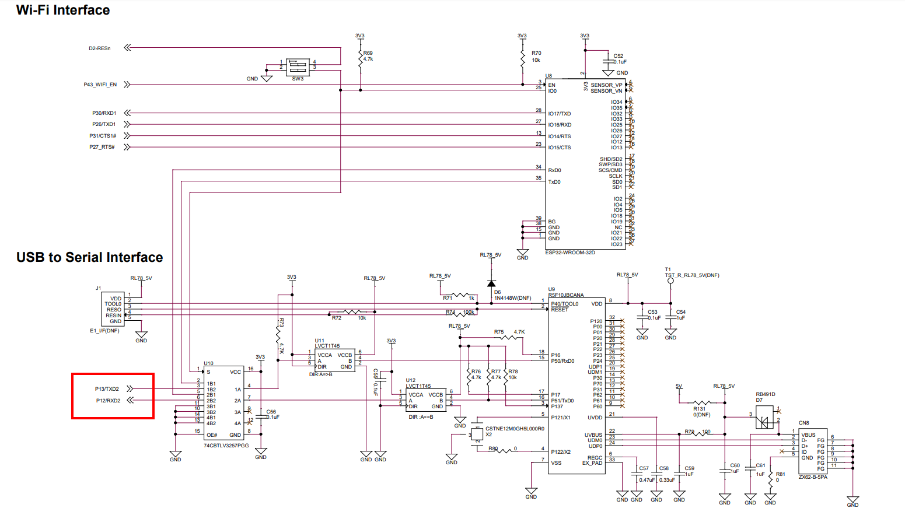
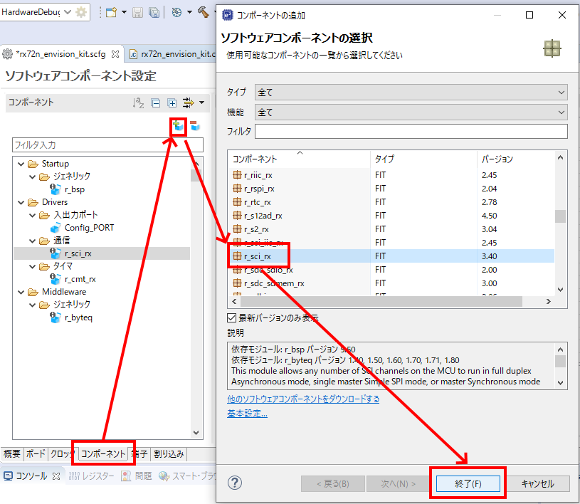
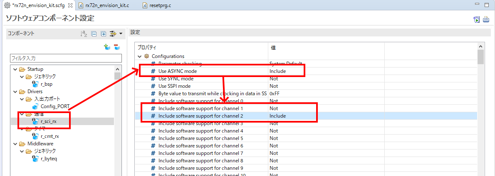
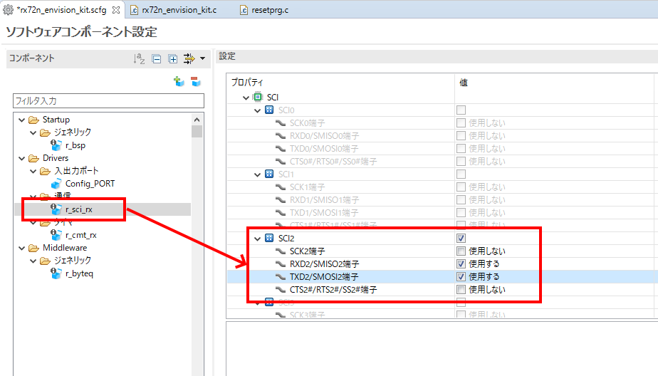
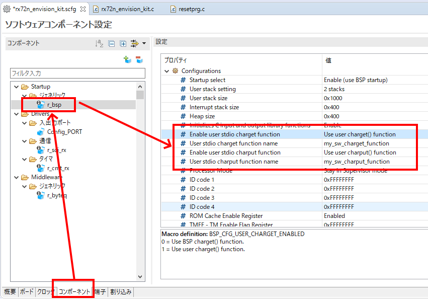
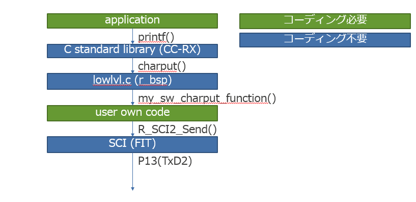
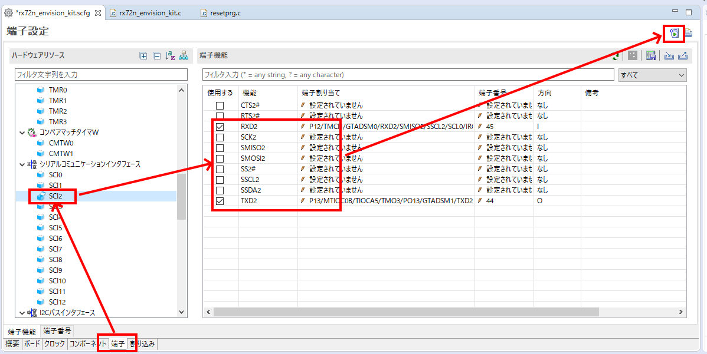

# 準備する物
* 必須
    * RX72N Envision Kit × 1台
    * USBケーブル(USB Micro-B --- USB Type A) × 2 本
    * Windows PC × 1 台
        * Windows PC にインストールするツール
            * [e2 studio 2020-04](https://www.renesas.com/products/software-tools/tools/ide/e2studio.html)
                * 初回起動時に時間がかかることがある
            * [CC-RX](https://www.renesas.com/products/software-tools/tools/compiler-assembler/compiler-package-for-rx-family.html) V3.01以降
            * [Tera Term](https://osdn.net/projects/ttssh2/) 4.105以降
                * [シリアル接続における高速なファイル転送](https://teratermproject.github.io/manual/5/ja/setup/teraterm-trans.html#FileSendHighSpeedMode) の FileSendHighSpeedMode を OFF にする
                    * Tera Term -> 設定 -> 設定の読み込み -> TERATERM.INI を テキストエディタで開く -> 設定を変更 -> 保存 -> Tera Term再起動

# 前提条件
* [新規プロジェクト作成方法(ベアメタル)](../../bare-metal/generate-new-project.md) を完了すること
    * 本稿では、[新規プロジェクト作成方法(ベアメタル)](../../bare-metal/generate-new-project.md)で作成したLED0.1秒周期点滅プログラムにSCI(Serial Communication Interface)のUARTモードを用いてPCと通信するためのコードを追加する形で実装する

# 回路確認
* <a href="../../images/033_board_usb_serial.png" target="_blank"></a>
    * SCI(Serial Communication Interface)とは、上記回路のP13/TXD2、P12/RXD2のようにデータ信号線の送信側TXDx、受信側RXDx(xはチャネル番号)の2本のUARTインタフェースを持つ
    * TXDx、RXDx にCTS/RTS信号を追加してフロー制御機構を併せ持ったUARTインタフェースとして使用することも可能
    * また、I2CやSPIなどのUART以外のモードとしても使用可能
    * RX72N Envision Kit では、**SCIのチャネル2**をUSB-シリアル変換チップを介しCN8に接続されており、RX72NとPCとはCN8コネクタを通じてUART通信することが可能
    * 上記回路においてCN8はSW3の選択によりESP32(WiFiモジュール)と接続することも可能
        * これはESP32のファームウェアを更新したり、接続先のSSL証明書を書き込むための仕掛けである
        * 通常システム動作時はこの機能は使わず、RX72NとCN8を接続するようSW3を設定しておく
        * もしRX72NとCN8が繋がっていないと思われる場合、SW3の設定を確認すること
            * SW3-2がOFFになっていれば、RX72NとCN8が繋がっている
            * SW3-2がONになっていれば、ESP32とCN8が繋がっている
        * なお、RX72NとESP32はP30/RXD1、P26/TXD1、P31/CTS1#、P27_RTS#で接続されており、SSL証明書を書き込む経路とは別となっている
            * つまり、ESP32のファームウェアを更新したりSSL証明書を書き込むとき以外はSW3-2をOFFにすること
        * ESP32の応用については[ESP32活用](../../features/esp32.md)のページを参照のこと

# スマートコンフィグレータによるSCI用ドライバソフトウェアの設定
## コンポーネント追加
* <a href="../../images/034_e2_studio_sc.png" target="_blank"></a>
    * 上記のように2個のコンポーネントを追加する
        * r_sci_rx (上記スクリーンショットで説明)
        * r_byteq
* r_sci_rx が表示されない場合、「ソフトウェアコンポーネントの選択」ウィンドウにおいて「基本設定」を選択し「すべてのFITモジュールを表示」にチェックを入れる

## コンポーネント設定
### r_sci_rx
* SCI関連設定を施す (UART使用、SCIチャネル2使用)
    * Use ASYNC mode を Include (調歩同期式モード(UART)を選択) および、Include software support for channel 1 を Not、およびInclude software support for channel 2 を Include
    * <a href="../../images/035_e2_studio_sc.png" target="_blank"></a>

* SCI関連の端子を使用する設定にする (SCI2のTXD2、RXD2使用)
    * <a href="../../images/036_e2_studio_sc.png" target="_blank"></a>

### r_byteq
* 無し

### r_bsp
* UARTの送受信をより一般的なC言語のソフトウェアインタフェース(printf(), scanf()等)で用いるため、r_bspで標準ライブラリの入出力先を変更する
    * PC上のソフトウェアでprintf()を実行すると「printf()→C言語標準ライブラリ→PC画面上に文字列が表示される」となる
    * RXマイコン上のソフトウェアでprintf()を実行すると「printf()→C言語標準ライブラリ→r_bsp内部lowlvl.cのcharput()関数呼び出し→E1/E2エミュレータのデバッグポート出力」となっている
        * この結果、e2 studio のRenesas Debug Virtual Consolウィンドウにprintf()データが到達する
    * デフォルトでは上記のようにE1/E2デバッガのインタフェース経由で入出力される設定になっている
    * デバッガを接続しているときはデフォルトでもよいが、実機をスタンドアロン(デバッガ非接続)で動作させるときにも実機とPCを繋いで実機を操作したい場面は多い
    * r_bsp で以下設定を行う
        * <a href="../../images/038_e2_studio_sc.png" target="_blank"></a>
    * 上記設定を施すとprintf()のデータ伝達経路が「printf()→C言語標準ライブラリ→r_bsp内部lowlvl.cのcharput()関数呼び出し→my_sw_charput_function()」に切り替わる
    * my_sw_charput_function()の実装はユーザが自由に作りこみができる
    * RX72N Envision Kitではmy_sw_charput_function()をSCIチャネル2のUARTモードの送信関数で実装することで、printf()の出力をCN8に接続し、PCとUART通信が可能となる
    * このときのprintf()のデータ出力経路をまとめると「printf()→C言語標準ライブラリ→r_bsp内部lowlvl.cのcharput()関数呼び出し→my_sw_charput_function()→R_SCI_Send(channel2, ...)->SCI2(TXD2) -> P13 -> CN8 -> USBケーブル -> PC(COMポート) -> PC(Tera Term等)」となる
        * <a href="../../images/039_printf.png" target="_blank"></a>


## 端子設定
* <a href="../../images/037_e2_studio_sc.png" target="_blank"></a>
    * RX72N マイコンは、1個の端子に複数機能が割り当たっているため、どの機能を使用するかの設定をソフトウェアにより施す必要がある
    * RX72N Envision KitではSCIはP13(<-TXD2), P12(<-RXD2)の2本でUART制御を行う
    * 上記のようにスマートコンフィグレータ上で端子設定を行い、コード生成する
    * ボードコンフィグレーションファイル(BDF)を読み込むことで、スマートコンフィグレータ上の「端子設定」が自動化される

## TeraTermの設定
* 以下参照
    * https://github.com/renesas/rx72n-envision-kit/wiki/%E5%88%9D%E6%9C%9F%E3%83%95%E3%82%A1%E3%83%BC%E3%83%A0%E3%82%A6%E3%82%A7%E3%82%A2%E5%8B%95%E4%BD%9C%E7%A2%BA%E8%AA%8D%E6%96%B9%E6%B3%95#%E3%83%99%E3%83%B3%E3%83%81%E3%83%9E%E3%83%BC%E3%82%AF%E3%83%87%E3%83%A2%E8%B5%B7%E5%8B%95

## main()関数のコーディング(送信側だけで良い場合)
* 以下のように rx72n_envision_kit.c にコード追加を行う
* このコードでは、printf()の出力をSCIチャネル2に出力する
* my_sw_charput_function()の実装は「送信バッファが空であることを確認→送信実行→送信完了を待たずに終了」となっている
* printf()を実行中は割り込み処理を除く他のソフトウェアの実行がブロックされることに注意が必要
* これを避けるためにはR_SCI_Send()とコールバック(sci_callback)を直接ハンドリングする方法、またはリアルタイムOSを使用する方法がある
* 上記を理解することを前提としprintf()を使用することとする
    * リアルタイムOSを用いた上手な実装: [queueの活用 printデバッグのシリアライズ](../../freertos/queue-serialization-of-print-debug.md)

```rx72n_envision_kit.c
#include <stdio.h>

#include "r_smc_entry.h"
#include "platform.h"
#include "r_cmt_rx_if.h"
#include "r_sci_rx_if.h"

#include "Pin.h"
#include "r_sci_rx_pinset.h"

void main(void);
void cmt_callback(void *arg);
void sci_callback(void *arg);
void my_sw_charput_function(char *data);
char my_sw_charget_function(void);

static sci_hdl_t sci_handle;

void main(void)
{
    uint32_t cmt_channel;
    R_CMT_CreatePeriodic(10, cmt_callback, &cmt_channel);
    sci_cfg_t   my_sci_config;

    /* Set up the configuration data structure for asynchronous (UART) operation. */
    my_sci_config.async.baud_rate    = 115200;
    my_sci_config.async.clk_src      = SCI_CLK_INT;
    my_sci_config.async.data_size    = SCI_DATA_8BIT;
    my_sci_config.async.parity_en    = SCI_PARITY_OFF;
    my_sci_config.async.parity_type  = SCI_EVEN_PARITY;
    my_sci_config.async.stop_bits    = SCI_STOPBITS_1;
    my_sci_config.async.int_priority = 15; /* disable 0 - low 1 - 15 high */

    R_SCI_Open(SCI_CH2, SCI_MODE_ASYNC, &my_sci_config, sci_callback, &sci_handle);
    R_SCI_PinSet_SCI2();

    printf("Hello World\n");

    while(1);
}

void cmt_callback(void *arg)
{
	if(PORT4.PIDR.BIT.B0 == 1)
	{
		PORT4.PODR.BIT.B0 = 0;
	}
	else
	{
		PORT4.PODR.BIT.B0 = 1;
	}
}

void sci_callback(void *arg)
{

}

void my_sw_charput_function(char *data)
{
    uint32_t arg = 0;
    /* do not call printf()->charput in interrupt context */
    do
    {
        R_SCI_Control(sci_handle, SCI_CMD_TX_Q_BYTES_FREE, (void*)&arg);
    }
    while (SCI_CFG_CH2_TX_BUFSIZ != arg);
    R_SCI_Send(sci_handle, (uint8_t*)&data, 1);
}

char my_sw_charget_function(void)
{
	return 0;
}
```

## main()関数のコーディング(送信・受信を活用しコマンド・レスポンス的な動作を目指す場合)
* 以下のように rx72n_envision_kit.c にコード追加を行う
* このコードでは、SCI2からの入力をSCI2の割り込みで1バイトずつ受信し、改行コードが受信されたらグローバル変数のフラグをONにセットしmain()側で検出させることとする
* my_sw_charget_function()の実装は「何もしない」となっている
* my_sw_charget_function()を実装しscanf()等を使用可能としても良いが、scanf()はユーザからの入力を常に待つ状態となりリアルタイムOSを使わない場合他のソフトウェアが一切動かせないため、ここでは未実装とした
* ここでは、"hello"とコマンドを打ち込むと"Hello World."がレスポンスとして返る実装とした
* main()内のsscanf()により、コマンドはcommand変数、引数はarg1 ~ arg4 に格納される
* command変数はget_command_code()に渡されコマンド毎の定数値に変換されswitch-caseでふるい分けられる
* コマンドを追加する場合、get_command_code()関数を拡張し、main()内のswitch-caseを拡張すればよい

```rx72n_envision_kit.c
#include <stdio.h>
#include <string.h>

#include "r_smc_entry.h"
#include "platform.h"
#include "r_cmt_rx_if.h"
#include "r_sci_rx_if.h"

#include "Pin.h"
#include "r_sci_rx_pinset.h"

#define COMMAND_UNKNOWN -1
#define COMMAND_HELLO 1

#define PROMPT "\nRX72N Envision Kit\n$ "

void main(void);
void cmt_callback(void *arg);
void sci_callback(void *arg);
void my_sw_charput_function(char *data);
char my_sw_charget_function(void);

static int32_t get_command_code(uint8_t *command);

static sci_hdl_t sci_handle;
static uint8_t sci_buffer[4096];
static uint8_t command[256];
static uint8_t arg1[256];
static uint8_t arg2[256];
static uint8_t arg3[256];
static uint8_t arg4[256];
static uint32_t sci_current_received_size;

static volatile uint32_t sci_command_received_flag;

void main(void)
{
    uint32_t cmt_channel;
    R_CMT_CreatePeriodic(10, cmt_callback, &cmt_channel);
    sci_cfg_t   my_sci_config;

    /* Set up the configuration data structure for asynchronous (UART) operation. */
    my_sci_config.async.baud_rate    = 115200;
    my_sci_config.async.clk_src      = SCI_CLK_INT;
    my_sci_config.async.data_size    = SCI_DATA_8BIT;
    my_sci_config.async.parity_en    = SCI_PARITY_OFF;
    my_sci_config.async.parity_type  = SCI_EVEN_PARITY;
    my_sci_config.async.stop_bits    = SCI_STOPBITS_1;
    my_sci_config.async.int_priority = 15; /* disable 0 - low 1 - 15 high */

    R_SCI_Open(SCI_CH2, SCI_MODE_ASYNC, &my_sci_config, sci_callback, &sci_handle);
    R_SCI_PinSet_SCI2();

    printf("%s", PROMPT);
    while(1)
    {
        while(sci_command_received_flag)
        {
            if ( 0 != sscanf((char*)sci_buffer, "%256s %256s %256s %256s %256s", command, arg1, arg2, arg3, arg4))
            {
                switch(get_command_code(command))
                {
                    case COMMAND_HELLO:
                        printf("Hello World.\n");
                        break;
                    default:
                        printf("Command not found.\n");
                        break;
                }
            }
            sci_command_received_flag = 0;
            printf("%s", PROMPT);
        }
    }
}

void cmt_callback(void *arg)
{
    if(PORT4.PIDR.BIT.B0 == 1)
    {
        PORT4.PODR.BIT.B0 = 0;
    }
    else
    {
        PORT4.PODR.BIT.B0 = 1;
    }
}

void sci_callback(void *arg)
{
    sci_cb_args_t   *p_args;

    p_args = (sci_cb_args_t *)arg;

    if (SCI_EVT_RX_CHAR == p_args->event)
    {
        R_SCI_Receive(p_args->hdl, &sci_buffer[sci_current_received_size], 1);
        R_SCI_Send(sci_handle, (uint8_t*)&sci_buffer[sci_current_received_size], 1);
        if(((char)sci_buffer[sci_current_received_size - 1] == '\r') && ((char)sci_buffer[sci_current_received_size] == '\n'))
        {
            sci_buffer[sci_current_received_size + 1] = 0;
            sci_command_received_flag = 1;
            sci_current_received_size = 0;
        }
        else if(sci_current_received_size == (sizeof(sci_buffer) - 1)) /* -1 means string terminator after "\n" */
        {
            sci_current_received_size = 0;
        }
        else
        {
            sci_current_received_size++;
        }
    }
}

void my_sw_charput_function(char *data)
{
    uint32_t arg = 0;
    /* do not call printf()->charput in interrupt context */
    do
    {
        R_SCI_Control(sci_handle, SCI_CMD_TX_Q_BYTES_FREE, (void*)&arg);
    }
    while (SCI_CFG_CH2_TX_BUFSIZ != arg);
    R_SCI_Send(sci_handle, (uint8_t*)&data, 1);
}

char my_sw_charget_function(void)
{
    return 0;
}

static int32_t get_command_code(uint8_t *command)
{
    int32_t return_code;

    if(!strcmp((char*)command, "hello"))
    {
        return_code = COMMAND_HELLO;
    }
    else
    {
        return_code = COMMAND_UNKNOWN;
    }
    return return_code;
}
```
