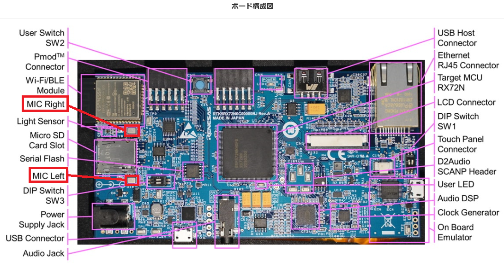

**作成中**


# 目的
* [D2 Audio](https://www.renesas.com/products/audio-video/audio/digital-sound-processors/device/D2-41051.html)（D2-41051、旧インターシル社製のオーディオプロセッサ）を用いてSin波音声を出力する
  * SSIEのI2Sフォーマットを用いて音声データをMCUからD2 Audioに伝送する
* D2 Audioを操作し、ボリューム変更、ミュートON/OFF、サンプリング周波数の変更を実施する
  * I2Cを用いてD2 Audioを操作する
* MEMSマイク（ICS-43434、TDK製）を用いて音声を入力する
  * SSIEのI2Sフォーマットを用いて音声データをMEMS MICからMCUに伝送する

# 準備するもの
* 必須
  * RX72N Envision Kit × 1台
  * USBケーブル(USB Micro-B --- USB Type A) × 1 本
  * Windows PC × 1 台
    * Windows PC にインストールするツール
      * e2 studio 2020-07以降
        * 初回起動時に時間がかかることがある
          * CC-RX V3.02以降
  * スピーカ、ヘッドフォン、イヤホンのいずれか × 1 個
    * アンプ付きを推奨（参考：[RX72N Envision Kit マニュアル](https://www.renesas.com/doc/products/mpumcu/doc/rx_family/001/r20ut4788jj0100-rx72n.pdf?key=c3e0927448cedaa6fa41636c92e39bac) 5.15.1章）
* 参考
  * [SSI モジュールを使用するPCM データ転送サンプルプログラム Firmware Integration Technology（R01AN2825）](https://www.renesas.com/software/D4800301.html)
    * 本稿は上記サンプルプログラム「rx72n_example_ssi_rx」のアレンジ版である
  * [RX72N Envision Kit マニュアル](https://www.renesas.com/doc/products/mpumcu/doc/rx_family/001/r20ut4788jj0100-rx72n.pdf?key=c3e0927448cedaa6fa41636c92e39bac)
  * D2 Audio マニュアル
    * データシート：[d2-41051-151.pdf](https://www.renesas.com/products/audio-video/audio/digital-sound-processors/device/D2-41051.html#documents)
    * APIレジスタ仕様書：[r32an0004eu-d2-4-d2-4p.pdf](https://www.renesas.com/products/audio-video/audio/digital-sound-processors/device/D2-41051.html#documents)
  * MEMSマイク マニュアル
    * データシート：[DS-000069-ICS-43434-v1.2.pdf](https://invensense.tdk.com/products/ics-43434/)

# 前提条件
 * [新規プロジェクト作成方法(ベアメタル)](../../bare-metal/generate-new-project.md)を完了すること
   * 本稿では、[新規プロジェクト作成方法(ベアメタル)](../../bare-metal/generate-new-project.md)で作成したLED0.1秒周期点滅プログラムに、D2 Audio及びMENSマイクを用いて音声を入出力するためのコードを追加する形で実装する
  * 最新の[RX Driver Package](https://www.renesas.com/products/software-tools/software-os-middleware-driver/software-package/rx-driver-package.html)(FITモジュール)を使用すること

# <a name="circuit_Audio"></a>回路確認
## D2 Audio
* <a href="../../images/.png" target="_blank"></a>
* D2 AudioはIISEを介してMCUと接続されている
  * 音声データがIISEを介してMCUからD2 Audioに伝送される
* D2 AudioはI2Cを介してEEPROMと接続されている
  * EEPROMには音声出力のためのD2 Audio初期設定データが保存されている
  * RX72N Envision Kitの電源ON時に、EEPROMからD2 Audio初期設定データがD2 Audioに読み出され、その設定データがD2 Audioに書き込まれる
* D2 AudioはI2Cを介してMCUと接続されて**いない**（つまり、D2 Audioを動的に操作できない）
  * D2 Audioを動的に操作するためにはD2 Audio - MCU間のI2C通信が必要なため、<br>空いているPmodコネクタ端子（）とD2 Audio SCAMP Header（SCL (T5), SDA (T6)）を[ICクリップ](https://www.amazon.co.jp/テイシン電機-TLA101-テイシン-ICテストリード小/dp/B00HLBEMQE/ref=pd_sbs_21_7?_encoding=UTF8&pd_rd_i=B00HLBEMQE&pd_rd_r=65239b22-3d25-44ba-9f3e-d66d89d6dfab&pd_rd_w=XM1vq&pd_rd_wg=9pmjz&pf_rd_p=4acc31d7-eae8-4ee9-8e37-275fb9bc20c2&pf_rd_r=YV9P560NFN22QYA5MF3X&psc=1&refRID=YV9P560NFN22QYA5MF3X)などでバイパスしI2C通信を行う
  * <a href="../../images/.png" target="_blank"></a>

## MEMSマイク
 <a href="../../images/108_72n_envision_kit_mems_mic.png" target="_blank"></a>
* MEMSマイクはIISEを介してMCUと接続されている
  * 音声データがIISEを介してMEMSマイクからMCUに伝送される

# スマート・コンフィグレータ(SC)によるドライバソフトウェア/ミドルソフトウェアの設定
## BDF確認
* プロジェクトにBDF`EnvisionRX72N`が適用されていることを確認する（[スマート・コンフィグレータの使い方#ボード設定](https://github.com/renesas/rx72n-envision-kit/wiki/スマート・コンフィグレータの使用方法#board_setting)を参照）
  * 適用されていない場合、[スマート・コンフィグレータの使い方#ボード設定](https://github.com/renesas/rx72n-envision-kit/wiki/スマート・コンフィグレータの使用方法#board_setting) を参照

## コンポーネント追加
* [スマート・コンフィグレータの使い方#コンポーネント組み込み](https://github.com/renesas/rx72n-envision-kit/wiki/スマート・コンフィグレータの使用方法#component_import)を参考に以下の5個のコンポーネントを追加する
  * r_ssi_api_rx
  * r_gpio_rx
  * r_mpc_rx

* <a href="../../images/.png" target="_blank"></a>
## コンポーネント設定
### r_ssi_api_rx
  * SSIE関連設定を施す
    * SSIEのチャネル0と1を使用
      * <a href="../../images/.png" target="_blank"></a>
* SSIE関連の端子を使用する設定にする
  * SSIBCK0, SSILRCK0, SSIRXD0, SSIBCK1, SSILRCK1, SSIDATA1, AUDIO_CLK端子を使用
    * <a href="../../images/.png" target="_blank"></a>
### r_gpio_rx
  * デフォルトで問題なし
### r_mpc_rx
  * デフォルトで問題なし
### r_bsp
  * デフォルトで問題なし

# ユーザアプリケーション部のコーディング
## ソースコード全体
```
```

## 動作確認


### Audacityの活用
* [Audacityの使用方法](https://github.com/renesas/rx72n-envision-kit/wiki/Audacity%E3%81%AE%E4%BD%BF%E7%94%A8%E6%96%B9%E6%B3%95)を参照

***

# 追加情報
# Sin波の生成