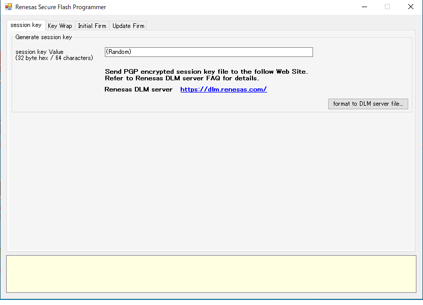
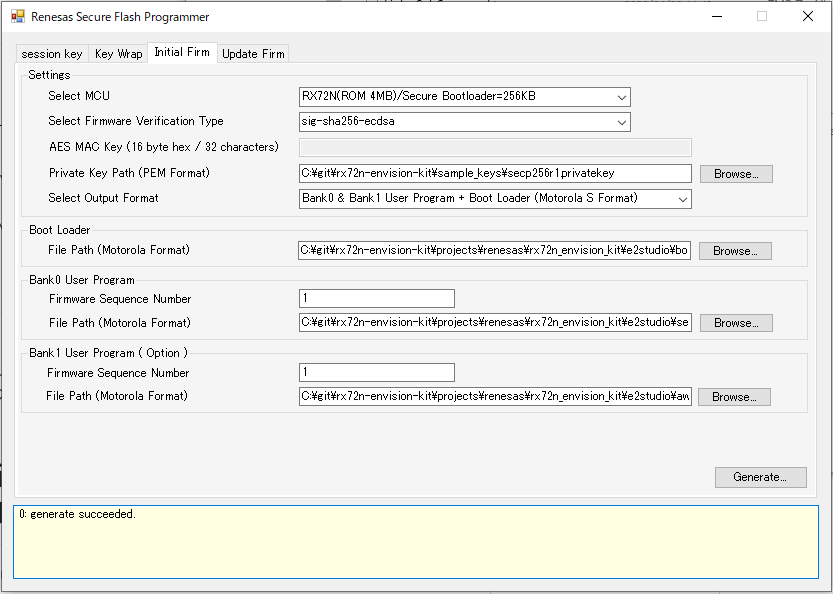

# 準備する物
* 必須
    * RX72N Envision Kit × 1台
    * USBケーブル(USB Micro-B --- USB Type A) × 2 本
    * Windows PC × 1 台
        * Windows PC にインストールするツール
            * [e2 studio 2020-04](https://www.renesas.com/products/software-tools/tools/ide/e2studio.html)
                * 初回起動時に時間がかかることがある
            * [CC-RX](https://www.renesas.com/products/software-tools/tools/compiler-assembler/compiler-package-for-rx-family.html) V3.02以降

# 前提条件
* [デバッグ方法](../developer/how-to-debug.md) を完了すること
* 単に従来通りのデバッグおよびRX72Nの単体機能の評価が必要な場合は[新規プロジェクト作成方法](../developer/generate-new-project-overview.md)を参照のこと

# RX72N Envision Kitのメモリマップおよびファームウェアの動作の理解する
* [設計メモ](../developer/design-memo.md)の以下を参考にRX72N Envision Kitのメモリマップおよびファームウェアの動作の理解する
    * コードフラッシュ: RX72N Envision Kit 初期ファームウェアでのメモリマップ定義
    * 初期ファームウェアとアップデート後ファームウェアの動作の違い

# ファームウェア結合とアップデータ生成
* [デバッグ方法](../developer/how-to-debug.md) はデバッグ時に有効であるが、量産時には有効ではない
* なぜならば、以下2点の課題が存在するからである
    1. 量産時、ダウンロードに時間および手間がかかる
    1. 量産後運用時、アップデータ配信時のデータ量が増える（通信料金が増える）
* それぞれ以下のような機能を持つツールを作ることで対策とする
    1. Bootloaderとuser application(execute area用)と、user application(temporary area用)を結合し量産時用の1枚のMOTファイルを生成する
    1. 任意のuser applicationをバイナリ化し量産運用時のRSUファイル(独自)を生成する
        * MOTファイルは16進数表現のテキスト、RSUファイルはバイナリであり、RX72Nのバンク1面分2MB分のデータを包含するファイルサイズとしては、MOTファイルは4MB、RSUファイルは2MBとなる
            * 特にインターネット経由の自動ファームウェア配信を想定する場合、AWS(Amazon Web Services)等のデータ配信用サーバの利用料金が従量課金制であるため、配信されるデータは少しでも圧縮しておく必要がある

# ファームウェアをカスタムする
* ソースコードを変更し、コンパイル・ビルドを実施すればよい
    * 例えば aws_demos に含まれるバージョンデータを変更して試すとよい
        * [link](https://github.com/renesas/rx72n-envision-kit/blob/4301d18f8b23839bde70d8d2f5b428cf74a7a423/demos/include/aws_application_version.h#L34)

# ファームウェア結合方法
## 共通
* 以下パスのWindowsアプリを起動する
    * ${base_folder}/rx72n-envision-kit/vendors/renesas/tools/mot_file_converter/Renesas Secure Flash Programmer/bin/Debug/
        * Renesas Secure Flash Programmer.exe
            * dllがないと起動しないので、リポジトリ全体のコピーをローカルに保存しておくこと
                * 

## ケースの切り替え
* Initiali Firmタブ の Select Output Formatの設定で切り替え可能
    * ケース1 = デバッグ時: Bank0(execute area) の RSUファイル
    * ケース2 = 量産時1: ブートローダ + Bank0(execute area) の MOTファイル
    * ケース3 = 量産時2: ブートローダ + Bank0(execute area) + Bank1(temporary area) の MOTファイル (初期ファームウェアと同じ構成)
* 以下はケース3の例
    * 

# 書き込み
* MOTファイルを書き込む
    * [初期ファームウェアに戻す方法](../quick-start/revert-to-factory-image.md)参照
* RSUファイル(Initial Firmで生成したデータ)を書き込み、デバッグを行う
    * [デバッグ方法](../developer/how-to-debug.md)参照

