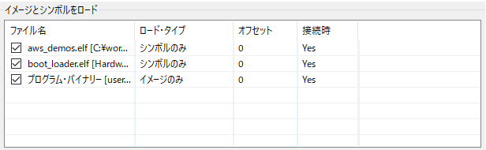

# 準備する物
* 必須
    * RX72N Envision Kit × 1台
    * USBケーブル(USB Micro-B --- USB Type A) × 2 本
    * Windows PC × 1 台
        * Windows PC にインストールするツール
            * [e2 studio 2020-04](https://www.renesas.com/products/software-tools/tools/ide/e2studio.html) 以降
                * 初回起動時に時間がかかることがある
            * [CC-RX](https://www.renesas.com/products/software-tools/tools/compiler-assembler/compiler-package-for-rx-family.html) V3.02以降
            * [Tera Term](https://osdn.net/projects/ttssh2/) 4.105以降
                * [シリアル接続における高速なファイル転送](https://teratermproject.github.io/manual/5/ja/setup/teraterm-trans.html#FileSendHighSpeedMode) の FileSendHighSpeedMode を OFF にする
                    * Tera Term -> 設定 -> 設定の読み込み -> TERATERM.INI を テキストエディタで開く -> 設定を変更 -> 保存 -> Tera Term再起動

# 前提条件
* RX72N Envision Kitの初期ファームウェアのデバッグや機能追加を行いたい場合
* ファームウェアアップデートの仕組みを学びたい場合
    * ファームウェアアップデートの仕組みが不要な場合、およびRX72Nの単体機能の評価が必要な場合は[新規プロジェクト作成方法](../../developer/generate-new-project-overview.md)を参照のこと

# ソースコード一式をダウンロードする
* 最新版のコードをダウンロードする
```
git clone https://github.com/renesas/rx72n-envision-kit.git
```

* 確実に動作するビルドに戻す(最新版のソースコードがビルドできない場合等)
```
cd rx72n-envision-kit
git checkout 07469396d612f805ab158b5dae99a4d1bcea2aed
```

# ベースフォルダの定義
* gitでクローンしたルートフォルダを ${base_folder} と表記する
* ${base_folder} には demos や libraries フォルダが存在する
* ベースフォルダは、Cドライブ直下等浅いパスにしてください。**パス全長が256文字**を超えるとe2 studioはビルド時にエラーを出力します。

# e2 studio を起動する
* ファイル -> インポート -> 一般 -> 既存プロジェクトをワークスペースへ -> ルートディレクトリの選択
    * ${base_folder}/projects/renesas/rx72n_envision_kit/e2studio
* 以下3点のプロジェクトが読み込まれる
    * aws_demos
    * rx72n_boot_loader
    * segger_emwin_demos
* 以下チェックボックスを外す
    * <a href="../../images/109_e2_studio_project_import.png" target="_blank"></a>
* 終了ボタン

# コンパイラ設定の確認
* 以下のようにCCRXコンパイラがインストールされているか確認
    * <a href="../../images/110_e2_studio_project_build.png" target="_blank"></a>
* もしバージョンが何も選択できない場合は、CCRXコンパイラをインストールする
    * https://www.renesas.com/software-tool/cc-compiler-package-rx-family

# 準備
* RX72N Envision KitのSW1-2 をOFF(ボードの下側)にする
    * <a href="../../images/017_board_sw1.jpg" target="_blank"></a>

* CN8(USB Micro-B)と通信相手となるUSBポート(PC等)をUSBケーブルを用いて接続
    * <a href="../../images/009_board_serial_terminal2.jpg" target="_blank"></a>
        * Windows PC上でTeratermを立ち上げ、COMポート(COMx: RSK USB Serial Port(COMx))を選択し接続
            * 設定 -> シリアルポート で以下設定を行う
                * ボーレート: 115200 bps
                * データ: 8 bit
                * パリティ: none
                * ストップ: 1 bit
                * フロー制御: none
            * 設定 -> 端末 で以下設定を行う
                * 改行コード
                    * 受信: AUTO
                    * 送信: CR+LF
                * ローカルエコー
                    * チェックを外す

# ビルド・ダウンロード・実行
* ビルド
    * プロジェクト -> すべてをビルド
        * ${base_folder} が長かったり日本語パスが含まれる場合コンパイルエラーが出るので注意
* ダウンロード
    * Launch Configuration (画面上部歯車マーク付近） -> rx72n_boot_loader HardwareDebug -> 虫マーク（画面上部左側）
    * resetprg.c の R_BSP_POR_FUNCTION()関数が表示されることを確認
* 実行
    * 再開ボタン(画面上部)を押す
    * main()関数が表示されることを確認
    * 再開ボタン(画面上部)を押す
    * teraterm に以下ログが出力されれば成功
        * 液晶にも同一表示が出る
```
-------------------------------------------------
RX72N secure boot program
-------------------------------------------------
Checking data flash ROM status.
Loading user code signer public key: not found.
provision the user code signer public key: OK.
Checking code flash ROM status.
bank 0 status = 0xff [LIFECYCLE_STATE_BLANK]
bank 1 status = 0xff [LIFECYCLE_STATE_BLANK]
bank info = 1. (start bank = 0)
start installing user program.
erase bank1 secure boot mirror area...OK
copy secure boot (part1) from bank0 to bank1...OK
copy secure boot (part2) from bank0 to bank1...OK
========== install user program phase ==========
erase install area (data flash): OK
erase install area (code flash): OK
send "userprog.rsu" via UART.
```
# ファームウェアアップデートのメカニズム
* [設計メモ](../../developer/design-memo.md)

# aws_demosのMOTファイルに署名を付与する
* ${base_folder}/vendors/renesas/tools/mot_file_converter/Renesas Secure Flash Programmer/bin/Debug
    * Renesas Secure Flash Programmer.exe
* Initial Firm タブ
    * Settings
        * Select MCU -> "RX72N(ROM 4MB)/Secure Bootloader=256KB"
        * Select Firmware Verification Type -> sig-sha256-ecdsa
        * Private Key Path (PEM Format) -> ${base_folder}/sample_keys
            * secp256r1.privatekey
        * Select Output Format -> Bank0 User Program (Binary Format)
    * Bank0 User Program
        * Firmware Sequence Number -> 1
        * File Path (Motorola Format) -> ${base_folder}/projects/renesas/rx72n_envision_kit/e2studio/aws_demos/HardwareDebug
            * aws_demos.mot
* Generate ボタンを押す
    * userprog.rsu を デスクトップに保存

# aws_demosをブートローダ経由(CN8(SCI2))でダウンロード
* teraterm -> ファイル -> ファイル送信 -> オプション -> 「バイナリ」にチェック
* デスクトップの userprog.rsu を指定
* teratermと液晶に以下ログが流れた後、aws_demos (ベンチマーク) が起動することを確認

```
========== install user program phase ==========
erase install area (data flash): OK
erase install area (code flash): OK
send "userprog.rsu" via UART.
installing firmware...1%(32/1792KB).
installing firmware...3%(64/1792KB).
installing firmware...5%(96/1792KB).
installing firmware...7%(128/1792KB).
installing firmware...8%(160/1792KB).
installing firmware...10%(192/1792KB).
installing firmware...12%(224/1792KB).
installing firmware...14%(256/1792KB).
installing firmware...16%(288/1792KB).
installing firmware...17%(320/1792KB).
installing firmware...19%(352/1792KB).
installing firmware...21%(384/1792KB).
installing firmware...23%(416/1792KB).
installing firmware...25%(448/1792KB).
installing firmware...26%(480/1792KB).
installing firmware...28%(512/1792KB).
installing firmware...30%(544/1792KB).
installing firmware...32%(576/1792KB).
installing firmware...33%(608/1792KB).
installing firmware...35%(640/1792KB).
installing firmware...37%(672/1792KB).
installing firmware...39%(704/1792KB).
installing firmware...41%(736/1792KB).
installing firmware...42%(768/1792KB).
installing firmware...44%(800/1792KB).
installing firmware...46%(832/1792KB).
installing firmware...48%(864/1792KB).
installing firmware...50%(896/1792KB).
installing firmware...51%(928/1792KB).
installing firmware...53%(960/1792KB).
installing firmware...55%(992/1792KB).
installing firmware...57%(1024/1792KB).
installing firmware...58%(1056/1792KB).
installing firmware...60%(1088/1792KB).
installing firmware...62%(1120/1792KB).
installing firmware...64%(1152/1792KB).
installing firmware...66%(1184/1792KB).
installing firmware...67%(1216/1792KB).
installing firmware...69%(1248/1792KB).
installing firmware...71%(1280/1792KB).
installing firmware...73%(1312/1792KB).
installing firmware...75%(1344/1792KB).
installing firmware...76%(1376/1792KB).
installing firmware...78%(1408/1792KB).
installing firmware...80%(1440/1792KB).
installing firmware...82%(1472/1792KB).
installing firmware...83%(1504/1792KB).
installing firmware...85%(1536/1792KB).
installing firmware...87%(1568/1792KB).
installing firmware...89%(1600/1792KB).
installing firmware...91%(1632/1792KB).
installing firmware...92%(1664/1792KB).
installing firmware...94%(1696/1792KB).
installing firmware...96%(1728/1792KB).
installing firmware...98%(1760/1792KB).
installing firmware...100%(1792/1792KB).
completed installing firmware.
integrity check scheme = sig-sha256-ecdsa
bank1(temporary area) on code flash integrity check...OK
installing const data...5%(1/20KB).
installing const data...10%(2/20KB).
installing const data...15%(3/20KB).
installing const data...20%(4/20KB).
installing const data...25%(5/20KB).
installing const data...30%(6/20KB).
installing const data...35%(7/20KB).
installing const data...40%(8/20KB).
installing const data...45%(9/20KB).
installing const data...50%(10/20KB).
installing const data...55%(11/20KB).
installing const data...60%(12/20KB).
installing const data...65%(13/20KB).
installing const data...70%(14/20KB).
installing const data...75%(15/20KB).
installing const data...80%(16/20KB).
installing const data...85%(17/20KB).
installing const data...90%(18/20KB).
installing const data...95%(19/20KB).
installing const data...100%(20/20KB).
completed installing const data.
software reset...
-------------------------------------------------
RX72N secure boot program
-------------------------------------------------
Checking data flash ROM status.
Loading user code signer public key: found.
Checking code flash ROM status.
bank 0 status = 0xff [LIFECYCLE_STATE_BLANK]
bank 1 status = 0xfe [LIFECYCLE_STATE_TESTING]
bank info = 1. (start bank = 0)
integrity check scheme = sig-sha256-ecdsa
bank1(temporary area) on code flash integrity check...OK
update LIFECYCLE_STATE from [LIFECYCLE_STATE_TESTING] to [LIFECYCLE_STATE_VALID]
bank1(temporary area) block0 erase (to update LIFECYCLE_STATE)...OK
bank1(temporary area) block0 write (to update LIFECYCLE_STATE)...OK
swap bank...
-------------------------------------------------
RX72N secure boot program
-------------------------------------------------
Checking data flash ROM status.
Loading user code signer public key: found.
Checking code flash ROM status.
bank 0 status = 0xf8 [LIFECYCLE_STATE_VALID]
bank 1 status = 0xff [LIFECYCLE_STATE_BLANK]
bank info = 0. (start bank = 1)
integrity check scheme = sig-sha256-ecdsa
bank0(execute area) on code flash integrity check...OK
integrity check(parts of SHA256 process) needs 1211340 us.
integrity check(parts of ECDSA process) needs 93750 us.
jump to user program
```

# aws_demosをブートローダ経由(CN6(SCI7))で高速ダウンロード
* CN8(SCI2) は 通信経路上のRL78/G1Cチップに律速し 115200 bps設定と低速であるため2MBのファームウェアをダウンロードするのに2分程度かかる
* CN6(SCI7) は 通信経路上のFTDIチップが 912600 bps 対応と高速設定可能であるため2MBのファームウェアをダウンロードするのに20秒程度で済む
    * <a href="../../images/013_board_network.jpg" target="_blank"></a>
        * (右側の赤枠は無視。後で写真を張り替える)
        * CN6に[USB-シリアル変換 PMODモジュール](https://store.digilentinc.com/pmod-usbuart-usb-to-uart-interface/)を接続
            * CN6は12ピン、[USB-シリアル変換 PMODモジュール](https://store.digilentinc.com/pmod-usbuart-usb-to-uart-interface/)は6ピンのため、挿し込む位置・向きに注意。CN6付近のボード上の印字の1と[USB-シリアル変換 PMODモジュール](https://store.digilentinc.com/pmod-usbuart-usb-to-uart-interface/)上の印字の1を合わせること
        * [USB-シリアル変換 PMODモジュール](https://store.digilentinc.com/pmod-usbuart-usb-to-uart-interface/)にUSBケーブルを接続し、通信相手となるUSBポート(PC等)をUSBケーブルを用いて接続 
            * Windows PC上でTeratermを立ち上げ、COMポート(COMx: USB Serial Port(COMx))を選択し接続
                * 設定 -> シリアルポート で以下設定を行う
                    * ボーレート: 912600bps
                    * データ: 8 bit
                    * パリティ: none
                    * ストップ: 1 bit
                    * フロー制御: none
                * 設定 -> 端末 で以下設定を行う
                   * 改行コード
                        * 受信: AUTO
                        * 送信: CR+LF
                    * ローカルエコー
                        * チェックを外す

* ブートローダのBSPの設定を変更し、ターミナル接続用のSCIチャネルの番号を2から7に、ボーレートを115200bpsから912600bpsに変更する
    * [変更対象のコード](https://github.com/renesas/rx72n-envision-kit/blob/f4d7ee62a3c52da856f882fdf3e1329059336f7e/projects/renesas/rx72n_envision_kit/e2studio/boot_loader/src/smc_gen/r_config/r_bsp_config.h#L770)
        * /rx72n-envision-kit/projects/renesas/rx72n_envision_kit/e2studio/boot_loader/src/smc_gen/r_config/r_bsp_config.h

```
/* This macro is used to select which SCI channel used for debug serial terminal.
   RX72N-Envision-Kit Default: SCI2 - G1CUSB0(RL78/G1C), bit rate 115200bps.
   RX72N-Envision-Kit Default: SCI7 - external of PMOD2, bit rate ~921600bps if user would attach FTDI chip.
 */
#define MY_BSP_CFG_SERIAL_TERM_SCI                  (7)

/* This macro is used to select which SCI bit-rate.
 */
#define MY_BSP_CFG_SERIAL_TERM_SCI_BITRATE          (921600)

/* This macro is used to select which SCI interrupt priority.
   0(low) - 15(high)
 */
```

# boot_loader および aws_demos のデバッグ
* e2 studio のデバッガ機能でダウンロードしたファームウェアはboot_loaderである
* boot_loaderはダウンロードした直後からデバッグ可能である
* 一方でaws_demos はboot_loader経由でダウンロードしたため通常の手法だとデバッグができない
* 以下のように、boot_loaderのダウンロード時設定でaws_demosのシンボル情報も合わせてダウンロードする設定を施すことでこの問題を回避している
    * <a href="../../images/019_pc_e2studio_settings.png" target="_blank"></a>

## 検討中
* Renesas Secure Flash Programmer で生成したuserprog.motをrx-elf-objcopy.exeでデバッグできるelfファイルに変換する機能がある
  * rx-elf-objcopy.exe がRXGCCに付属するツールだが、CC-RX環境でも利用可能
* これを活用し、e2 studioでダウンロード時に以下設定を施すことで、上述した難解な手法を用いなくてもデバッグが可能
  * <a href="../../images/111_e2_studio_download.png" target="_blank"></a>

