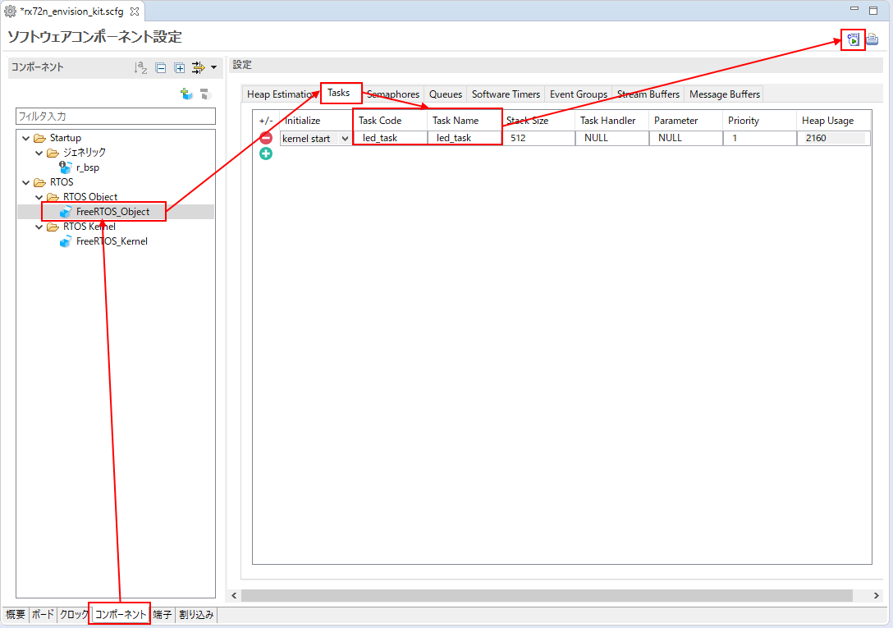
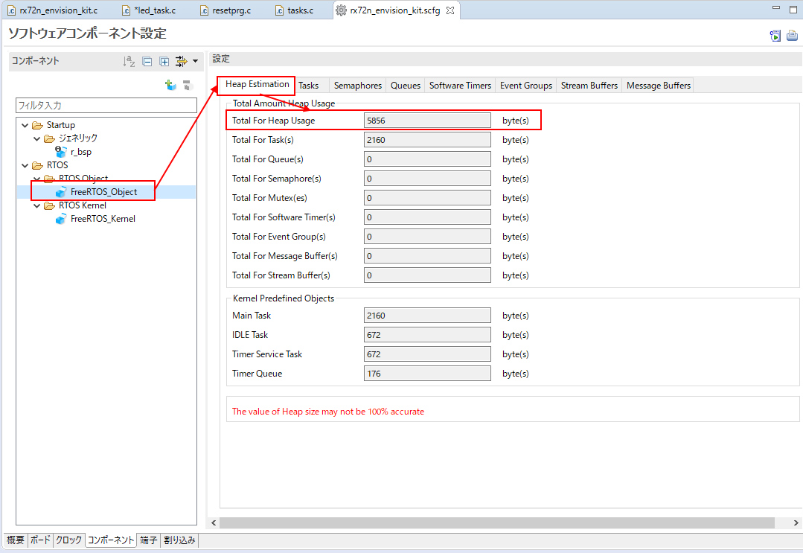
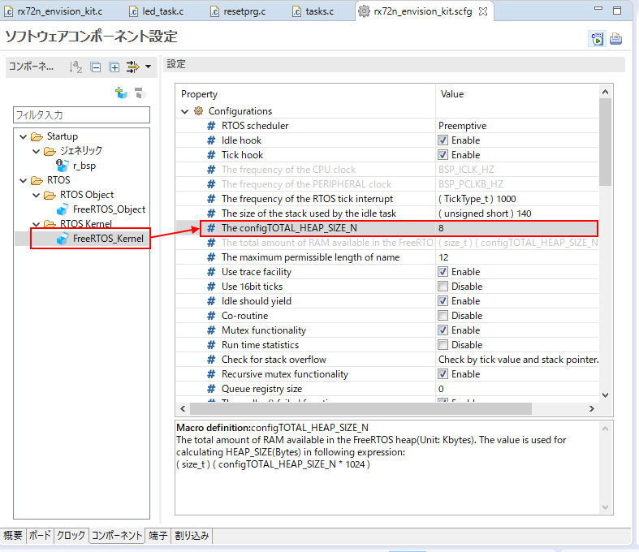

# 準備する物
* 必須
    * RX72N Envision Kit × 1台
    * USBケーブル(USB Micro-B --- USB Type A) × 1 本
    * Windows PC × 1 台
        * Windows PC にインストールするツール
            * [e2 studio 2020-10](https://www.renesas.com/products/software-tools/tools/ide/e2studio.html)
            * [CC-RX](https://www.renesas.com/products/software-tools/tools/compiler-assembler/compiler-package-for-rx-family.html) V3.02以降

# e2 studio を起動し、新規プロジェクトを作成する
* ファイル -> 新規 -> プロジェクト
    * ウィザード -> C/C++ -> C/C++ プロジェクト -> 次へ
        * All -> Renesas CC-RX C/C++ Executable Project
            * プロジェクト名 = rx72n_envision_kit を入力 -> 次へ
                * Toolchain Settings
                    * RTOS -> FreeRTOS(Kernel Only)
                    * RTOS Version に何も表示されない場合は "Manage RTOS Versions..." リンクからRTOSパッケージを入手
                * Device Settings 
                    * Target Board -> EnvisionRX72N
                        * EnvisionRX72Nが選択できる場合：ターゲット・デバイスが自動選択される
                        * EnvisionRX72Nが選択できない場合：ターゲット・デバイスが自動選択されない。
                            * この場合、Download Additional Boards を選び、EnvisionRX72Nをダウンロード
                            * プロジェクト新規作成時もBDFインストールができるようにする
                * Configuration -> Hardware Debug 構成を生成 -> E2 Lite (RX) -> 次へ
                    * スマート・コンフィグレータを使用する にチェック -> 終了

# スマートコンフィグレータで設定を行う
* [クロック設定](https://github.com/renesas/rx72n-envision-kit/wiki/%E3%82%B9%E3%83%9E%E3%83%BC%E3%83%88%E3%83%BB%E3%82%B3%E3%83%B3%E3%83%95%E3%82%A3%E3%82%B0%E3%83%AC%E3%83%BC%E3%82%BF%E3%81%AE%E4%BD%BF%E7%94%A8%E6%96%B9%E6%B3%95#%E3%82%AF%E3%83%AD%E3%83%83%E3%82%AF%E8%A8%AD%E5%AE%9A)

# FreeRTOSのタスクを使用し0.1秒周期割り込みを発生させLEDを0.1秒周期で点滅させる
## スマートコンフィグレータでタスクを登録しコード生成する
* <a href="../../images/056_e2_studio_sc.png" target="_blank"></a>
    * スマートコンフィグレータの下部、「コンポーネント」タブを押す
    * FreeRTOS_Object -> Taskを選択
    * Task CodeとTask Nameに led_task と入力
    * コード生成

## LEDタスク(led_task.c)において、0.1秒の待ち状態の後、LEDを点滅させるコードを追加する
* 待ち状態を作り出すvTaskDelay()という関数を使用する
    * 引数はFreeRTOSのTimeTick=1msを分解能とする待ち時間
    * 100を指定すると100ms、つまり0.1秒の待ち状態を作り出すことができる

```led_task.c
#include "task_function.h"
/* Start user code for import. Do not edit comment generated here */
#include "platform.h"
/* End user code. Do not edit comment generated here */

void led_task(void * pvParameters)
{
/* Start user code for function. Do not edit comment generated here */
	PORT4.PDR.BYTE = 1;	/* 本来スマートコンフィグレータで設定されるべき(★要改善) */
	while(1)
	{
		vTaskDelay(100);
		if(PORT4.PIDR.BIT.B0 == 1)
		{
			PORT4.PODR.BIT.B0 = 0;
		}
		else
		{
			PORT4.PODR.BIT.B0 = 1;
		}
	}
/* End user code. Do not edit comment generated here */
}
/* Start user code for other. Do not edit comment generated here */
/* End user code. Do not edit comment generated here */
```

## メインタスク(rx72n_envision_kit.c)において、無限ループ時にOSに制御を渡すための待ち状態を作り出す
* メインタスクは優先度 "3" で登録されている
* LEDタスクは優先度 "1" で登録されている
* 優先度は数字が大きい方が高い
* この状態では、LEDタスクにプログラムカウンタが渡らずLED制御が動作しない
* 従って以下のように無限ループ時にOSに制御を渡すための待ち状態を作り出す

```rx72n_envision_kit.c
#include "r_smc_entry.h"
#include "FreeRTOS.h"
#include "task.h"

void main_task(void *pvParameters)
{

	/* Create all other application tasks here */

	while(1)
	{
		vTaskDelay(10);
	}

	vTaskDelete(NULL);

}
```

### 参考
* 複数タスク間で同じ優先度の場合はどうなるか？
    * FreeRTOSにはスケジューラのメカニズムを選択できるコンフィグレーションがある
    * デフォルトは "Preemptive" 有効である
    * この場合、同じ優先度のタスクが存在する場合、FreeRTOSのTimeTick=1msが経過するまたは実行中のタスクが終了すると同じ優先度の別のタスクに切り替わる

## ヒープ容量を調整する
* タスクなどの資源を増やすと、必要となるヒープメモリも増える
* FreeRTOSはヒープメモリを設定できる
    * まずはスマートコンフィグレータが算出したヒープ見積もり値を確認する
        * <a href="../../images/057_e2_studio_sc.png" target="_blank"></a>
        * Total For Heap Usage に 5856 byte(s) と見積もられている
    * 次にスマートコンフィグレータでFreeRTOSのヒープ値を設定する
        * <a href="../../images/058_e2_studio_sc.png" target="_blank"></a>
        * 見積もり値に対してある程度余裕のある数値を入力する。この例では 8 (8KB設定値となる) と入力
        * もしヒープが足りない状態で実行すると、vApplicationMallocFailedHook()で無限ループする
# デバッガ設定
* [参照](https://github.com/renesas/rx72n-envision-kit/wiki/%E6%96%B0%E8%A6%8F%E3%83%97%E3%83%AD%E3%82%B8%E3%82%A7%E3%82%AF%E3%83%88%E4%BD%9C%E6%88%90%E6%96%B9%E6%B3%95(%E3%83%99%E3%82%A2%E3%83%A1%E3%82%BF%E3%83%AB)#%E3%83%87%E3%83%90%E3%83%83%E3%82%AC%E8%A8%AD%E5%AE%9A)

# 動作確認
* [参照](https://github.com/renesas/rx72n-envision-kit/wiki/%E6%96%B0%E8%A6%8F%E3%83%97%E3%83%AD%E3%82%B8%E3%82%A7%E3%82%AF%E3%83%88%E4%BD%9C%E6%88%90%E6%96%B9%E6%B3%95(%E3%83%99%E3%82%A2%E3%83%A1%E3%82%BF%E3%83%AB)#%E5%8B%95%E4%BD%9C%E7%A2%BA%E8%AA%8D)