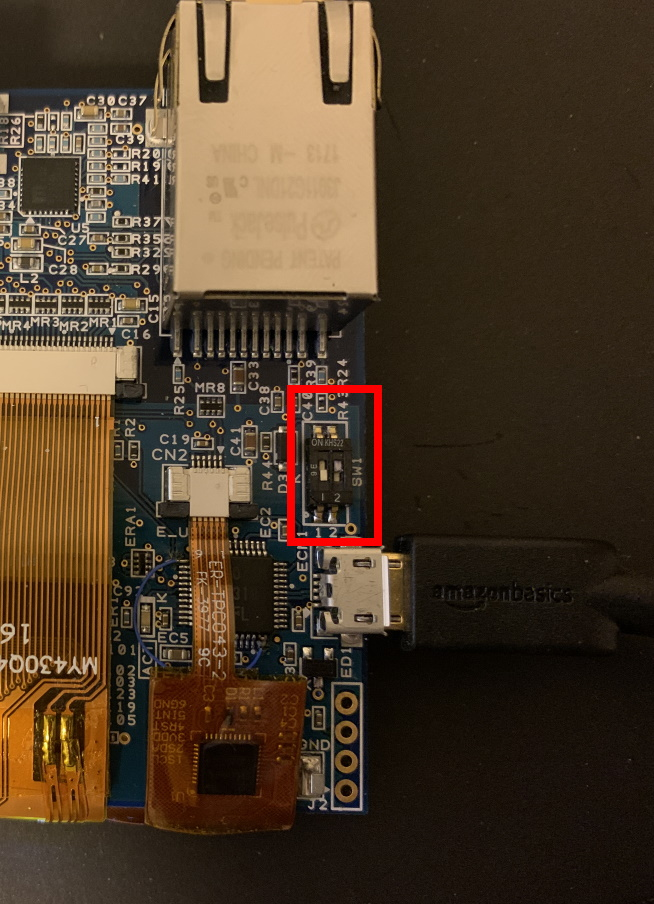

# 準備する物
* 必須
    * RX72N Envision Kit × 1台
    * USBケーブル(USB Micro-B --- USB Type A) × 1 本
    * Windows PC × 1 台
* オプション
    * なし

# 初期ファームウェアに戻す手順
1. 初期ファームウェアをダウンロードする
    * 以下から初期ファームウェア(userprog.mot)ファイルをダウンロードする
        * [link](https://github.com/renesas/rx72n-envision-kit/wiki/%E3%83%9B%E3%83%BC%E3%83%A0#%E5%88%9D%E6%9C%9F%E3%83%95%E3%82%A1%E3%83%BC%E3%83%A0%E3%82%A6%E3%82%A7%E3%82%A2)
1. 初期ファームウェア(userprog.mot)ファイルをデスクトップに保存する
1. RX72N Envision KitのSW1-2 をOFF(ボードの下側)にする
    * 
1. Renesas Flash Programmer v3.06 以降をダウンロードする
    * [link](https://www.renesas.com/products/software-tools/tools/programmer/renesas-flash-programmer-programming-gui.html)
1. Renesas Flash Programmer を起動する
1. ファイル → 新しいプロジェクトを作成
    * プロジェクト情報
        * マイクロコントローラ: RX72x
        * プロジェクト名: 任意
        * 作成場所: 任意
    * 通信
        * ツール: E2 emulator Lite
        * インタフェース: Fine
1. IDコードの設定はそのまま「OK」を押す
1. プログラムファイル右側の「参照」ボタンを押し、[1]でダウンロードした初期ファームウェア(userprog.mot)を指定
1. スタートボタンを押す
1. 書き込み完了まで待つ
1. RX72N Envision KitのSW1-2 をON(ボードの上側)にする
    * 
1. 終了
