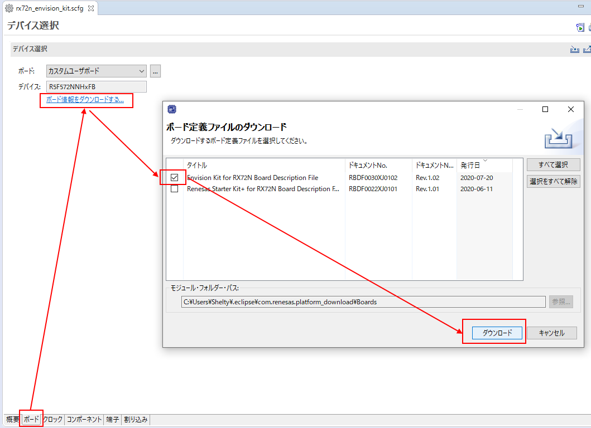
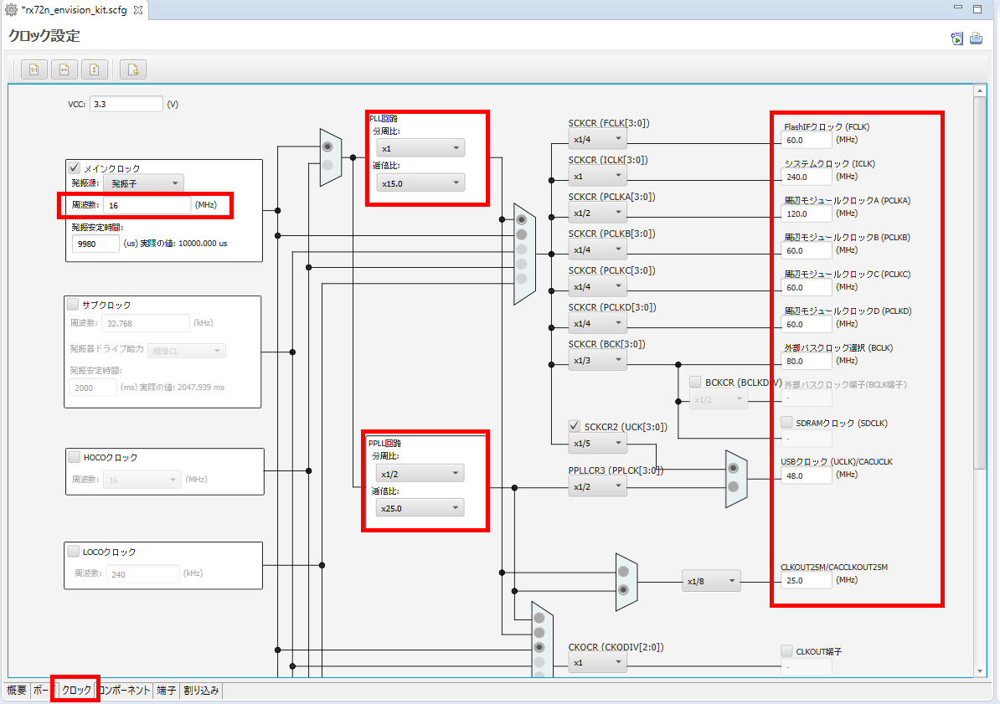
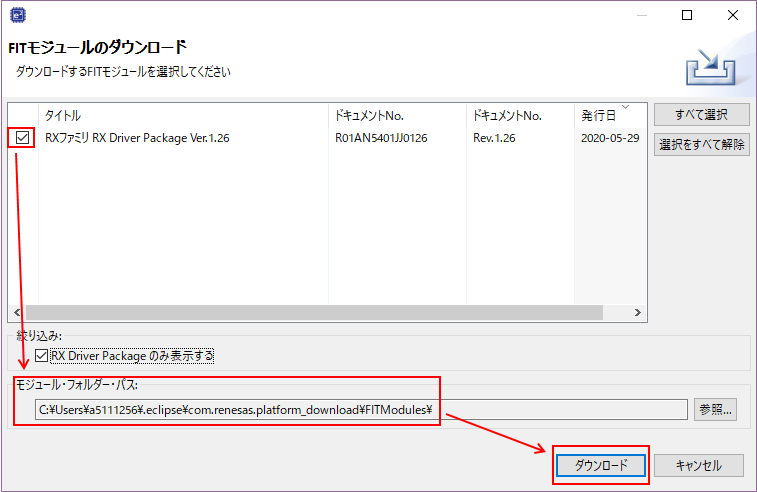
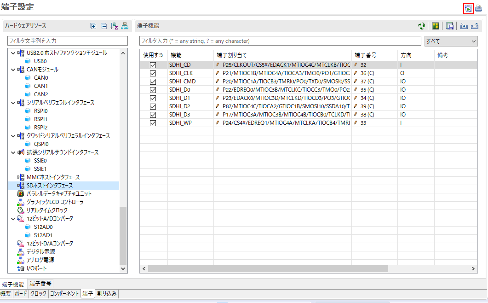

# <a name="purpose"></a>目的
* [RX用スマート・コンフィグレータ](https://www.renesas.com/products/software-tools/tools/solution-toolkit/smart-configurator.html)の使い方を概説する
* e2 studio 2020-07、及び、CS+ V8.03での操作を前提に記載する（CS+ 64-bit版で再確認予定）
* スマート・コンフィグレータをこのページではSCと呼称する

# <a name="summary"></a>スマート・コンフィグレータの概説
## スマート・コンフィグレータとは？
* SCは「ソフトウェアを自由に組み合わせられる」をコンセプトとしたユーティリティである
* SCは主に以下の機能を提供する
  * RXマイコン周辺機能を活用したドライバソフトウェアやミドルウェアの導入や設定<br>（これらのソフト/ミドルウェアは以下のコンポーネントとして提供されている）
    * Firmware Integration Technology (FIT)モジュール
    * コード生成（CG）モジュール
  * GUIを用いたクロックや端子設定
  * ソース生成機能
* 詳細は以下のアプリケーションを参照
  * [RX スマート・コンフィグレータ ユーザーガイド: e2 studio 編](https://www.renesas.com/doc/products/tool/doc/016/r20an0470jj0120-cspls-sc.pdf)
  * [RH850 スマート・コンフィグレータ ユーザーガイド: CS+編](https://www.renesas.com/doc/products/tool/doc/016/r20an0470jj0120-cspls-sc.pdf)
## <a name="merit"></a>スマート・コンフィグレータ使用のメリット
* CMTに代表されるタイマ系や、SCIに代表される通信系においては、自身に配線されているクロック信号のクロック速度に応じて自身への設定値をソフトウェアにより調整する必要がある
* このソフトウェアのコーディングは本来、マイコンのマニュアルを参照しながらユーザが行う必要があるが、非常に設定項目が多岐に渡るためSCのようなツールでこれを支援する機構を用意した
* ユーザ（特にアプリ設計者）はクロック源が何MHzであるとか、内部PLLの設定がどうなっているかを意識することなく、APIレベルでたとえば「ボーレートは115200bps」といった形でソフトウェアからハードウェアに対して指示をすることが可能となり、ソフトウェア開発効率が改善する
* また、RXファミリ製品を熟知した設計者がCMT、SCI、Ether、USB、SDHI等のRXファミリ内蔵回路用のドライバソフトウェアを主要RXグループに対し同一API設計にて「FITモジュール」という形式で開発・メンテナンス(継続的な不具合修正)を実施し、FITモジュールを1個のパッケージに同梱したものを「RX Driver Package」として配布をしている
* 従ってユーザはRXファミリ間の詳細なハードウェア差異やハードウェアエラッタ情報を意識することなくアプリケーション開発に注力できる

# ジェネリックなドキュメント
* https://www.renesas.com/document/apn/renesas-e-studio-smart-configurator-application-examples-cmt-ad-sci-dma-usb

# <a name="how_to_use"></a>使用方法
## <a name="creation_sc_project"></a>SC付きプロジェクト作成とSC起動
### <a name="creation_sc_project_e2"></a>e2 studioの場合
1. プロジェクトを新規作成する
   * ```ファイル``` -> ```新規``` -> ```プロジェクト```
    * ```ウィザード``` -> ```C/C++``` -> ```C/C++ プロジェクト``` -> ```次へ```
        * ```All``` -> ```Renesas CC-RX C/C++ Executable Project```
            * ```プロジェクト名```に任意の名前を入力 -> ```次へ```
                * ```Device Settings``` -> ```ターゲット・デバイス``` にて使用するデバイスを選択
                * ```Toolchain Settings``` -> ```RTOS```にて使用するRTOSとバージョンを選択
                * ```Configuration``` -> ```Hardware Debug 構成を生成``` ->使用するエミュレータを選択
                * その他の設定はお好みで -> ```次へ```
                    * ```スマート・コンフィグレータを使用する```に<font color="Red">チェック</font> -> ```終了```
2. 新規作成されたプロジェクトの```[プロジェクト名].scfg```をダブルクリック
    * SCが起動される
### <a name="creation_sc_project_cs"></a>CS+の場合
1. プロジェクトを新規作成する
   * ```ファイル``` -> ```新しいプロジェクトを作成```
    * ```ウィザード``` -> ```マイクロコントローラ``` -> ```RX```
        * ```使用するマイクロコントローラ``` -> 使用するデバイスを選択
        * ```プロジェクトの種類``` -> ```アプリケーション(CC-RX)```
        * ```プロジェクト名```に任意の名前を入力 -> ```次へ```
        * その他の設定はお好みで -> ```作成```
2. 新規作成されたプロジェクトの```スマート・コンフィグレータ (設計ツール)```をダブルクリック
    * SCが起動される

## <a name="board_setting"></a>ボード設定
1. SCの下部、```ボード```タブを押す
2. ```ボード```項目で利用したいボードを選択する（ボードコンフィグレーションファイル(BDF)をプロジェクトに読み込み）
   * BDFを読み込むことで、スマートコンフィグレータ上の「端子設定」が自動化される
      * ★将来改善★ コンポーネントやクロックの設定も全自動になる見込み
   * 望みのボードが選択肢に現れない場合、```ボード情報をダウンロードする```からBDFをインストールできる
      * ★将来改善★ プロジェクト生成ウィザードでBDFの選択及びインストールできるようになる見込み
   * <a href="../../images/044_e2_studio_sc.png" target="_blank"></a>

## <a name="clock_setting"></a>クロック設定
* ★将来改善★ BDF連携により e2 studio 2020-xx (将来バージョン)で不要になる見込み（e2 studio 2020-07以前では必要）
1. SCの下部、```クロック```タブを押す
2. チェックボックスやプルダウンメニューの値を変更し、クロック設定を実施する
  * <a href="../../images/022_e2_studio_sc1.png" target="_blank"></a>
3. ビルドエラーの確認（必須ではないがお勧め）
   1.  一旦[コード生成](#code_generation)を実行し、SCで設定した内容に応じたスケルトンプログラムが出力される
   2.  プロジェクトのビルドを実行し、コンソールにエラー表示されないことを確認
          * e2 studioの場合、e2 studio画面上部の```プロジェクト``` -> ```すべてをビルド``` を実行してビルドできる


## <a name="component_import"></a>コンポーネント組み込み
### <a name="add_component"></a>コンポーネント追加
1. SCの下部、```コンポーネント```タブを押す
2. SCの左部、```コンポーネント```ペインにて、```コンポーネントの追加```を押す
3. 表示されたウィンドウで追加したいコンポーネント（FITまたはCG）を選択する<br>（Ctrlキーを押しながらクリックで、複数選択できる）
4. SCの左部、```コンポーネント```ペインに上記で追加したコンポーネントが表示されることを確認する
* <a href="../../images/069_setting_component.png" target="_blank"></a>
#### <a name="recovery_for_missing_fit"></a>目的のFITモジュールが表示されない場合の対処法
 * ```ソフトウェアコンポーネントの選択```ウィンドウにおいて```基本設定```を選択し```すべてのFITモジュールを表示```にチェックを入れる
 * 上記の操作によっても目的のFITモジュールが表示されない場合、[FITモジュールの保存先フォルダ](https://github.com/renesas/rx72n-envision-kit/wiki/%E3%82%B9%E3%83%9E%E3%83%BC%E3%83%88%E3%83%BB%E3%82%B3%E3%83%B3%E3%83%95%E3%82%A3%E3%82%B0%E3%83%AC%E3%83%BC%E3%82%BF%E3%81%AE%E4%BD%BF%E7%94%A8%E6%96%B9%E6%B3%95#stored_fit_folder)にモジュールが存在するかを確認する
     1. [FITモジュールの保存先フォルダ](https://github.com/renesas/rx72n-envision-kit/wiki/%E3%82%B9%E3%83%9E%E3%83%BC%E3%83%88%E3%83%BB%E3%82%B3%E3%83%B3%E3%83%95%E3%82%A3%E3%82%B0%E3%83%AC%E3%83%BC%E3%82%BF%E3%81%AE%E4%BD%BF%E7%94%A8%E6%96%B9%E6%B3%95#stored_fit_folder)にアクセスする
     2. このファイルパスに目的のFITモジュールが存在していることを確認する
     3. 存在する場合、SCを閉じた後でIDEを再起動し、再度目的のモジュールが表示されるかを確認する
     4. 存在していない場合、[FITモジュールを手動で導入する](#fit_import_manually)
#### <a name="fit_import_manually"></a>FITモジュールの手動導入方法
公式ドキュメント：[Firmware Integration Technology (FIT)](https://www.renesas.com/jp/ja/software-tool/fit) -> [RXファミリ Firmware Integration Technology モジュールの手動導入方法](https://www.renesas.com/jp/ja/document/apn/rx-family-manually-importing-firmware-integration-technology-modules?r=485911)
1. [RX Driver Package (RDP)](https://www.renesas.com/products/software-tools/software-os-middleware-driver/software-package/rx-driver-package.html)から目的のFITモジュールを[入手する](#rdp)
2. 入手した目的のFITモジュールを[FITモジュールの保存先フォルダ](https://github.com/renesas/rx72n-envision-kit/wiki/%E3%82%B9%E3%83%9E%E3%83%BC%E3%83%88%E3%83%BB%E3%82%B3%E3%83%B3%E3%83%95%E3%82%A3%E3%82%B0%E3%83%AC%E3%83%BC%E3%82%BF%E3%81%AE%E4%BD%BF%E7%94%A8%E6%96%B9%E6%B3%95#stored_fit_folder)にコピーする
3. SCを閉じた後でIDEを再起動し、再度目的のモジュールが表示されるかを確認する
#### <a name="stored_fit_folder"></a>FITモジュールの保存先フォルダ
* コンポーネント追加操作に表示されるFITモジュールは以下のフォルダ（FITモジュールの保存先フォルダ）を参照している
  * ```コンポーネントの追加``` -> ```基本設定``` -> ```Module Download``` -> ```Location (RX)```に設定されたファイルパス
    * e2 studioのデフォルト：``` C:\Users\[ユーザ名]\.eclipse\org.eclipse.platform_download\FITModules```
  * 1つのFITモジュールは以下ファイルで構成されている（x: 機能名, n: バージョン）
    * ```r_xxx_vn.nn.zip```：ソースコードやドキュメントが圧縮されたモジュール本体
    * ```r_xxx_vn.nn.xml```：SC連携に必要なモジュール情報ファイル
    * ```r_xxx_vn.nn.mdf```：SCのコンポーネント設定に利用される定義ファイル（一部のFITモジュールのみ）
    * ```r_xxx_vn.nn_extend.mdf```：SCのコンポーネント設定に利用される定義ファイル（一部のFITモジュールのみ）
* FITモジュールを手動追加した直後はスマート・コンフィグレータに追加FITモジュールが認識されていない
  * 一旦、**e2 studioまたはCS+を再起動すること**
#### <a name="rdp"></a>RX Driver Package (RDP)
* [RX Driver Package (RDP)](https://www.renesas.com/products/software-tools/software-os-middleware-driver/software-package/rx-driver-package.html)とは、RXマイコン向けのBSP、ドライバ、ミドルウェアをまとめた無償のパッケージ
* 上記のソフトウェアは[FITモジュール](https://www.renesas.com/products/software-tools/software-os-middleware-driver/software-package/fit.html)として提供されている

* RDPのバージョンごとに同梱されているFITモジュールのバージョンは異なる
  * RDPの過去バージョンは[ページ下段](https://www.renesas.com/products/software-tools/software-os-middleware-driver/software-package/rx-driver-package.html)の```旧バージョン情報```をクリックすることで、ダウンロードのリンク先を展開できる
  * RDP過去バージョンに同梱されているFITモジュールをスマート・コンフィグレータに認識させるためには、手動の操作が必要 ⇒ [#FITモジュールの保存先フォルダ](#FITモジュールの保存先フォルダ)
* SCからもRDPをダウンロード可能である（ただし、最新版RDPのみ）
  1. ```コンポーネントの追加``` -> ```他のソフトウェアをダウンロードする```
  2. リージョン選択ウィンドウが表示された場合、```Japan```など自分の住む地域を選択 -> ```OK```
  3. RDPを選択 -> 任意で```モジュール・フォルダ―・パス```を指定 -> ```ダウンロード``` -> ```同意する```
      *  ```モジュール・フォルダ―・パス```にRDP同梱のFITモジュールが自動で展開される
      *  <a href="../../images/082_rdp_download.png" target="_blank"></a>
* **RX64Mよりも前のMCU（RX63Nなど）はRDP V1.19同梱のFITモジュールを使用すること**
  * これらのMCUは最新のFITモジュールに対応していない

### <a name="component_setting"></a>コンポーネント設定
1. SCの下部、```コンポーネント```タブを押す
2. SCの左部、```コンポーネント```ペインにて、設定したいコンポーネントを選択する
3. SCの中央部、```設定```ペインにて、設定を変更する
     * <a href="../../images/070_setting_sdhi1.png" target="_blank"></a>

### <a name="change_component_version"></a>コンポーネントのバージョン変更
* 場合に応じて実行する
1. SCの下部、```コンポーネント```タブを押す
2. SCの左部、```コンポーネント```ペインにて、バージョン変更したいコンポーネントを右クリックする
3. 表示されるコンテキストメニューにて、```バージョンの変更```を押す
4. 表示されるウィンドウにて、```変更後のバージョン```で変更先のバージョンを指定 -> ```次へ```
5. 次に表示される設定の変更内容画面で変更される設定項目を確認 -> 問題なければ```終了```
6. [コード生成](#code_generation)が自動で実行され、コンポーネントのバージョンが変更される
7. SCの左部、```コンポーネント```ペインにて、バージョン変更したコンポーネントを右クリック -> ```バージョンの変更```を押し、バージョンが自動で変更されていることを確認する

### <a name="delete_component"></a>コンポーネント削除
* 場合に応じて実行する
1. SCの下部、```コンポーネント```タブを押す
2. SCの左部、```コンポーネント```ペインにて、削除したいコンポーネントを選択する
3. SCの左部、```コンポーネント```ペインにて、```コンポーネントの削除```を押す
4. 表示さる確認ウィンドウで```はい```を押す
5. SCの左部、```コンポーネント```ペインにて、目的のコンポーネントが削除されることを確認する

## <a name="pin_setting"></a>端子設定
1. SCの下部、```端子```タブを押す
2. SCの左部、```ハードウェアリソース```ペインにて、設定したい端子のリソースを選択する
3. SCの中央部、```端子機能```ペインにて、```使用する```にチェックを入れ、使用したい端子を選択する
4. SCの中央部、```端子機能```ペインにて、```端子割り当て```のプルダウンメニューを変更し、使用したい端子のポート番号を設定する
   * 使用する端子やポート番号は回路図を参照してカスタマイズする
   * <a href="../../images/074_setting_pin_sdhi.png" target="_blank"></a>

## <a name="interrupt_setting"></a>割り込み設定
* [注意] FITの割り込み設定とは連携していない
1. SCの下部、```割り込み```タブを押す
2. 利用したい割り込みを選択し、```割り込み```の機能や```優先レベル```を設定する
3. 利用したい割り込みを選択し、```上へ移動```や```下へ移動```を押してベクタ番号を変更する


## <a name="code_generation"></a>コード生成
1. SC右上の```コードの生成```ボタンを押す
     * <a href="../../images/081_code_generate.png" target="_blank"></a>
2. SCで設定した内容に応じたプログラムコードが自動生成される
3. プロジェクトのビルドを実行し、コンソールにエラー表示されないことを確認
     * e2 studioの場合、e2 studio画面上部の```プロジェクト``` -> ```すべてをビルド``` を実行してビルドできる
* ソース生成直前のSC管理対象ソースコード（.\src\smc_gen\配下のソースプログラム）は、ソース生成実行後に .\trash\フォルダへバックアップされる